:::message
本記事の内容は筆者個人の見解であり、所属する会社を代表するものではありません。
記述は執筆時点のClaude Codeの最新版に基づいています。
:::

## TL;DR

* Claude Code はエージェントアプリのための OS と見立てることができます。

* この見立てのもとでは、「枝分かれ」系機能（`/fork`、`/branch`、`/rewind`、`/btw`、サブエージェント、動的ワークフロー）も OS の操作になぞらえて整理できます。サブエージェント起動はプロセス生成（`fork` や `spawn`）、`/branch`、`/resume`、`/rewind` は git のブランチや履歴操作、エージェントチームは IPC、という具合です。

* `/fork`＝会話を継承した分身を裏で並走（結果が返る）、`/branch`＝会話をコピーして別セッションへ乗り移る、`/rewind`＝同一セッション内の巻き戻し、`/btw`＝会話を見るが結果は残らない。

* `/fork` と名前付きサブエージェントは\*\*実体が同じ「サブエージェント」\*\*で、違いは起動オプション（継承するか、定義から構成するか）だけ。また `/btw` は似て非なる別物です。

## はじめに

NTTテクノクロスの上原です。最近、『スター・ウォーズ／マンダロリアン・アンド・グローグー』を見てつぶらな瞳のグローグーにぞっこんです。

さて、Claude CodeなどのAIコーディングアシスタントでプロンプトを契機として実行する処理は、基本的にエージェントもしくはサブエージェントという単位になっていることはご存知でしょう。また、最近は明示的な指示をしなくても、適切なサブエージェント群が自律的に協調し、バックグラウンドで処理を続け、互いの完了を待ち合わせたりします。これは OS 上で複数のプロセスが動く様子によく似ています。

AIエージェントが OS に似てきているのは、不思議なことではありません。OS とは突き詰めれば抽象的な概念で、その上で動くアプリに対して基本機能や共通機能を提供するものだからです。記述の基本単位がコンテナになれば、コンテナのための分散 OS が必要になり、それが Kubernetes でした。同じように、「AIアプリ」としてのエージェントを駆使する時代において、**Claude Code のコアはエージェントのための OS** だと捉えられます。

私たちが日々組み上げているエージェントこそが「アプリ」であり、それを設計し、動かし、品質を確かめる営みの足場が Claude Code、すなわち OS にあたります。

コーディングや設計が AI に巻きとられていく昨今、エンジニアに残る重要スキルのひとつは、この OS を知り尽くして使いこなすことです。だからこそ、Claude Code を OS になぞらえて理解する価値があります。

その Claude Code には、会話やタスクを「枝分かれ」させる機能がいくつもあります。`/fork`、`/branch`、`/rewind`、`/btw`、サブエージェント、動的ワークフローなど。名前が似ていたり、内部でつながっていたりして、初見では関係がつかみにくいのではないでしょうか。

この記事では、これらを OS の機能になぞらえて解きほぐしていきます。プロセスの生成（`fork` や `spawn`）、git によるブランチや履歴の操作、プロセス間通信（IPC）といった見慣れた仕組みに対応づけると、見た目はバラバラなこれらの機能が一本の筋で見えてきます。

## 土台：チェックポイント・セッション・プロジェクトの入れ子

これから扱う `/fork`・`/branch`・`/rewind`・`/resume`・`/cd` は触っている対象は以下の構造をもった何種類かの「入れ物」です。まずこの構造を押さえると、後の交通整理が一気に楽になります。

* **チェックポイント（cp）**：プロンプトを送るたびに自動で積まれる復元ポイント。手動では作りません（詳しくは後述の `/rewind`）。

* **セッション**：1 本の会話。チェックポイントが時系列に並んだもので、固有の ID を持ち、ファイルに永続します。ディスクに残る会話ログであって、推論時にモデルが見ている揮発的なコンテキストウィンドウとは別物です。

* **プロジェクト**：セッションをまとめる単位で、実体はセッション履歴情報や設定、自動メモリ等を保存するディレクトリ。また、バージョン管理システムのリポジトリにも対応します。

図にするとこうなります。**セッションはチェックポイントの並び**、**セッション群がプロジェクト（＝作業ディレクトリ）を構成**し、**プロジェクトはマシン上に複数**あります。そして CLI は起動するとその時のカレントディレクトリをプロジェクトとして新しいセッションを開始します。あるいは-cオプションをつけて起動するとそのプロジェクトに所属する最新のセッションをカレントセッションとして開始します。一度に開けるカレントセッションは、その中の**ただ 1 つ**だけです。

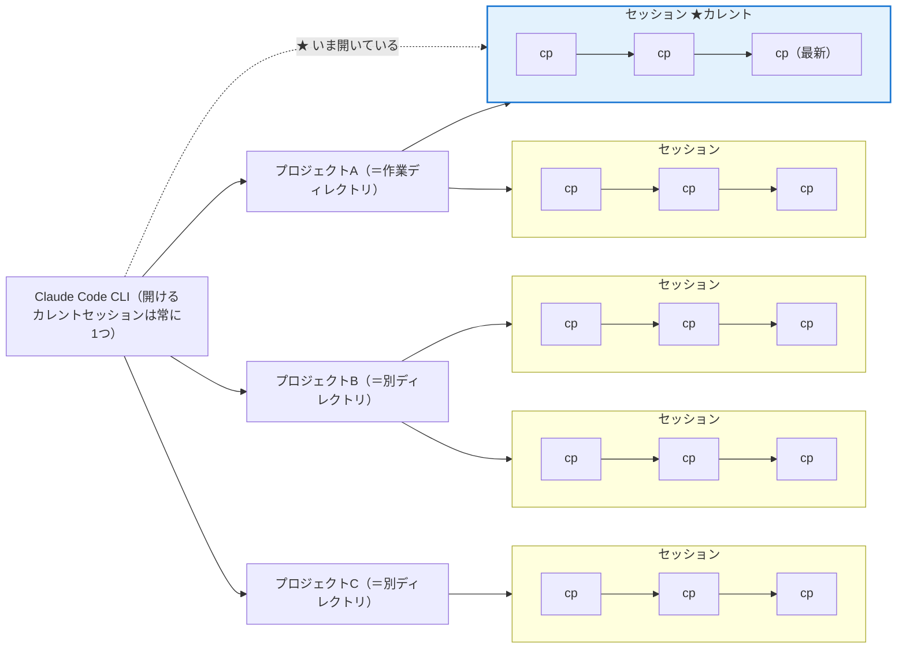

## 何を切り替えるか

`/rewind`・`/resume`・`/branch`・`/cd` などいずれも「切り替える」機能ですが、切り替えている対象は以下のとおりです。

| 機能 | 何を切り替えるか | 補足 |
| --- | --- | --- |
| `/rewind` | 同一セッション内の**位置**（時間軸） | チェックポイントへ巻き戻す。戻った部分より先の未来は消える（rewind のみで forward はできない） |
| `/resume` | **開くセッション**（既存の別セッションへ移動） | 新しいセッションは作らず、その会話の続きから再開する。既定は現在のプロジェクト |
| `/branch` | **開くセッション**（現在をコピーした新セッションへ） | 元セッションは凍結保存され、`/resume` で戻れる |
| `/cd` | **所属プロジェクト**（作業ディレクトリ）を移動 | OS の `cd` に相当。同じセッションのまま別プロジェクトへ移り、以後 `/resume` に並ぶのは移動先プロジェクトのセッション |
| `/fork` | 切り替えない（**実行主体が増える**） | 会話を継承したサブエージェントを裏で並走。メインはその場に留まる |
| 名前付きサブエージェント | 切り替えない（**実行主体が増える**） | 会話を継承せず起動し、要約だけが返る |
| `/btw` | 切り替えない（**覗くだけ**） | 会話を参照するが結果は破棄（`f` でフォーク可） |

要するに、動くのは *セッション内の位置*（`/rewind`）・ *開くセッションそのもの*（`/resume`・`/branch`）・ *所属プロジェクト*（`/cd`）のいずれかで、`/fork`・名前付きサブエージェント・`/btw` はそもそも何も切り替えず、別の実行主体を増やす（または覗く）だけです。

言いかえると、`/rewind` はセッションの**中**（チェックポイント間）、`/resume`・`/branch` はプロジェクトの**中**（セッション間）、`/cd` はその**外**（プロジェクト間）を動きます。

この地図を手に、以降は各コマンドを個別に見ていきましょう。

## /rewind：一本道を戻る

`/rewind`（または入力が空の状態で Esc 二度押し）は、セッション内のチェックポイントに戻る機能です。チェックポイントはプロンプトを送るたびに自動生成され、手動で作るものではありません。メニューには送信したプロンプトの一覧が並び、戻りたい地点を選び、「コードと会話を復元」「会話のみ」「コードのみ」など復元したい内容を選びます。

チェックポイントは**セーブポイント**で、編集前のコード状態を自動で控えています。「コードを復元」を選べば、その地点以降に Claude が **Edit／Write などの編集ツールで加えたファイル変更を一括で巻き戻せます**。バグを入れた、方針を間違えた、というときに編集前の状態へ一気に戻れる安全網です。


:::message

巻き戻せるのは Claude の編集ツール（Edit／Write など）による変更だけです。`rm`／`mv`／`cp` のような **Bash コマンドが行ったファイル変更や、Claude の外での手動編集は追跡されず、rewind では戻せません**。チェックポイントはセッション内の「ローカル undo」であって、git のような恒久的な履歴管理の代わりにはなりません（[checkpointing](https://code.claude.com/docs/en/checkpointing)）。

:::

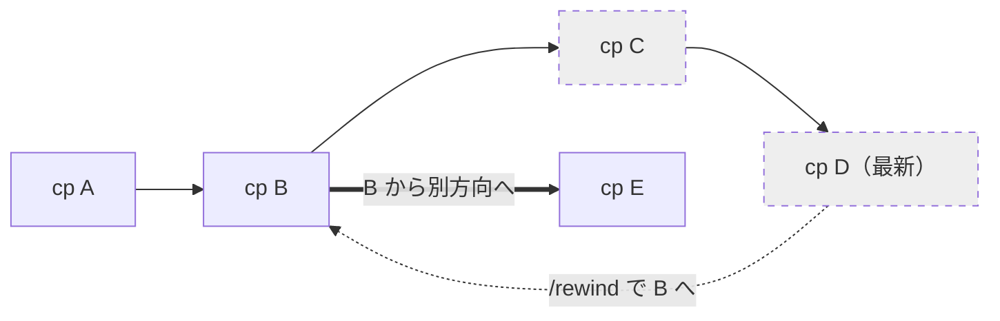

cp A → cp B → cp C → cp D と進み、`/rewind` で B に戻ったとき、その時点で C・D は消えて二度と戻せません（forward や redo に当たる操作はありません）。あとは B から別方向（E）へ進めるだけで、いったん消えた世界線は復元できない——これが「一本道」たるゆえんです。


:::message
なお、Esc 単押し／Ctrl+C で「実行の中断」を行えますが、この場合は`/rewind` で可能なチェックポイントへのファイルの復元は行なわれません。中断しても自動ではロールバックされず、完了済みの Edit／Write 変更は残ります（[公式](https://code.claude.com/docs/en/interactive-mode)：「cancels the in-flight action, keeps everything it had already done」）。実行途中だった編集は適用されないため半端に壊れたファイルにはなりませんが、複数ファイルにまたがる変更が**一部だけ適用された状態**にはなり得ます。戻すには `/rewind`（コードを復元）か `git` を使います。中断時の自動保護はなく、確認ダイアログ追加の要望も "not planned" として見送られました（[claude-code#17505](https://github.com/anthropics/claude-code/issues/17505)）。
:::

## /resume：保存済みの会話を選んで開き直す

`/resume` は、過去に保存された既存のセッションを選んで開き直すコマンドです。セッションはプロジェクト（作業ディレクトリ）ごとに保存されており、実行すると**既定では現在のプロジェクトのセッション**がピッカーに一覧表示され、選んだものをそのまま再開します（`Ctrl+A` で全プロジェクト、`Ctrl+W` で同一リポジトリの全 worktree へ一覧を広げられます）。`/rewind` が同じセッションの中をチェックポイント単位で行き来するのに対し、`/resume` は開いているセッションそのものを別のものへ切り替えます。

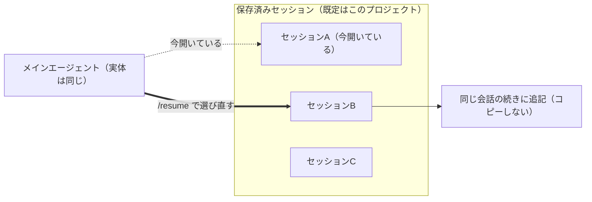

ポイントは、**新しいエージェントもセッションも作らない**ことです。メインエージェントはそのまま、開いている会話を既存の別セッションへ差し替えるだけで、再開後の発言はコピーではなく**その会話の続きにそのまま書き足され**ます。これが次節の `/branch`（履歴をコピーして新しいセッションを作り、元は凍結保存する）との決定的な違いです。git でいえば、`/branch` が今の状態をコピーして新ブランチを切る `git checkout -b`、`/resume` は既存のブランチへ移る `git checkout <既存ブランチ>` にあたります。

セッション内の `/resume` のほか、起動時にも指定できます。`claude --resume`（`-r`）はピッカーを開き、`claude --resume <名前>` は名前付きセッションを直接開きます。`claude --continue`（`-c`）は、そのディレクトリの直近セッションを自動で再開します（[sessions](https://code.claude.com/docs/en/sessions)、[how-claude-code-works](https://code.claude.com/docs/en/how-claude-code-works)）。

## /branch：会話そのものを枝分かれさせ、自分が乗り移る

`/branch` は、その時点までの会話をコピーした独立した別セッションを作り、**メインエージェントがそこへ移動します**。新しいエージェントは生まれず、同じメインエージェントが開くセッションを乗り換えるだけです。元のセッションは維持され、`/resume`で選択しなおせます。前節の `/resume` が既存のセッションへそのまま移るのに対し、`/branch` は現在の会話を**コピーしてから**新しいセッションへ移ります。

なお、ブランチという名称から枝わかれに感じるかもしれないし、論理的にはそのとおりなのですが、

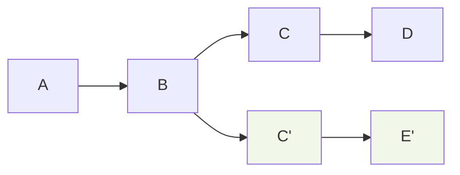

/branchをすると実際には以下のようにセッション全体がコピーされます。

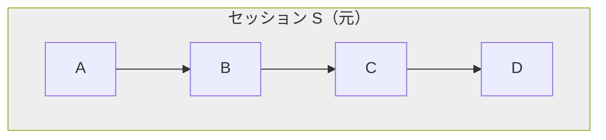

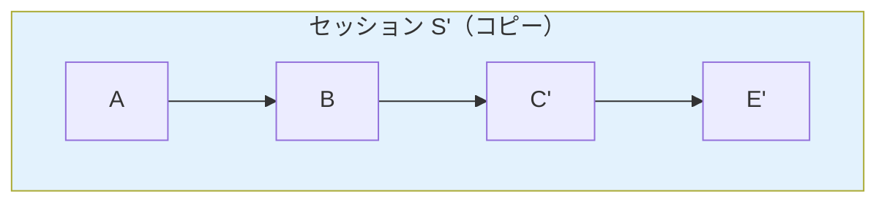

元セッション S はそのまま残り、分岐後は S と S' が別セッションになります。したがって `/rewind` の対象も各セッション内で独立です。S' 側で `/rewind` すれば S' の履歴を戻し、元側は `/resume` してから `/rewind` すれば S 側を戻せ、互いに干渉しません（[checkpointing](https://code.claude.com/docs/en/checkpointing)、[sessions](https://code.claude.com/docs/en/sessions)）。

`/branch`は`/resume`と組合せて使うもので、`/branch`は「戻るための準備」になります。ここで `/branch` を使わず進んでしまうと、何が起きるでしょうか。

* **2回後戻りして比較できない**。試した案1がダメだと分かって案2を試しいとき、`/rewind` で巻き戻ると案1の履歴が消えてしまいます。試しの履歴をセッションとして保存するために `/branch` をする必要があります。そうすればあとで案1には`/resume` で戻れます。

* **コンテキストが汚れる、無駄に消費する**。案1、案2を同じセッシ\`ョンでつづけることもできるかもしれませんが、失敗した案の議論、捨てたコード、行き止まりのエラーが会話に残り、以後のメインエージェントの判断材料に混ざります。望まない参照を誘発したり、肝心の本筋の推論を引きずったりする原因になり得ます。それだけでなく、捨てるはずの試行錯誤が有限のコンテキストウィンドウを食い潰すのも痛手です。本筋に使えるはずだったトークン枠が行き止まりの探索で埋まり、早期の compact や要約を招いて、かえって本筋の文脈が削られます。

* **積み上げた良質な文脈を失う、使い回せない**。せっかく練り上げた「分かれ道の直前」の状態は、片方の案で上書きすると二度と同じ起点に戻れません。複数案の共通の出発点として再利用することもできません。

要するに、メインで突っ込むと「捨てるコスト」と「汚染コスト」を本筋が払うことになります。これを避けたいからこそ、「ここは分岐すべき地点か？」という選択が効いてきます。`/branch` は、その分かれ道を別セッションに退避してから進む手段です。

この違いは、`/rewind` と `/branch` の進み方を並べると見えてきます。`/rewind` はセッションを1本に保ち、履歴を巻き戻して別方向へ進みます（B に戻ると、その先にあった C 以降の世界線は消えて戻せません）。`/branch` はセッションそのものをコピーして増やし、残したどのセッションへも `/resume` で行き来できます。

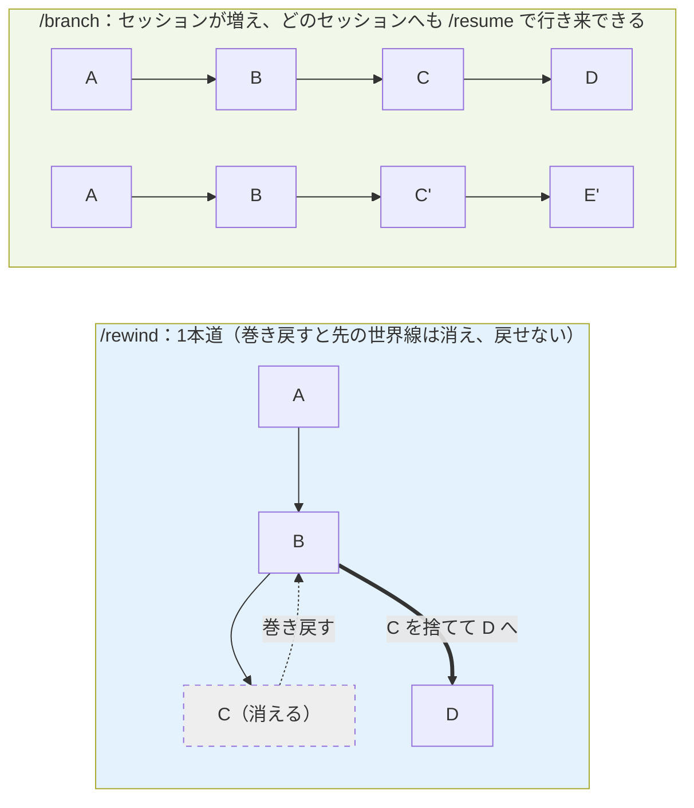

具体的なユースケースはこうです。

* **方針の二択で迷ったとき**。40 メッセージ進んだ地点で「Redis でキャッシュか、クエリ最適化か」。従来は片方に賭けるしかありませんでしたが、ブランチなら片方を枝で試し、ダメなら元に戻ってもう片方を試せます。

* **リスキーな変更の前**。大規模リファクタや実験的アイデアを枝で試し、失敗してもメインは無傷です。

* **同じ出発点から複数案を比較**。要件説明済みの地点から枝を分けるので、各案に状況を説明し直す必要がありません。

* **練り上げた文脈のテンプレート化**。プロジェクト理解や規約を積み上げた良質なコンテキストを、何度も分岐の起点として再利用できます。

* **探索的デバッグ**。仮説 A の枝、仮説 B の枝と分けて独立に検証し、有望だった枝の結論だけ持ち帰れます。

:::message
**コツ：分岐点に「マーカー」プロンプトを置いておく**

ブランチのあと、`/rewind` で戻ってくるときには送信したプロンプトの一覧が並ぶので、`/branch`する直前に `echo '===== ここでいくつかの実験をする ====='` のような**目印になるプロンプト**を 1 つ送っておくと、戻りたいチェックポイントをメニュー上で見つけやすくなります。
:::

### セッションは増え、ピッカーでは root 配下にまとまる

ブランチするたびに、独自のセッション ID を持つセッションが一つ増えます。3 回分岐すれば元＋枝3つ＝4セッションです。散らからないよう、`/branch`、`/rewind`、`--fork-session` で作られたセッションはセッションピッカー上で root（最上位の元セッション）の下にグループ化され、展開して見られます（[sessions](https://code.claude.com/docs/en/sessions)）。

### 分岐したとき、チェックポイントはどうなるか

`/branch` はチェックポイントを**マージしたり共有したりする機能ではありません**。やっていることは「現在までの会話履歴をコピーして、新しいセッション ID に乗り移る」だけです。

つまり、`/branch` が分けるのは会話履歴だけで、**Git worktree や作業ディレクトリは自動コピーされません**。同じ checkout 上で branch 側を進めてファイルを編集すると、元セッションに戻ったときも作業ツリーは編集後の状態です。会話は分かれても、ファイル空間は分かれないのです。コード状態まで独立させたいなら、Git worktree を併用するのが正道です。

## /fork：途中経過でコンテキストを汚さずにバックグラウンドで作業

ここまでの `/rewind`・`/resume`・`/branch` は、どれも「開く対象（セッション内の位置か、開くセッションそのもの）を切り替える」操作でした。`/fork` は毛色が違います。自分はその場に残したまま、会話を丸ごと引き継いだ分身（サブエージェント）を一つ**増やす**操作です。

`/fork` は、現在の会話をそのまま継承したサブエージェント（フォーク）をバックグラウンドで起動するコマンドです。

ポイントは、**フォークしても自分はメイン会話から離れない**ことです。フォークはプロンプト入力欄の下のパネルに表示され、裏で並行して動きます。その間、こちらはメインセッションでそのまま作業を続けられます。フォークが完了すると、最終結果だけがメッセージとしてメイン会話に届きます。

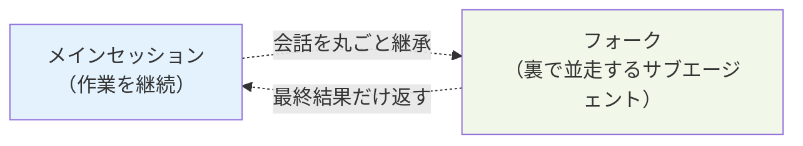

たとえば以下のように別作業を実行するために`/fork`を使えます。

```text
/fork これまでのパーサ変更に対するユニットテストを下書きして
```

フォークは起動時点の会話履歴、システムプロンプト、ツール、モデルをすべて親から継承します。一方で、フォーク自身のツール呼び出しはメインの会話には混ざらず、メインのコンテキストウィンドウはきれいなまま保たれます。名前の由来そのままに、OS の `fork()`（親プロセスのメモリ空間をコピーして子プロセスを作るシステムコール）に近い発想です。システムプロンプトとツール定義が親と同一なので、最初のリクエストは親のプロンプトキャッシュを再利用でき、同じ文脈を必要とするタスクなら（親のコンテキストをコピーしない）名前付きサブエージェントより安く済みます。

実行中のフォークは、プロンプト入力欄の下にパネルとして表示されます。


このパネルで管理できます。矢印キーで選択、Enter でトランスクリプトを開いて追加指示、`x` で停止や削除、Esc でメインの入力欄へ戻る、という操作が可能です。「フォークから戻る」操作が必要になるのは、自分から覗きに行ったときだけです。

なお、フォークはさらにフォークを生むことはできません（フォーク以外のサブエージェントは生成可能で、それらは深さ制限にカウントされます）。

## /btw：コンテキストを一切汚さずに質問する

`/btw` は、会話の本筋を汚さずにサイド質問を投げるコマンドです。これも独立した推論パスを並行に走らせる点で「分身」の仲間です。バックグラウンドで動作する点でサブエージェントに似ていますが、サブエージェントがツールを持ち、会話の履歴を引き継がないコンテキストから始まるのに対し、`/btw` はツールをもたず、会話全体を引き継ぎます。

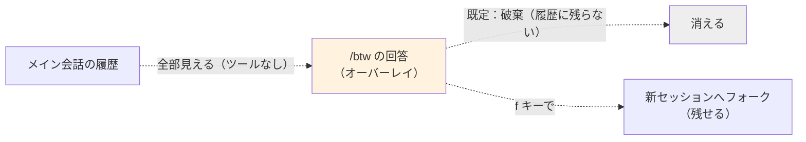

|       | 起動時の文脈                     | ツール          | 結果の扱い              |
| ----------- | -------------------------- | ------------ | ------------------ |
| /btw        | 会話を全部見る                    | なし           | 破棄（ただし `f` でフォーク可） |
| 通常のサブエージェント | 会話履歴は継承しない（CLAUDE.md 等は読む） | 既定は継承、定義で制限可 | 結果がメインに返る          |
| /fork       | 会話を全部継承                    | フル           | 最終結果がメインに返る        |
| /branch     | 会話を全部継承                    | フル           | 別セッションとして残る        |

 違いは、サブエージェント呼び出しや/forkは、呼び出し側のトランスクリプトに「ツール呼び出し＋結果」という記録が残ります。一方 `/btw` は、公式の [Interactive mode](https://code.claude.com/docs/en/interactive-mode) によれば、質問と回答は消せるオーバーレイに表示されるだけで**メインの会話履歴には入りません**。また、/btwはツールを呼び出せません。`/btw`は、コンテキストを汚さないという目的を`/fork`よりもさらに徹底したものだと言えるでしょう。

もっとも、`/btw`でも「答えを履歴に持ち込めない」わけではありません。公式の [Interactive mode](https://code.claude.com/docs/en/interactive-mode) によれば、回答オーバーレイで `f` を押すと、親会話と BTW の質問と回答を実トランスクリプト化した新しいセッションへフォークできます（この「フォーク」は裏で並走する `/fork` ではなく、`/branch` のように新セッションへ移る動きです）。BTW の答えを残したいときは、この `f` でのフォークか、重要と分かった時点で通常プロンプトで聞き直して履歴に入れる、が現実解です。あるいは`c`で結果をクリップボードにコピーすることもできます。

## サブエージェント：コンテキストは基本的には共有せずバックグラウンドで動作

サブエージェントとは「Agent ツールで起動され、隔離されたコンテキストで動き、結果を返すワーカー」です（[v2.1.172 以降](https://code.claude.com/docs/en/sub-agents#spawn-nested-subagents)はサブエージェント自体を深さ5まで入れ子にでき、フォークだけはフォークを生めません）。`/fork`の背景にあるものです。

 `/subagent` というスラッシュコマンドは存在せず、サブエージェントを使う手段は三段階あります。

1. **自然言語**（「サブエージェントで実行して」）：ヒントであって保証ではありません。Claude が委譲プロンプトを書き、まっさらなサブエージェントが起動し、要約だけが返ります。会話の文脈は自動では渡らないので、文脈依存のタスクは依頼文に必要情報を明記するか、フォークを使います。
2. **@メンション**（`@agent-名前`）：特定のサブエージェントが必ず1タスク走ることを保証します。
3. **`--agent`** **フラグ**：これは委譲ではなく、起動時にメインセッション自体をそのエージェントとして動かす CLI オプションです。エージェントのシステムプロンプトが既定のものを置き換え、再開時も引き継がれます。プロジェクトの settings に書けば既定にもできます。

サブエージェントは、コンテキスト、システムプロンプト、ツール、モデルで構成されます。この構築方法は以下のとおりでう。

* **定義から構成する**（名前付き／general-purpose）：自分の定義ファイルの設定を使います。ここで言う「隔離」は、会話の履歴、このセッションで読んだファイル、既に呼んだスキルを引き継がないという意味で、完全な無の状態ではありません。初期コンテキストには、エージェントのプロンプトや委譲プロンプトのほか、CLAUDE.md やメモリ階層、`git status`（親セッション開始時点のスナップショット）、エージェント定義の `skills` に指定された事前ロードスキルなどが入ります（例外的に Explore や Plan などは CLAUDE.md や git status の一部をスキップします）。ツールは `tools` を省略すれば親から継承し、定義に書けば制限できます。

* **親から丸ごと継承する**（フォーク）：会話履歴、システムプロンプト、ツール、モデルを親からコピーし、プロンプトキャッシュも共有します。

つまり`/fork`も名前つきサブエージェントもサブエージェントの起動構成の一種です（[sub-agents](https://code.claude.com/docs/en/sub-agents)）。一方 `/btw` は、独立した推論パスを走らせる点で動きこそ似ていますが、前節で見たとおり出力がトランスクリプトに残らず、サブエージェントには含まれません（サブエージェント機構とは別のコードパスが示唆されています）。

## 動的ワークフロー： オーケストレーション処理コードを動的生成

**動的ワークフロー**は、Claude がオーケストレーション用スクリプトを生成し、多数のサブエージェントを走らせる仕組みです。ループや分岐、中間結果はスクリプト側が保持し、Claude のコンテキストには最終的な答えだけが残ります。同時実行には上限があり（[公式ドキュメント](https://code.claude.com/docs/en/workflows)では最大 16 並列、1 run あたり合計 1,000 エージェント）、「無制限に並列」ではない点に注意してください。なお、ここで出てくる「分岐（branching）」はスクリプト内の制御フロー（if やループ）のことで、`/branch` とは無関係です。

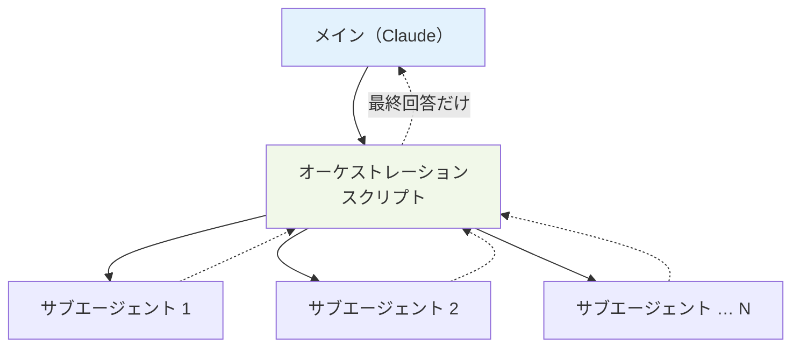

整理すると、`/fork` は会話を継承した分身を裏で走らせるプロセス生成、動的ワークフローは会話を継承しないワーカーを多数 `spawn` してファンアウトさせる編成です。前者は探索と実験の保存、後者は大規模並列処理（コードベース全体のバグ掃討、数百ファイルの移行など）に向いています。

## エージェントチーム：「枝分かれ」ではなく「対等な協調」(実験的)

ここまで見てきた機能は、どれも**一つのメインエージェントが主役**でした。`/fork` も動的ワークフローも、起動するのはメインに従属するワーカーで、結果はメインへ吸い上げられます。OS でいえば、親プロセスが子プロセスを `fork` や `spawn` で作って使う構図です。

これに対して **エージェントチーム（Agent teams）** は、まったく別のカテゴリに立ちます。公式ドキュメント（[agent-teams](https://code.claude.com/docs/en/agent-teams)）によれば、エージェントチームは複数の Claude Code インスタンスを協調させて働かせる仕組みです。一つのセッションが「チームリード」として作業を割り振り、統合し、各「チームメイト」はそれぞれ独立したコンテキストウィンドウで動き、互いに直接やり取りします。ここが決定的に違います。

> Agent teams let you coordinate multiple Claude Code instances working together. One session acts as the team lead... Teammates work independently, each in its own context window, and communicate directly with each other.
>
> — Anthropic 公式ドキュメント「[Orchestrate teams of Claude Code sessions](https://code.claude.com/docs/en/agent-teams)」より（拙訳：エージェントチームは複数の Claude Code インスタンスを協調動作させる仕組み。一つのセッションがチームリードとなり…各チームメイトはそれぞれ独立したコンテキストウィンドウで動き、互いに直接通信する）

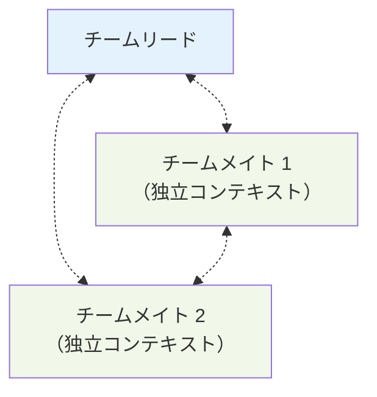

サブエージェントとの違いを並べると、こうなります。

|  | サブエージェント／動的ワークフロー        | エージェントチーム                  |
| ------ | ------------------------ | -------------------------- |
| 関係     | メインに従属するワーカー             | 独立セッション同士が対等に協調            |
| 通信     | メインへ結果を返すだけ（横の通信なし）      | チームメイト同士が直接通信し、共有タスクリストで調整 |
| 結果の行き先 | 要約がメインに集約される             | 各自のセッションに残り、リードが統合         |
| OS の比喩 | プロセス生成（`fork` や `spawn`） | プロセス間通信（IPC）やマルチプロセス協調     |

エージェントチームは、横に並んだ対等なプロセスが通信し合う、もう一段上の構図です。「枝分かれ」の延長線上ではなく、`fork` に対する IPC のような別レイヤーだと捉えるのが正確です。

ただし現状は実験的機能で、`CLAUDE_CODE_EXPERIMENTAL_AGENT_TEAMS=1` での明示的な有効化が必要です（v2.1.32 以降）。トークンコストは独立セッションぶん高く、`/resume` や `/rewind` では in-process のチームメイトが復元されない、同時に動かせるチームは一つ、チームメイトはさらにチームメイトを生めない（入れ子チーム不可）、といった[既知の制約](https://code.claude.com/docs/en/agent-teams#limitations)も公式に挙げられています。使いどころは、複数の探索を対等に並走させる価値が大きい場面（大きめのリファクタを分担、独立した複数仮説の調査など）です。

:::message
**コラム：シェルスクリプトに当たるのは何か**

ここまで Claude Code を OS になぞらえてきました。エージェントはプロセス、コンテキストは作業メモリ、セッションはディスク上のファイル、というのが冒頭の対応でした。同じ目線をもう少し延ばすと、プロンプトを打ち込む入力欄はコマンドライン、セッションに積み上がるプロンプトの並びはコマンド履歴（ヒストリ）に当たります。ところで、この対応表にはまだ空きが残ります。シェルスクリプトに当たるものは何でしょうか。

シェルスクリプトがコマンドラインの定型部分をまとめて再利用するものであるのと同様に、**Agent Skill** はプロンプトの再利用と部品化のためのしくみです。プロンプトが自然言語のコマンドラインなら、その並びを名前（とトリガー）で呼べる単位に固め、引数（`args`）を取り、複数のツールやサブエージェント（プロセス）を呼んで組み合わせるのがスキルです。SKILL.md は、自然言語で書かれた実行可能な手順書だと言えます。PATH の代わりに `description` で発見され、状況に合致すると発火します。

ただし、重ねているのは役割であって、実行のしかたではありません。シェルスクリプトもスキルも、それ自体が実行の主体ではなく、プロセスやサブエージェントの上で動く手順だからです。だからこそ、どちらも「手で繰り返す操作を、名前のついた部品にまとめる層」として同じ場所に立ちます。
:::

## まとめ：OS として見ると全部つながる

各機能を OS の用語に対応づけると、こうなります。

| 機能                    | OS でいうと                               | 何が起きるか                    |
| --------------------- | ------------------------------------- | ------------------------- |
| /rewind               | `git reset`（戻った先からは元の枝に戻れない）          | 同一セッション内のチェックポイントへ戻る      |
| /resume               | `git checkout <既存ブランチ>`（既存の保存先へ切り替える） | 既存の別セッションを開き直す            |
| /branch               | `git checkout -b`（履歴をコピーして新ブランチ）      | メインが別セッションへ乗り移る（元は残る）     |
| /cd                   | `cd`（別リポジトリ＝別作業ディレクトリへ）             | 同じセッションのまま所属プロジェクト（作業ディレクトリ）を移す  |
| /fork                 | `fork()`（親のメモリをコピーした子プロセス）            | 会話を継承した分身が裏で並走し、結果がメインに返る |
| /btw                  | プロセスではない別パス                           | 会話を見て答えるが、履歴には残さない        |
| 名前付き／general サブエージェント | `posix_spawn`（定義から新規プロセス）             | 会話は継承せず、要約がメインに返る         |
| 動的ワークフロー              | プロセスを多数 `spawn` するスクリプト               | ワーカーをファンアウトし、最終回答だけ残る     |
| スキル                   | シェルスクリプト（名前で呼ぶ再利用可能な定型手順／必要時にロード）     | 関連する場面でロードされ、専門の手順や知識をその場で与える |
| エージェントチーム（実験的）        | マルチプロセスとプロセス間通信（IPC）                  | 対等なセッションが直接通信し、リードが統合     |

OS の機能に対応づけてしまえば、似た名前の機能群は迷わず使い分けられます。探索を保存するなら `/branch`、片手間の並行作業なら `/fork`、即席の確認なら `/btw`、隔離した評価ならフレッシュなサブエージェントとクリーン環境。OS の地図を一枚持っておけば、役割が重なって迷うことはありません。

以上、自分の整理をかねてまとめてみました。間違いや過不足あればコメントなどでご指摘いただけますと幸いです。
では良きClaude Codeライフを!

***

注：本記事の内容は 2026 年 6 月時点の Claude Code v2.1.175 の挙動と公式ドキュメントに基づきます。動的ワークフローは研究プレビュー、`/btw` の内部実装は非公式解析に基づく部分があり、キー操作などは実機観察を含むため、利用時は最新の公式ドキュメントとご自身のバージョンでの確認を推奨します。
