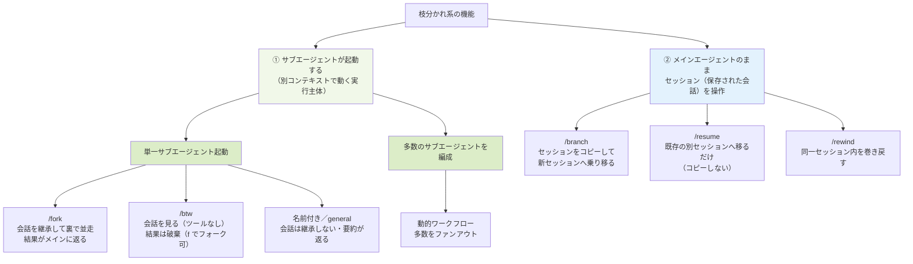
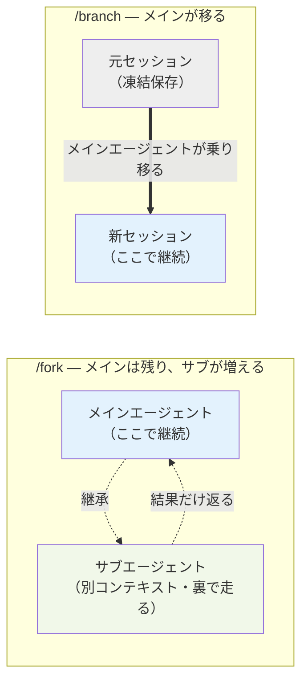
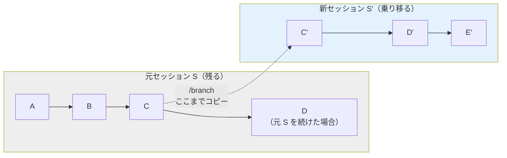
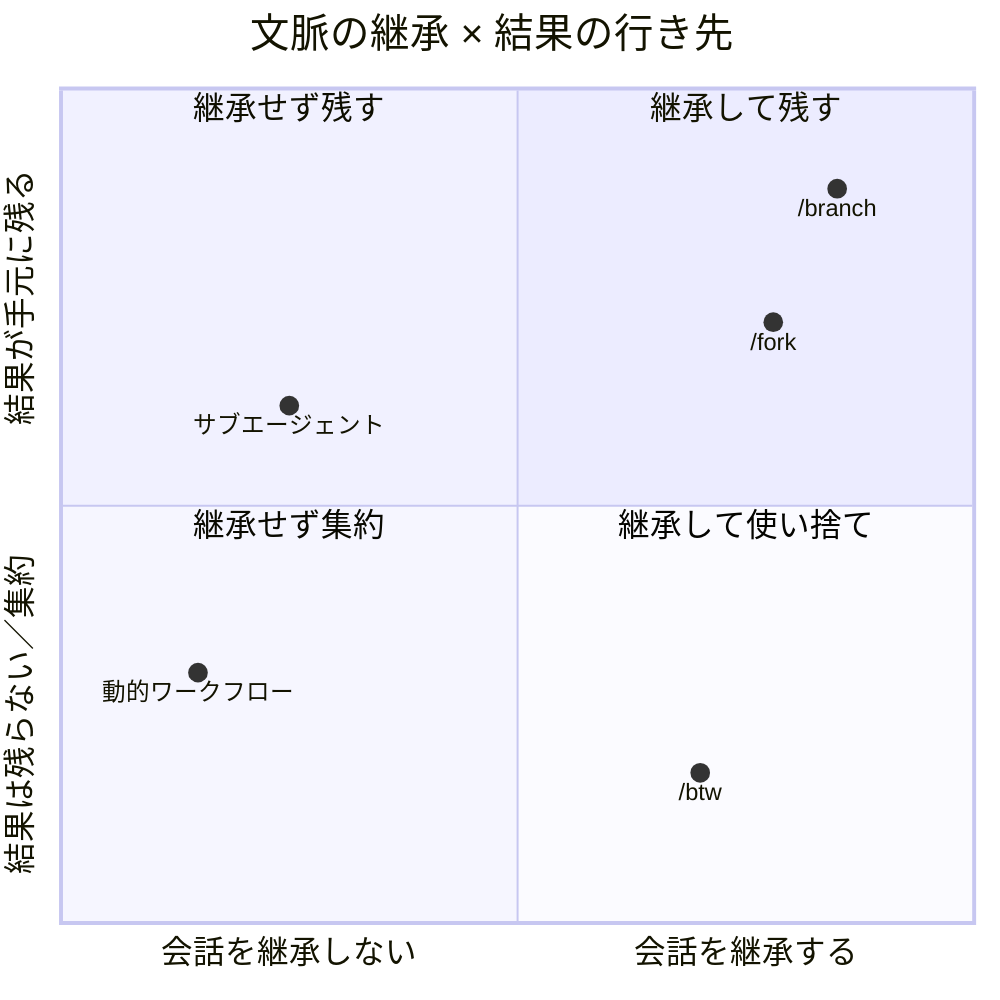

:::message
本記事の内容は筆者個人の見解であり、所属する会社を代表するものではありません。
記述は執筆時点のClaude Codeの最新版に基づいています。
:::

## TL;DR

- 「枝分かれ」系機能（`/fork`、`/branch`、`/rewind`、`/btw`、サブエージェント、動的ワークフロー）は、「**どのコンテキストで起動するか**」×「**結果がどこへ行くか**」の二軸でほぼ説明できます。
- `/fork`＝会話を継承した分身を裏で並走（結果が返る）、`/branch`＝会話をコピーして別セッションへ乗り移る、`/rewind`＝同一セッション内の巻き戻し、`/btw`＝会話を見るが結果は残らない。
- `/fork` と名前付きサブエージェントは**実体が同じ「サブエージェント」**で、違いは起動オプション（継承するか、定義から構成するか）だけ。また `/btw` は似て非なる別物です。

## はじめに

NTTテクノクロスの上原です。最近、マンダロリアン アンド グローグーを見てつぶらな瞳のグローグーにぞっこんです。

さて、Claude CodeなどのAIコーディングアシスタントでプロンプトを契機として実行する処理は、基本的にエージェントもしくはサブエージェントという単位になっていることはご存知でしょう。また、最近は明示的な指示をしなくても、適切なサブエージェント群が協調動作をおこなったり、バックグラウンドにまわって処理を継続したり、まちあわせたりしています。これはOSにおけるプロセスの動作に似ています。

AIエージェントが OS に似てきているのは、不思議なことではありません。OS とは突き詰めれば抽象的な概念で、その上で動くアプリに対して基本機能や共通機能を提供するものだからです。記述の基本単位がコンテナになれば、コンテナのための分散 OS が必要になり、それが Kubernetes でした。同じように、「AIアプリ」としてのエージェントを駆使する時代において、**Claude Code のコアはエージェントのための OS** だと捉えると、その機能群が一気に見通しよくなります。

われわれが日々やっている「ハーネスエンジニアリング」というのは、AIアプリを開発しているということなのです。開発対象のアプリを作り、検証し、その品質を見極めるためのシステムをAIアプリとして開発しているのです。Claude Code はそのAIアプリを対話的に動作させるための OS なのです。

だから、いままで人間が行なっていたコーディング作業や設計作業が、AI にいやおうなく巻きとられていく昨今、エンジニアに残る重要スキルのひとつは「この OS を知り尽くして使いこなすこと」です。AI エージェント自身もそれを自動的にやり始めてもいますが、要点は変わりません。だからこそ、Claude Code を OS になぞらえて理解する価値があります。

その Claude Code には、会話やタスクを「枝分かれ」させる機能がいくつもあります。`/fork`、`/branch`、`/rewind`、`/btw`、サブエージェント、動的ワークフローなど。名前が似ていたり、内部でつながっていたりして、初見では関係がつかみにくいのではないでしょうか。

この記事では、これらを「**起動時にどのコンテキストを持つか**」と「**結果がどこへ行くか**」という二つの軸で、OS のプロセス生成や git の比喩を交えながら解きほぐしていきます。結論を先に言うと、見た目はバラバラなこれらの機能は、ほぼこの二軸の組み合わせで説明できます。

## まず、エージェントとセッションとコンテキストを分ける

機能の整理に入る前に、土台となる3つの基本用語について説明しておきます。

- **エージェント**：実際に推論を回す実行の主体。メインで応答している Claude も、裏で走るサブエージェントも、それぞれ1つのエージェントです。
- **セッション**：ファイルに永続する会話の保存単位。会話履歴やチェックポイントが積まれ、固有のセッション ID を持ち、あとから `/resume` で開き直せます。
- **コンテキスト（コンテキストウィンドウ）**：エージェントが推論時に見ている揮発的な作業メモリ。今まさにモデルの入力に載っているトークンの集合で、セッションのように ID を持って保存されるものではありません。中身は会話履歴だけではありません。システムプロンプト、ツール定義、ハーネス（Claude Code 本体）が注入する情報（CLAUDE.md、メモリ、`git status`、内部指示としての `<system-reminder>` など）も合わせてコンテキストに載ります。

セッションは「ディスクに追記される会話ログ」、コンテキストは「いまエージェントの頭の中にある作業領域（会話履歴＋システムプロンプト＋ハーネス注入情報）」。1つのセッションを開いて作業すれば、その会話履歴がコンテキストの一部として載りますが、コンテキストにはそれ以外の注入情報も含まれます。

OS でたとえるなら、エージェントはプロセスやスレッド（実行主体）、コンテキストはそのプロセスが使っている作業メモリ、セッションはディスクに保存されたファイル、という対応です（あくまで直感のための比喩で、厳密な実装ではありません）。

| 概念 | 役割 | OS の比喩 |
|---|---|---|
| エージェント | 推論を回す実行主体 | プロセスやスレッド |
| コンテキスト | 推論時の揮発的な作業メモリ | 作業メモリ（RAM 上の領域） |
| セッション | 永続する会話の保存単位 | ディスク上のファイル |

:::message
**コラム：サブエージェントは OS のスレッドで実行されるのか**

表ではエージェントを「プロセスやスレッド」と並べましたが、OS ではこの二つは別物です。サブエージェントはどちらに近いのでしょうか。

両者の分かれ目は、メモリ空間を共有するかどうかにあります。スレッドは同じプロセスの中でメモリ（アドレス空間）を共有し、グローバル変数やヒープを互いに覗けます。プロセスは独立したメモリを持ち、相手の中身は見えません。

この物差しを当てると、サブエージェントはプロセスに当たります。各サブエージェントはメインとは別の独立したコンテキストで動き、そのコンテキスト（メモリにあたるもの）を共有しないからです。`/fork` ですら共有ではなく起動時点のコピーを持ち、結果は要約として返ります。どちらも、共有メモリの読み書きではなく、プロセス間のやり取りに近い形です。

ただし、実装上の「実行」と、比喩としての「分離」は分けて考える必要があります。サブエージェントは、おそらく一つの Claude Code プロセスの中で、OS のスレッドや非同期タスクとして並行に走っています。その意味でなら「スレッドで実行される」と言えなくもありません。それでも本記事がプロセスになぞらえたのは、スレッドの核心であるメモリ共有が、サブエージェントには無いからです。動かす機構ではなく、何を共有しないかで見たとき、サブエージェントはスレッドではなくプロセスなのです。
:::

この3つを踏まえると、枝分かれ系の機能は次の2つに大別できます。

- **メインエージェントのまま、セッション（保存された会話）を操作する**：`/branch`、`/resume`、`/rewind` がこちら。新しい実行主体は生まれず、メインエージェントがどのセッションを開くか、その中のどの地点に戻るかを変えます。
- **メインとは別のサブエージェント（独立した実行主体）を起動する**：`/fork`、名前付きサブエージェント、動的ワークフローがこちら。サブエージェントはメインとは別の独立したコンテキストで動きます。そのコンテキストの中身が、`/fork` なら親会話のコピー、名前付きなら会話履歴のない状態、という違いです。

:::message
**コラム：①はプロセス生成、②は git で考える**

2つのグループは、それぞれ別のアナロジーで捉えると腑に落ちます。

①（サブエージェント起動）は OS のプロセス生成です。`/fork` は **`fork()`**（親プロセスのメモリ空間をコピーして子を作るシステムコール）に由来する名前で、まさに親のコンテキストを丸ごと複製して持ち出します。一方、名前付きサブエージェントは、親のメモリをコピーせず新しいプロセスを最初から生成する `posix_spawn`（Win32 でいう `CreateProcess`）のようなもので、親のコンテキストは引き継がず、自分の定義に従ってまっさらな状態から立ち上がります。

②（セッション操作）は git です。こちらは新しい実行主体を作らず、保存された履歴を操作するので、git のブランチやチェックアウト操作にきれいに対応します。

| 機能 | git でいうと |
|---|---|
| `/branch` | `git checkout -b`（今の状態をコピーして新ブランチへ移る） |
| `/resume` | `git checkout <既存ブランチ>`（既存の保存先へ切り替える） |
| `/rewind` | `git reset` / `git reflog` で過去のコミットへ戻る |

セッションはディスクに永続する履歴なので、永続性まで含めて表せる git の比喩がしっくりきます。
:::

## 全体像

以上を踏まえて全体像を俯瞰すると、こうなります。まず大きく、**メインとは別のサブエージェント（独立したコンテキストで動く実行主体）が起動するのか**、それとも**メインエージェントのまま、セッション（保存された会話）を操作するだけなのか**で分かれます。



:::message
`/btw` は厳密にはサブエージェントそのものではありません。並列に実行するという「動き」はサブエージェントに近いのですが、機構は異なります。サブエージェントでは起きるはずのフックイベントが発生せず、履歴を共有し、出力を会話履歴に残さないぶんコンテキスト消費を抑えられます。ここでは便宜上「単一サブエージェント起動」グループに並べています。
:::

**① サブエージェントが起動する側**：後述するとおり、サブエージェントとは Agent ツールで起動され、メインとは別の独立したコンテキストで動く実行主体です。`/fork` と名前付きサブエージェントはサブエージェントを1つだけ起動するグループ、動的ワークフローは多数のサブエージェントを編成するグループです（`/btw` は上記の注記のとおり、動きが似ているためここに並べています）。

**② メインエージェントのままセッションを操作する側**：`/branch`、`/resume`、`/rewind` は、新しいエージェントを起動しません。メインエージェントが、どのセッション（保存された会話）を開くか、その中のどの地点に戻るかを変えるだけです。3つの違いはこうです。

- **`/branch`**：現在のセッションをコピーして、新しいセッションへ乗り移る（元は残る）
- **`/resume`**：コピーせず、既存の別セッションを開き直す（開くセッションを切り替える）。新しいエージェントは生まれず、メインエージェント（プロセス）はそのままに、載っている会話（実行イメージ）を既存の別セッションへ丸ごと差し替えます。OS でいえば `exec`（PID は変えずにプログラムイメージを置き換えるシステムコール）にあたり、複製を伴う `/branch`（`fork` 的）と、置換の `/resume` で対をなします
- **`/rewind`**：セッションは移らず、同じセッション内のチェックポイントを行き来する

`/fork` と `/branch` が紛らわしいのは、この①と②をまたぐからです。`/fork` は①にあたり、サブエージェントが1つ起動して裏で走り、メインエージェントはそのまま。`/branch` は②にあたり、メインエージェント自身がセッションを乗り換えるだけで、新しいエージェントは生まれません。

## /fork：会話を丸ごと持った分身を裏で走らせる

`/fork` は、現在の会話をそのまま継承したサブエージェント（フォーク）をバックグラウンドで起動するコマンドです。

ポイントは、**フォークしても自分はメイン会話から離れない**ことです。フォークはプロンプト入力欄の下のパネルに表示され、裏で並行して動きます。その間、こちらはメインセッションでそのまま作業を続けられます。フォークが完了すると、最終結果だけがメッセージとしてメイン会話に届きます。

```text
/fork これまでのパーサ変更に対するユニットテストを下書きして
```

フォークは起動時点の会話履歴、システムプロンプト、ツール、モデルをすべて親から継承します。一方で、フォーク自身のツール呼び出しはメインの会話には混ざらず、メインのコンテキストウィンドウはきれいなまま保たれます。名前の由来そのままに、OS の `fork()`（親プロセスのメモリ空間をコピーして子プロセスを作るシステムコール）に近い発想です。システムプロンプトとツール定義が親と同一なので、最初のリクエストは親のプロンプトキャッシュを再利用でき、同じ文脈を必要とするタスクなら（親のコンテキストをコピーしない）名前付きサブエージェントより安く済みます。

実行中のフォークは、プロンプト入力欄の下にパネルとして表示されます。


このパネルで管理できます。手元の v2.1.175 では、矢印キーで選択、Enter でトランスクリプトを開いて追加指示、`x` で停止や削除、Esc でメインの入力欄へ戻る、という操作になっています。「フォークから戻る」操作が必要になるのは、自分から覗きに行ったときだけです。

なお、フォークはさらにフォークを生むことはできません（入れ子不可）。

## /branch：会話そのものを枝分かれさせ、自分が乗り移る

`/branch` は `/fork` とはまったく違います。

`/branch` は、その時点までの会話をコピーした独立した別セッションを作り、**メインエージェントがそこへ移動します**。新しいエージェントは生まれず、同じメインエージェントが開くセッションを乗り換えるだけです。元のセッションは変更されないまま凍結保存され、`/resume`（実行するとセッションピッカーが開きます）でいつでも戻れます。git で言えば、`/fork` がバックグラウンドジョブ、`/branch` が `git checkout -b` です。



ユースケースの中心は「長い文脈を積み上げたセッションで、引き返せない分かれ道に立ったとき」にあります。

ここで `/branch` を使わず、メインセッションとメインエージェントのまま分かれ道を進んでしまうと、何が起きるでしょうか。

- **2回後戻りして比較できない**。試した案1がダメだと分かって案2を試したとき、`/rewind` で巻き戻ってももう案1の履歴はありません。別の試しが残せるのは `/branch` だけで、`/resume` で何度も戻れます。
- **コンテキストが汚れる、無駄に消費する**。案1、案2を同じセッションでつづけることもできるかもしれませんが、失敗した案の議論、捨てたコード、行き止まりのエラーが会話に残り、以後のメインエージェントの判断材料に混ざります。望まない参照を誘発したり、肝心の本筋の推論を引きずったりする原因になり得ます。それだけでなく、捨てるはずの試行錯誤が有限のコンテキストウィンドウを食い潰すのも痛手です。本筋に使えるはずだったトークン枠が行き止まりの探索で埋まり、早期の compact や要約を招いて、かえって本筋の文脈が削られます。
- **積み上げた良質な文脈を失う、使い回せない**。せっかく練り上げた「分かれ道の直前」の状態は、片方の案で上書きすると二度と同じ起点に戻れません。複数案の共通の出発点として再利用することもできません。

要するに、メインで突っ込むと「捨てるコスト」と「汚染コスト」を本筋が払うことになります。これを避けたいからこそ、「ここは分岐すべき地点か？」という選択が効いてきます。`/branch` は、その分かれ道を別セッションに退避してから進む手段です。

具体的なユースケースはこうです。

- **方針の二択で迷ったとき**。40 メッセージ進んだ地点で「Redis でキャッシュか、クエリ最適化か」。従来は片方に賭けるしかありませんでしたが、ブランチなら片方を枝で試し、ダメなら元に戻ってもう片方を試せます。
- **リスキーな変更の前**。大規模リファクタや実験的アイデアを枝で試し、失敗してもメインは無傷です。
- **同じ出発点から複数案を比較**。要件説明済みの地点から枝を分けるので、各案に状況を説明し直す必要がありません。
- **練り上げた文脈のテンプレート化**。プロジェクト理解や規約を積み上げた良質なコンテキストを、何度も分岐の起点として再利用できます。
- **探索的デバッグ**。仮説 A の枝、仮説 B の枝と分けて独立に検証し、有望だった枝の結論だけ持ち帰れます。

### セッションは増え、ピッカーでは root 配下にまとまる

ブランチするたびに、独自のセッション ID を持つセッションが一つ増えます。3 回分岐すれば元＋枝3つ＝4セッションです。散らからないよう、`/branch`、`/rewind`、`--fork-session` で作られたセッションはセッションピッカー上で root（最上位の元セッション）の下にグループ化され、展開して見られます（[sessions](https://code.claude.com/docs/en/sessions)）。

### 分岐したとき、チェックポイントはどうなるか

`/branch` はチェックポイントを**マージしたり共有したりする機能ではありません**。やっていることは「現在までの会話履歴をコピーして、新しいセッション ID に乗り移る」だけです。



元セッション S はそのまま残り、分岐後は S と S' が別セッションになります。したがって `/rewind` の対象も各セッション内で独立です。S' 側で `/rewind` すれば S' の履歴を戻し、元側は `/resume` してから `/rewind` すれば S 側を戻せます。互いに干渉しません（[checkpointing](https://code.claude.com/docs/en/checkpointing)、[sessions](https://code.claude.com/docs/en/sessions)）。

ただし落とし穴があります。`/branch` が分けるのは会話履歴だけで、**Git worktree や作業ディレクトリは自動コピーされません**。同じ checkout 上で branch 側を進めてファイルを編集すると、元セッションに戻ったときも作業ツリーは編集後の状態です。会話は分かれても、ファイル空間は分かれないのです。コード状態まで独立させたいなら、Git worktree を併用するのが正道です。

## /rewind：一本道を行き来する（複数案の並行管理ではない）

`/rewind`（または入力が空の状態で Esc 二度押し）は、セッション内のチェックポイントに戻る機能です。チェックポイントはプロンプトを送るたびに自動生成され、手動で作るものではありません。メニューには送信したプロンプトの一覧が並び、戻りたい地点を選んで「コードと会話を復元」「会話のみ」「コードのみ」などを選びます。

`/branch` との違いは使いどころにあります。`/rewind` は**1セッション内のチェックポイントを巻き戻す**仕組みで、戻った先から別方向に進めますが、`/branch` のように複数案を並行管理する機能ではありません。複数の仮説を同時に育てたいなら `/branch` で独立セッションに分けることになります。

なお、チェックポイントには**名前を付けられません**。一覧上の識別子は「自分が送ったプロンプトの文面＋タイムスタンプ」です。git タグのような名前付きチェックポイントは現状なく、回避策としては「=== 目印: 認証実装の直前 ===」のような特徴的なメッセージを送って目印にする手があります。

## /btw：答えを使い捨てる、もう一つの「分身」

`/btw` は、会話の本筋を汚さずにサイド質問を投げるコマンドです。これも独立した推論パスを並行に走らせる点で「分身」の仲間ですが、性格は独特で、公式には「サブエージェントの逆」と説明されています。サブエージェントがツールを持つが会話の履歴を引き継がないコンテキストから始まるのに対し、`/btw` は会話全体を見られるがツールを持ちません。

| | 起動時の文脈 | ツール | 結果の扱い |
|---|---|---|---|
| /btw | 会話を全部見る | なし | 破棄（ただし `f` でフォーク可） |
| 通常のサブエージェント | 会話履歴は継承しない（CLAUDE.md 等は読む） | 既定は継承、定義で制限可 | 結果がメインに返る |
| /fork | 会話を全部継承 | フル | 最終結果がメインに返る |
| /branch | 会話を全部継承 | フル | 別セッションとして残る |

ここで面白いのが「では `/btw` の実装はサブエージェントなのか？」という問いです。サブエージェントは `tools` 指定でツールを絞れる（実質ゼロにもできる）ので、「ツールなし」は決定的な区別になりません。本当の分界線は**出力の扱い**にあります。

サブエージェント呼び出しは、呼び出し側のトランスクリプトに「ツール呼び出し＋結果」という構造的エントリとして残ります。返り値がたとえ空文字列でも、呼び出したという事実が履歴に記録されます。一方 `/btw` は、公式の [Interactive mode](https://code.claude.com/docs/en/interactive-mode) によれば、質問と回答は消せるオーバーレイに表示されるだけで**メインの会話履歴には入りません**。同じ「ツールなしのサブエージェント」とは、ここが決定的に違います。

:::message
公式で確認できるのは「`/btw` の回答はメイン会話履歴に入らず、オーバーレイに表示される」ところまでです。「ファイルにも一切残らない」「サブエージェントのライフサイクルフックが発火しない」といった内部挙動は、有志の解析に基づく観察であり、公式には明かされていません（バージョンで変わりうるので、ここは参考程度に）。
:::

ただし「答えを履歴に持ち込めない」わけではありません。公式の [Interactive mode](https://code.claude.com/docs/en/interactive-mode) によれば、回答オーバーレイで `f` を押すと、親会話と BTW の質問と回答を実トランスクリプト化した新しいセッションへフォークできます。BTW の答えを残したいときは、この `f` でのフォークか、重要と分かった時点で通常プロンプトで聞き直して履歴に入れる、が現実解です。

## サブエージェントの正体：「種類」ではなく「起動オプション」

ここまでで「フォークはサブエージェントの一種」と書きたくなりますが、より正確なモデルがあります。ユニットは一つ、サブエージェントです。フォークと名前付きは、その同一ユニットの二つの起動構成にすぎません。

サブエージェントとは「Agent ツールで起動され、隔離されたコンテキストで動き、結果を返し、入れ子不可のワーカー」です。起動時に決まるのは、コンテキスト、システムプロンプト、ツール、モデルという構成の束で、選択肢は二つあります。

- **定義から構成する**（名前付き／general-purpose）：自分の定義ファイルの設定を使います。ここで言う「隔離」は、会話の履歴、このセッションで読んだファイル、既に呼んだスキルを引き継がないという意味で、完全な無の状態ではありません。初期コンテキストには、エージェントのプロンプトや委譲プロンプトのほか、CLAUDE.md やメモリ階層、`git status`（親セッション開始時点のスナップショット）、エージェント定義の `skills` に指定された事前ロードスキルなどが入ります（例外的に Explore や Plan などは CLAUDE.md や git status の一部をスキップします）。ツールは `tools` を省略すれば親から継承し、定義に書けば制限できます。
- **親から丸ごと継承する**（フォーク）：会話履歴、システムプロンプト、ツール、モデルを親からコピーし、プロンプトキャッシュも共有します。

つまり「会話を継承するか否か」はサブエージェントの種別ではなく、launch 時のオプションです。公式ドキュメントは「フォークとは〜を継承するサブエージェントである」と名詞で定義していますが、機能的には呼び出し規約に近いものです（[sub-agents](https://code.claude.com/docs/en/sub-agents)）。`/fork` も名前付きも、この同一ユニット（サブエージェント）の起動構成違いにすぎません。一方 `/btw` は、独立した推論パスを走らせる点で動きこそ似ていますが、前節で見たとおり出力がトランスクリプトに残らず、このユニットには含まれません（サブエージェント機構とは別のコードパスが示唆されています）。

ちなみに `/subagent` というスラッシュコマンドは存在しません。サブエージェントを使わせる手段は三段階あります。

1. **自然言語**（「サブエージェントで実行して」）：ヒントであって保証ではありません。Claude が委譲プロンプトを書き、まっさらなサブエージェントが起動し、要約だけが返ります。会話の文脈は自動では渡らないので、文脈依存のタスクは依頼文に必要情報を明記するか、フォークを使います。
2. **@メンション**（`@agent-名前`）：特定のサブエージェントが必ず1タスク走ることを保証します。
3. **`--agent` フラグ**：これは委譲ではなく、起動時にメインセッション自体をそのエージェントとして動かす CLI オプションです。エージェントのシステムプロンプトが既定のものを置き換え、再開時も引き継がれます。プロジェクトの settings に書けば既定にもできます。

## 動的ワークフローは「会話を継承しない側」

では、より大規模な仕組み（動的ワークフロー）は `/branch` や `/fork` を使うのでしょうか。答えは使いません。これは「会話履歴を継承しないサブエージェント」を多数ファンアウトさせる側に立つ仕組みです。

**動的ワークフロー**（研究プレビュー）は、Claude がオーケストレーション用スクリプトを生成し、多数のサブエージェントを走らせる仕組みです。ループや分岐、中間結果はスクリプト側が保持し、Claude のコンテキストには最終的な答えだけが残ります。同時実行には上限があり（公式ドキュメントでは最大 16 並列、1 run あたり合計 1,000 エージェント）、「無制限に並列」ではない点に注意してください。なお、ここで出てくる「分岐（branching）」はスクリプト内の制御フロー（if やループ）のことで、`/branch` とは無関係です。用語の罠に注意してください。

整理すると、軸は二つあります。`/fork` と `/branch` は「自分の会話スレッドを継承して枝分かれさせる」軸。動的ワークフローは「会話履歴を継承しないワーカーを多数ファンアウトさせて集約する」軸です。前者は探索と実験の保存、後者は大規模並列処理（コードベース全体のバグ掃討、数百ファイルの移行など）に向いています。

## エージェントチーム：「枝分かれ」ではなく「対等な協調」

ここまで見てきた機能は、どれも**一つのメインエージェントが主役**でした。`/fork` も動的ワークフローも、起動するのはメインに従属するワーカーで、結果はメインへ吸い上げられます。OS でいえば、親プロセスが子プロセスを `fork` や `spawn` で作って使う構図です。

これに対して **エージェントチーム（Agent teams）** は、まったく別のカテゴリに立ちます。公式ドキュメント（[agent-teams](https://code.claude.com/docs/en/agent-teams)）によれば、エージェントチームは複数の Claude Code インスタンスを協調させて働かせる仕組みです。一つのセッションが「チームリード」として作業を割り振り、統合し、各「ティームメイト」はそれぞれ独立したコンテキストウィンドウで動き、互いに直接やり取りします。ここが決定的に違います。

> Agent teams let you coordinate multiple Claude Code instances working together. One session acts as the team lead... Teammates work independently, each in its own context window, and communicate directly with each other.

サブエージェントとの違いを並べると、こうなります。

| | サブエージェント／動的ワークフロー | エージェントチーム |
|---|---|---|
| 関係 | メインに従属するワーカー | 独立セッション同士が対等に協調 |
| 通信 | メインへ結果を返すだけ（横の通信なし） | ティームメイト同士が直接通信し、共有タスクリストで調整 |
| 結果の行き先 | 要約がメインに集約される | 各自のセッションに残り、リードが統合 |
| OS の比喩 | プロセス生成（`fork` や `spawn`） | プロセス間通信（IPC）やマルチプロセス協調 |

本記事の二軸（コンテキストの継承と結果の行き先）は「一つのスレッドが枝分かれする」現象を捉えるものでしたが、エージェントチームは横に並んだ対等なエージェントが通信し合うという、もう一段上の構図です。「枝分かれ」の延長線上ではなく、`fork` に対する IPC のような別レイヤーだと捉えるのが正確です。

ただし現状は実験的機能で、`CLAUDE_CODE_EXPERIMENTAL_AGENT_TEAMS=1` での明示的な有効化が必要です（v2.1.32 以降）。トークンコストは独立セッションぶん高く、セッション再開でティームメイトが復元されない、同時に動かせるチームは一つ、`/fork`、`/branch`、`/rewind` との併用に制限がある、といった既知の制約も公式に挙げられています。使いどころは、複数の探索を対等に並走させる価値が大きい場面（大きめのリファクタを分担、独立した複数仮説の調査など）です。

## 応用：スキルの評価に「まっさら隔離」を使う

この二軸の理解は、実務にそのまま効きます。たとえば自作スキルの汎用性と再現性を評価したいときです。

このときに使うべきはフレッシュなサブエージェントです。各サブエージェントは隔離コンテキストで始まり、会話履歴も、既に呼んだスキルも、（このセッションで）読んだファイルも引き継ぎません。だからこそ「スキル単体で成立しているか」「どんな入り口でも発動して再現するか」を素直に試せます（CLAUDE.md やメモリ階層などプロジェクト共通の文脈は読む点には留意してください。完全な無からのテストにしたければ、後述のクリーン環境を併用します）。逆にフォーク（会話を継承する起動）を使うと、排除したいはずのセッション文脈を持ち込んでしまい、隔離テストの意味が消えてしまいます。

きちんとやるなら、ヘッドレス実行（`claude -p`）でスクリプト化し、クリーンな初期状態から最低3回程度独立に走らせてばらつきを測り、入口の言い回しを変えて発動精度を確認します。判定は LLM ジャッジで自動化できますし、skill-creator 系には eval やベンチマーク機能があり、複数サブエージェントを並列かつ隔離で走らせてテスト間の汚染を防ぐ構成が使われています。

## ヘッドレス実行の落とし穴：`-p` は思ったより多くを読む

最後に、非対話実行の足元の話です。CI で自動レビューをさせようと素の `claude -p` を叩くと、**対話モードと同じ設定読み込みが走ります**。

- **settings.json**：管理（managed）→ CLI フラグ → ローカル `.claude/settings.local.json` → プロジェクト `.claude/settings.json` → ユーザー `~/.claude/settings.json` の階層でマージされます
- **CLAUDE.md**：ユーザー `~/.claude/CLAUDE.md`、プロジェクトの `./CLAUDE.md`（上位ディレクトリへ遡る）などが通常通りロードされます
- **MCP**：ヘッドレスでも同じように初期化されます。定義の置き場所には罠があり、settings.json の `mcpServers` キーは読まれず、ユーザーは `~/.claude.json`、プロジェクトは `.mcp.json` が定義元です。settings.json が担うのは承認やブロックの制御です

つまり、CI ランナーや開発者のホームにある個人設定、個人 CLAUDE.md、個人 MCP が、レビュー結果に静かに混ざり込みます。

また、ヘッドレスは権限プロンプトを出せません。公式の [headless](https://code.claude.com/docs/en/headless) によれば、許可されていないシェルコマンドやネットワーク要求は、`--allowedTools` や permission rule で明示的に許可されていないと**実行が abort されます**（無期限にハングするわけではありません）。意図した操作を通すには `--allowedTools` の列挙や `--dangerously-skip-permissions` などを自動化では必ずセットにしてください。なお、終了しない background task が `claude -p` を無期限に保持してしまう挙動は、v2.1.163 以降で修正されています。

### スコープを絞るフラグ

混入を防ぐには、明示的にスコープを固定します。

- `--strict-mcp-config`＋`--mcp-config`：ファイル由来の MCP をすべて無視し、指定したものだけ使います
- `--setting-sources`：user、project、local のうち読む設定ソースを限定します
- `--settings <file>`：設定ファイルを固定します
- `--allowedTools`、`--model`：ツールとモデルを決め打ちします

`--bare` という軽量起動フラグもあります。フック、スキル、プラグイン、MCP サーバ、自動メモリ、CLAUDE.md の自動発見をスキップし、その分 OAuth や keychain も読まないため API キー認証（または settings の `apiKeyHelper`）が必要になります。これは現在、公式の [CLI reference](https://code.claude.com/docs/en/cli-reference) と [headless/programmatic usage](https://code.claude.com/docs/en/headless) に明記されており、CI やスクリプト用途では推奨扱いです。何をスキップするかの細部はバージョンによって動くので、使うなら自分のバージョンで `claude --help` を併せて確認しておくと安心です。

### クリーン環境という最終防壁

設定の混入と過去の残骸という二大ノイズ源を断つ最も確実な方法が、クリーン環境です。強い順に挙げます。

1. **コンテナやサンドボックスでの隔離**：実行ごとに新しいコンテナを立て、ホストの `~/.claude` を持ち込みません。固定バージョン＋必要物だけ。最も再現性が高い方法です。
2. **設定ディレクトリの分離**：`CLAUDE_CONFIG_DIR` を専用ディレクトリに向け、意図した設定だけを置きます。
3. **明示フラグでの固定**：上記のフラグ群で構成を決め打ちします。
4. **作業ツリーの清潔さ**：既知コミットのクリーンなチェックアウト、専用ボリュームのマウント。
5. **状態の不継承**：過去セッションを resume しない、エージェントメモリの隔離。

毎回ゼロから同じ条件で走らせます。スキル評価のサンドボックスが徹底しているのも、まさにこれです。

:::message
**コラム：シェルスクリプトに当たるのは何か**

ここまで Claude Code を OS になぞらえてきました。エージェントはプロセス、コンテキストは作業メモリ、セッションはディスク上のファイル、というのが冒頭の対応でした。同じ目線をもう少し延ばすと、プロンプトを打ち込む入力欄はコマンドライン、積み上がっていくセッションはコマンド履歴（ヒストリ）に当たります。ところで、この対応表にはまだ空きが残ります。シェルスクリプトに当たるものは何でしょうか。

シェルスクリプトがコマンドラインの定型部分をまとめて再利用するものであるのと同様に、**Agent Skill** はプロンプトの再利用と部品化のためのしくみです。プロンプトが自然言語のコマンドラインなら、その並びを名前（とトリガー）で呼べる単位に固め、引数（`args`）を取り、複数のツールやサブエージェント（プロセス）を呼んで組み合わせるのがスキルです。SKILL.md は、自然言語で書かれた実行可能な手順書だと言えます。PATH の代わりに `description` で発見され、状況に合致すると発火します。

ただし、重ねているのは役割であって、実行のしかたではありません。シェルスクリプトもスキルも、それ自体が実行の主体ではなく、プロセスやサブエージェントの上で動く手順だからです。だからこそ、どちらも「手で繰り返す操作を、名前のついた部品にまとめる層」として同じ場所に立ちます。
:::

## まとめ：二軸で全部つながる

| 機能 | エージェント／セッション | 起動時のコンテキスト | 結果の行き先 |
|---|---|---|---|
| /fork | サブが1つ増える（別コンテキストで裏で並走） | 会話を継承 | メインに返る（履歴に残る） |
| /branch | メインのまま、別セッションへ乗り移る | 会話を継承 | 別セッションとして永続 |
| /resume | メインのまま、既存セッションを開き直す | 開いたセッション次第 | そのセッションを継続 |
| /rewind | メインのまま、同一セッション内を巻き戻す | （同一セッション内） | 同一履歴の巻き戻し |
| /btw | サブではない別パス（実体はサブエージェントでない） | 会話を参照 | 破棄（`f` でフォーク可） |
| 名前付き／general サブエージェント | サブが1つ増える（会話履歴は継承せず、CLAUDE.md 等は読む） | 定義から構成 | 要約がメインに返る |
| 動的ワークフロー | サブが多数（スクリプトが編成） | 継承せず | 最終回答のみ残る |
| エージェントチーム（実験的） | 独立セッションが複数で対等（リードが統括） | 各自が独立して構成 | 各自に残り、直接通信で共有し、リードが統合 |

これを二軸の平面に置くと、各機能の居場所が一目で分かります（エージェントチームは「対等な協調」という別レイヤーなので、この平面には載せていません）。



「文脈を継承するか、継承しないか」「結果を履歴に戻すか、別セッションに残すか、捨てるか」。この二軸を押さえれば、似た名前の機能群は迷わず使い分けられます。探索の保存なら `/branch`、片手間の並行作業なら `/fork`、即席の確認なら `/btw`、隔離した評価ならフレッシュなサブエージェントとクリーン環境。それぞれの居場所は、ちゃんと分かれています。

## 付録：Codex CLI の等価物対応表

ここまで見てきた二軸（文脈の継承と結果の行き先）は、Claude Code 固有の発想ではありません。別のエージェント CLI を同じ物差しで眺めると、設計思想の違いがくっきり浮かびます。題材として OpenAI の Codex CLI（コマンド `codex`、本稿は手元の v0.137.0 で確認）を取り上げ、本記事で扱った各概念に対応物があるか、どう違うかを並べてみます。

結論を先に言うと、両者は得意分野がずれています。Claude Code は「会話を裏で並走させる `/fork`」「同一セッション内を巻き戻す `/rewind`」という会話スレッドの時間操作が手厚い一方、Codex は並走フォークと rewind を持たない代わりに、サンドボックス強度（`--sandbox`）と承認ポリシー（`--ask-for-approval`）の組み合わせ、そしてネイティブの `codex review` が手厚いです。「枝分かれ」の軸では Claude Code、「実行の隔離と安全弁」の軸では Codex、という住み分けです。

特に紛らわしいのが名前です。`codex fork` という同名コマンドがありますが、これは Claude Code の `/fork`（裏で並走させる分身）ではなく、`/branch`（会話をコピーして乗り移る）に近いものです。逆に、Claude Code の `/btw` とまったく同じ綴りのコマンドが Codex にも存在し（`/side` のエイリアス）、役割も近いという嬉しい一致もあります。名前に引きずられず、挙動で対応づけるのが安全です。

| Claude Code | Codex CLI の等価物 | 有無 | 主な違い |
|---|---|---|---|
| `/fork`（会話継承、裏で並走、結果がメインに返る） | （並走フォークは無い） | ✗ | `codex fork` はバックグラウンド並走ではない。過去セッションを分岐して新会話に乗り移るだけで、元会話を裏で同時進行はさせない |
| `/branch`（会話コピーして新セッションへ乗り移る） | `codex fork [SESSION_ID]`（`--last` / picker） | ◯ | 概念的に最も近い。Codex は分岐元の会話を選んで新会話として起動するスタイル |
| `/resume`（既存セッションを開き直す） | `codex resume`（`--last` / picker、TUI の `/new` も関連） | ◯ | ほぼ一致。`codex resume <id\|name>` で ID か名前を指定できる |
| `/rewind`（同一セッション内チェックポイントの巻き戻し、コードや会話の復元） | （なし） | ✗ | 公式スラッシュコマンド一覧に `/undo` や rewind は見当たらない。`/compact`（会話の要約圧縮）は別物。コード復元は git 任せ |
| `/btw`（会話を見る、ツールなし、履歴に残さない） | `/side`（＝`/btw`。ephemeral side conversation） | ◯ | 公式の説明は「Start an ephemeral side conversation」。Codex 側のエイリアスが `/btw` で、Claude Code と同名。メインのトランスクリプトを汚さずサイド質問を投げる性格も一致する（ツール有無など細部の挙動までは未確認） |
| 名前付き／general サブエージェント（定義から構成し要約を返す） | `~/.codex/agents/` や `.codex/agents/` の TOML で定義（`/agent` で切替、`/skills` も併存） | ◯ | 公式機能として存在。`name`、`description`、`developer_instructions` を持つ TOML で名前付き定義でき、組み込みエージェント `default`、`worker`、`explorer` もある。明示依頼で起動し要約を返す点は Claude Code と同発想。自動 spawn はせず、ユーザーが明示的に頼んだときだけ動く |
| 動的ワークフロー（多数のファンアウト、オーケストレーション） | `[agents]` の並列サブエージェント（`max_threads` や `max_depth`）、別軸で `codex cloud`（EXPERIMENTAL） | ◯/△ | ローカルでも `[agents]` 設定で並列サブエージェントを束ねられる（`multi_agent` は stable）。ただし Claude Code の動的ワークフローのような「スクリプトでループや分岐を回す」編成とは設計が異なる。クラウド実行の `codex cloud` は実験的 |
| `claude -p`（ヘッドレス非対話実行） | `codex exec`（alias `e`） | ◯ | 一致。`--json`（JSONL 出力）、`--output-schema`（構造化出力）、`--ephemeral`（セッション永続化なし）、`-o`（最終メッセージをファイル出力）が揃う |
| `CLAUDE.md` とメモリ階層 | `AGENTS.md`（`/init` で雛形生成、`/memories`） | ◯ | プロジェクト指示を階層で持つ発想は共通。ファイル名と探索規約が異なる |
| MCP 設定（`~/.claude.json` と `.mcp.json`） | `config.toml` の `[mcp_servers.*]`、`codex mcp add/list/get/remove`、TUI の `/mcp` | ◯ | 設定の置き場所が `config.toml`。CLI サブコマンド `codex mcp` で追加や管理ができるのが特徴 |
| クリーン実行のフラグ群（`--strict-mcp-config` / `--setting-sources` / `--bare` / `--dangerously-skip-permissions`） | `--sandbox`（read-only、workspace-write、danger-full-access）、`--ask-for-approval`（untrusted、on-request、never。`on-failure` は deprecated）、`--dangerously-bypass-approvals-and-sandbox`、`--skip-git-repo-check`、`--strict-config`、profiles（`-p`） | ◯ | 力点が違う。Claude Code は「設定ソースや MCP のスコープ固定」中心、Codex は「サンドボックス強度＋承認ポリシー」中心。`--dangerously-bypass-approvals-and-sandbox` が `--dangerously-skip-permissions` 相当 |
| （Claude Code に専用機能はなく、スキル等で代替） | `codex review`（`--uncommitted` / `--base <branch>` / `--commit <sha>`） | Codex が優位 | コードレビューがネイティブのサブコマンド。差分、ベースブランチ、特定コミット単位でレビューを回せる |

:::message
**二つの名前の罠と、一つの注意点。**

1. **`fork` の罠**：`codex fork` は Claude Code の `/fork`（裏で並走する分身）ではなく、`/branch`（会話をコピーして乗り移る）に対応します。同じ「fork」でも挙動が違うので、両ツールを行き来する人は特に注意してください。
2. **`/btw` は奇しくも同名**：Claude Code の `/btw` と同じ綴りのコマンドが Codex にもあり（`/side` のエイリアス）、しかも役割（サイド会話）まで近い。ただし「同名だから完全に同じ」とは限らないので、細部の挙動は各自で確認を。
3. **バージョン依存**：サブエージェント（`[agents]` や `~/.codex/agents/` の TOML 定義）や並列編成、`codex cloud` は活発に変化している領域です。ここでは v0.137.0 時点の公式ドキュメント（`developers.openai.com/codex`）に基づきますが、利用時はご自身のバージョンの `codex --help` と公式ドキュメントで確認してください。
:::

二軸という物差しが効くのは、結局「どのツールでも、起動時に何を持ち込み、結果をどこへ流すか」という問いは共通だからです。コマンド名や有無は違っても、この問いに引き直せば、初見のエージェント CLI でも見取り図がすぐ描けます。

---

*注：本記事の内容は 2026 年 6 月時点の Claude Code v2.1.175 の挙動と公式ドキュメントに基づきます。Codex CLI の対応表は同時点の v0.137.0 の `codex --help` および公式ドキュメント（`developers.openai.com/codex`）に基づきます。動的ワークフローは研究プレビュー、`/btw` の内部実装や Codex のサブエージェント挙動は非公式解析に基づく部分があり、キー操作などは実機観察を含むため、利用時は最新の公式ドキュメントとご自身のバージョンでの確認を推奨します。*
