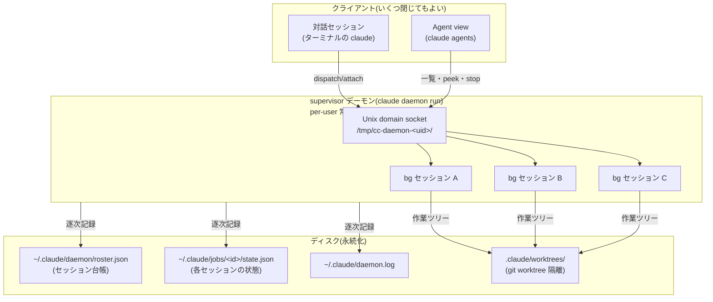
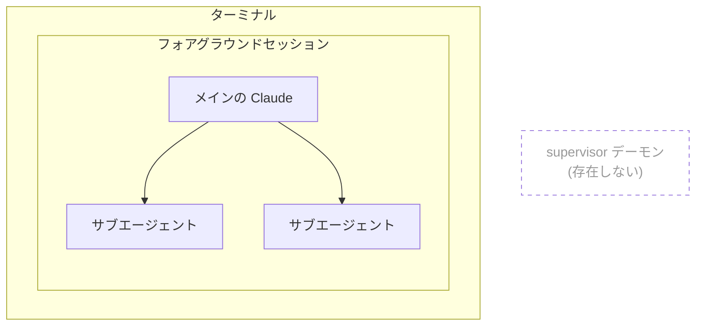
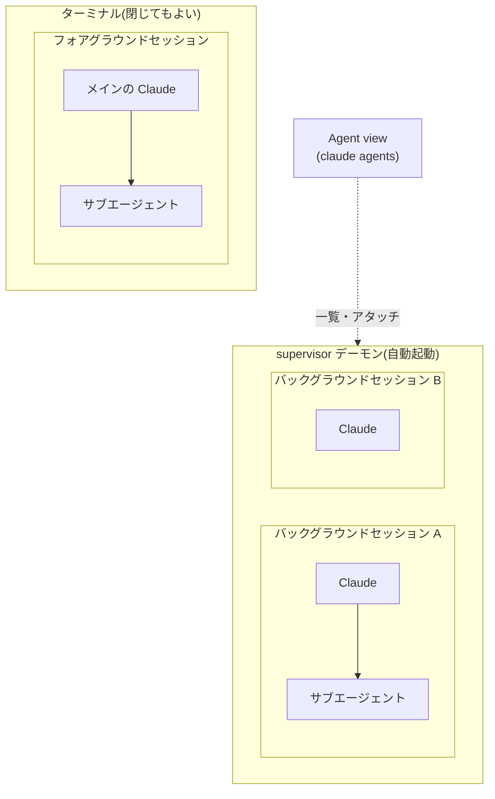

## TL;DR

* Claude Code には、ターミナルを閉じてもバックグラウンドでセッションを継続できる**supervisor デーモン**(`claude daemon run`)が実装されています(v2.1.139、2026年5月中旬〜)。バックグラウンドセッションは、サブエージェントとは異なるエージェントの実行単位です。

* `claude agents` で開く **Agent view** から、全バックグラウンドセッションの状態確認、アタッチ、停止ができます。

* セッションはターミナルを閉じても、Claude Code のバイナリ更新や PC のスリープをまたいでも生き残ります。デーモンが起動し、いわば tmux や GNU screen のようなセッション維持機能が実装されているのです。

* サブエージェントとは別物です。誰が起動し、いつ終わり、誰が結果を読むかが違います。

## ターミナルを閉じた後、セッションはどうなっているのか

`/exit` と入力したのに Claude Code が終了せず、以下のような見慣れない画面に連れて行かれた経験はないでしょうか。この画面の名前は Agent view です。


この画面はsupervisorデーモンと呼ばれるプロセスがバックグラウンドで起動しているときに表示されます。
これが表示される条件は

* claude agentsでClaude Code CLIを起動したとき
* 1つでもバックグラウンドセッションが存在しているとき

です。バックグラウンドセッションを起動したつもりがなくても、プロンプトが空のときに←を押すとその時点のフォアグラウンドセッションがバックグラウンドセッションに移動し、表示すべきフォアグラウンドセッションが無くなるため Agent view に移動します。あるいはフォアグラウンドセッションを `/exit` で終了すると、同じくフォアグラウンドに表示すべきセッションがなくなるので Agent view に移動します。

Agent view からシェルへ抜けるには、その画面上であらためて `/exit` を実行するか、`Ctrl+C` を2回押します。ただし、これでシェルに抜けても裏で常駐しているsupervisorデーモンは実行をつづけていて、バックグラウンドセッションも動いているままです。Agent view は supervisor デーモンの管理画面です。

## supervisor デーモンとは何か

supervisor デーモンは、バックグラウンドセッション(ターミナルから切り離されて動くセッション。後の章で詳しく扱います)をホストする、ユーザーごとの常駐プロセスです。実体は `claude daemon run` で起動する独立した OS プロセスです([公式ドキュメント](https://code.claude.com/docs/en/agent-view))。

全体の構図はこうなっています。



クライアント側(対話セッション、Agent view)はすべて「切断してよい」側にいます。セッションの生殺与奪を握っているのは supervisor デーモンとディスクの側であり、だからこそターミナルを閉じても、Claude Code のバイナリを更新しても、バックグラウンドセッションは生き残ります。シェルに慣れた人向けに一言でいえば「tmux サーバの Claude Code 版」です。tmux サーバが PTY を握っているから端末を閉じてもセッションが生きるのと同じ構図で、`C-z` + `bg` のジョブ制御(プロセスが端末にひもづいたまま)とは別物です。

:::message
では、tmux の中で `claude` を動かせば supervisor は要らないのかというと、そうではありません。tmux が生かしておけるのは端末とその中のプロセスだけで、プロセスが死ねばそこまでです。supervisor が管理しているのはその一段上、transcript(会話の全記録)と状態台帳(どのセッションが入力待ちで、何と呼ばれ、どの worktree に未収穫の作業を持つか)です。この分離があるから、プロセスを気軽に使い捨てられます。アイドルになったセッションはプロセスを回収しておき、話しかけられたら transcript から再起動する。蘇生の仕組み自体は `claude --resume` と同じですが、人間が履歴の山から正しい1本を選んで手動で蘇生する代わりに、supervisor はそれを台帳付きの自動運転にしています。tmux で15セッションを飼えば15個のプロセスがメモリを掴み続けるのに対し、supervisor 配下のセッションは寝ている間はタダです。
:::

デーモンといっても、OS に登録して常駐し続けるサービスではありません。最初のバックグラウンドセッションが作られたときにオンデマンドで立ち上がり、預かるものがなくなれば黙って終了します。この振る舞いは後半の実機観察で確かめます。

supervisor と Agent view は v2.1.139([whats-new 2026-w20](https://code.claude.com/docs/en/whats-new/2026-w20)、2026年5月11日から15日の週)で同時に research preview として公開されました([公式ブログの発表](https://claude.com/blog/agent-view-in-claude-code)は2026年5月11日)。supervisor がインフラ、Agent view がその UI という表裏一体の関係です。もっとも、Agent view は導入当初、`claude agents` で明示的に起動しないと表示されない画面でした。`/exit` や ← から不意に開くようになったのは、その後の更新でアクセス経路が増えたためです。

## Agent view でバックグラウンドセッションを一覧する

`claude agents` と打つと、TUI が開きます。対話セッションの中から ← キーで抜けて開くこともできます。並ぶのは**すべての Claude Code セッション**です。中心は supervisor 配下のバックグラウンドセッション(次節で定義します)ですが、別のターミナルで動いている対話セッションも一覧に載ります(`claude agents --json` の出力にも `interactive` と `background` 両方の kind が現れます)。Working、Needs input、Idle、Completed のように状態別に分類され、今どのセッションが手を止めているかが一目でわかります。

ただし、「一覧に見える」ことと「デーモンに預かってもらえる」ことは別です。一覧に載った対話セッションの生殺与奪は依然としてそのターミナルにあり、デーモンがホストしているのはバックグラウンドセッションだけです。Agent view は全景を見せる管制塔ですが、管制塔から生かせるのは配下の機体だけ、という関係です。

<!-- TODO: スクショ: Agent view 一覧画面 -->

一覧から先の操作もひととおり揃っています。Enter で選択したセッションにアタッチして通常の会話として再開でき、Space で会話に入らずに様子だけ覗けます(peek)。Shift+Enter は新規ディスパッチしてそのままアタッチ、Ctrl+S でディレクトリ別にグループ化、Ctrl+T でピン留め、Ctrl+R でリネーム、Ctrl+X で停止や削除ができます。アタッチした状態での `/exit` は終了ではなくデタッチとして扱われ、Agent view に戻ります。抜けるには Agent view 側で `/exit` するか `Ctrl+C` を2回押す必要があり、`Esc` は手前のセッションに戻るだけで抜け先にはなりません。実際に `claude agents --help` を引くと、これらに加えて `--json` オプションの存在も確認できます。

```
$ claude agents --help
Usage: claude agents [options]

Manage background agents

Options:
  --json                                 Print active sessions (interactive and
                                         background) as a JSON array and exit
                                         (for scripting; does not require a TTY)
  --all                                  With --json: also include completed
                                         background sessions
  --cwd <path>                           Show only background sessions started
                                         under <path>
  ...
```

`--json` を使えば TUI を介さずスクリプトから一覧を取得できるので、Agent view は人間が眺めるビューであると同時に、自動化の入口でもあります。

Agent view とセットで考えるべきなのは、一覧に映っているものの正体です。

## バックグラウンドセッションとは何か

Agent view に並ぶバックグラウンドセッションは、`claude --bg` のほか `/bg`、`/fork`、Agent view からの新規ディスパッチ(Shift+Enter)によって作られます。いずれの入口を通っても、生まれるのは対話セッションと **対等な独立セッション**であり、誰かの子ではありません。この「対等」という位置づけが、次節でサブエージェントと区別する軸になります。

バックグラウンドセッションは、git リポジトリの中であれば既定で `.claude/worktrees/` 配下に git worktree として隔離されます。手元の作業ツリーとバックグラウンドセッションの書き込みが衝突しないための仕組みで、`worktree.bgIsolation: "none"` を設定すれば無効化もできます。この隔離が起きるタイミングは、バックグラウンド化した瞬間ではありません。セッションはまず元の作業ディレクトリのまま動き、**最初にファイルを書き込む直前に** worktree へ移されます(公式ドキュメント: "Every background session ... starts in your working directory. Before editing files, Claude moves the session into an isolated git worktree under `.claude/worktrees/`")。← や `/bg` で既存セッションをバックグラウンド化した場合も、新規にディスパッチした場合も、この扱いは同じです。

git リポジトリであることは前提条件ではありません。非 git ディレクトリでもバックグラウンドセッションは起動できますが、その場合は worktree による隔離自体が働かず、作業ディレクトリに直接書き込みます。[公式ドキュメント](https://code.claude.com/docs/en/agent-view)も「Outside a git repository, sessions write to the working directory directly and aren't isolated from each other」と明記しており、同じ非 git ディレクトリで複数のバックグラウンドセッションを走らせると、互いの変更が隔離されないまま同居することになります。

`/fork`(v2.1.212〜)は、今の対話セッションのコピーをバックグラウンドセッションへ昇格させる操作です。手元で会話を続けながら、その時点までの文脈を引き継いだ別セッションを裏で走らせられます。会話をコピーする点は `/branch` と同じですが、コピーを作ったあとが違います。`/branch` はコピーへ自分が乗り移り、元セッションは凍結されるので、実行は1本のままです。`/fork` は自分が元セッションに残り、コピーの側が supervisor 配下で並走します。git でいえば、前者は `git checkout -b` で自分が新ブランチに移る操作、後者は別の作業者に worktree ごと渡して並行作業させる操作です。ただしサブエージェントと違い、結果を親セッションが自動で回収してくれるわけではありません。fork したコピーには行き先のタスクを与え、成果は自分で収穫するのが基本形です。なお v2.1.211 以前の `/fork` は「結果がメイン会話に返る in-session のサブエージェント起動」という別の機能でした。そちらは v2.1.212 で `/subtask` に改名されており、「結果を返してほしい」用途なら現在は `/subtask` を使います。

では、worktree の中で生まれた成果はどう収穫するのでしょうか。答えは通常の git 操作です。worktree は `worktree-<name>` という名前の**普通のブランチ**として作られるため、セッションの作業が終わったら、そのブランチを main に merge すれば取り込みは完了します。リモートと連携している場合は一歩手前まで自動化されていて、隔離 worktree で作業したセッションは**ドラフト PR を自動作成します**([公式ドキュメント](https://code.claude.com/docs/en/agent-view): "Sessions create draft PRs automatically when working in isolated worktrees")。PR をレビューして merge する、いつもの流れに乗せられるわけです。なお、push は収穫の前提ではありません。ローカルの merge だけで取り込みは完結します。push の有無が効いてくるのは後始末です。定期スイープは [`cleanupPeriodDays`](https://code.claude.com/docs/en/worktrees) を過ぎた worktree を削除しますが、変更ファイルや**未 push のコミット**が残っている worktree は「まだ収穫されていない」とみなして飛ばします。push する運用なら worktree は自動で片づき、push しない運用ではコミットが常に未 push 扱いになるため、掃除は `git worktree remove` での手動になります。いずれにせよ、収穫し忘れた成果が黙って消えることはありません。

## セッションの「状態」を整理する

では、バックグラウンド化しないまま、ターミナルごと閉じてしまったフォアグラウンドセッションはどうなるのでしょうか。終了なのか、一時停止なのか。答えは「プロセスは終了するが、会話は休眠する」です。会話履歴は作業中つねにローカルの transcript ファイルへ逐次保存されているため([公式ドキュメント](https://code.claude.com/docs/en/sessions): "Sessions are saved continuously to local transcript files as you work")、プロセスが死んでも `claude --continue` や `claude --resume` で会話を復元できます。閉じたときに supervisor 側へ自動退避されるわけではない、という点が、← や `/bg` で明示的にバックグラウンド化した場合との違いです。

バックグラウンドセッションの状態は、Agent view では2つの軸で表現されます。1つはタスクの進み具合、もう1つはプロセスの生死です。

タスク状態(一覧の表示名と `claude agents --json` が返す値):

| 表示          | JSON の値   | 意味        |
| ----------- | --------- | --------- |
| Working     | `working` | 実行中       |
| Needs input | `blocked` | ユーザーの入力待ち |
| Idle        | —         | 待機中       |
| Completed   | `done`    | 完了        |
| Failed      | `failed`  | エラーで終了    |
| Stopped     | `stopped` | 手動で停止     |

プロセスの生死(一覧の行頭アイコン):

| アイコン      | 意味                                                     |
| --------- | ------------------------------------------------------ |
| `✻` / `✽` | プロセスが生きていて、すぐ応答できる                                     |
| `∙`       | プロセスは終了済み。ただし peek も返信もでき、返信すると保存済み transcript から再起動する |
| `✢`       | `/loop` セッションがイテレーションの合間にスリープ中                         |

見どころは `∙` です。Completed に見えるセッションでも、プロセスが生きている場合と終了している場合があり、終了していても話しかければ transcript から蘇ります。フォアグラウンドセッションの「閉じたらプロセスは死ぬが resume できる」と同じ原理が、Agent view の中でも働いているわけです。

## サブエージェントとの違い

Agent view に一覧されるバックグラウンドセッションと、Claude が呼び出す **サブエージェント**は、しばしば同じものとして語られます。両者は起動主体、寿命、結果を読む人という3軸で異なります。

| 軸      | サブエージェント           | バックグラウンドセッション                   |
| ------ | ------------------ | ------------------------------- |
| 起動主体   | Claude が道具として起動する  | ユーザーがディスパッチする                   |
| 寿命     | 親セッションと道連れに終わる     | supervisor デーモンがホストし、親から独立して生きる |
| 結果の読み手 | 親の Claude が読んで統合する | ユーザーが Agent view からアタッチして直接読む   |

この対比を混乱させる落とし穴が一つあります。v2.1.198 以降、サブエージェントも「バックグラウンドで実行される」ようになりました。ただしこれは親セッションのターンの中で非同期に動くという意味であり、supervisor デーモンの配下に入るわけではありません。親のターンが終われば、サブエージェントの結果は親に回収されて終わります。Agent view に映るのはあくまで supervisor 配下のバックグラウンドセッションだけで、サブエージェントは対象外です。

この包含関係を、バックグラウンドセッションが「ないとき」と「あるとき」の2枚で図にします。

まず、`claude` を1つ起動しただけの状態です。サブエージェントはフォアグラウンドセッションの**中**にいます。supervisor デーモンはまだ存在しません。



この状態でターミナルを閉じると、フォアグラウンドセッションは中のサブエージェントごと終了します(transcript は残ります)。

次に、バックグラウンドセッションを1つでも作った状態です。supervisor デーモンが自動的に立ち上がり、バックグラウンドセッションはターミナルの**外**、デーモンの**中**で動きます。バックグラウンドセッションも、それ自身のサブエージェントを中に持てます。



2枚を並べると、章の頭で述べた3軸が図の形に対応していることがわかります。サブエージェントは常に**どこかのセッションの内側**にいて、そのセッションと運命を共にします。バックグラウンドセッションは**ターミナルの外側**にいて、ターミナルを閉じてもデーモン側の箱は無傷です。そしてバックグラウンドセッションがすべて終われば、デーモンは退場し、1枚目の状態に戻ります。

## supervisor デーモンを実機で観察する

ここまで概念として扱ってきた supervisor デーモンは、実機でそのまま観察できます。プロセスの素性、セッション台帳、ログに現れる挙動から、前章で述べた性質(オンデマンド起動、プリウォームワーカー、バイナリ更新の自己監視)の裏付けが取れます。環境変数(プロキシ設定を含む)の継承の落とし穴もこの章にまとめました。長くなるため、全体を折りたたんであります。

:::details 実機観察の詳細(ログと考察)

`claude daemon status` を叩くと、稼働中のデーモンの素性が返ってきます(ユーザー名やパスはマスク済み)。

```
$ claude daemon status
pid:     48162
version: 2.1.220
uptime:  206564s
origin:  transient — started on-demand by `claude` (pid 45069) in /Users/<user>/work/<project>
config:  /Users/<user>/.claude/daemon.json
log:     /Users/<user>/.claude/daemon.log

bg sessions:
  sock dir:     /tmp/cc-daemon-501/a2508396
  control.sock: reachable
  bg workers:   8 running (control.sock), 8 in roster.json
  roster.json:  updated 5574s ago
  daemon.log:   593.7KB at /Users/<user>/.claude/daemon.log

holding this daemon open:
  8 bg workers running (daemon waits for them to settle)
  `claude agents` (pid 45426) in /Users/<user>/work/<project-a>
  `claude agents` (pid 47486) in /Users/<user>/work/<project-b>
```

`origin: transient` が示すとおり、このデーモンは誰かが手動で登録したサービスではなく、最初のバックグラウンドセッション起動をきっかけに `claude` プロセスがオンデマンドで立ち上げたものです。`ps aux` で見ても独立プロセスとして浮かんでいます。

```
$ ps aux | grep 'claude daemon'
user  48162  0.5  0.7  ...  /Users/<user>/.local/bin/claude daemon run --origin transient \
  --spawned-by {"label":"claude","cwd":"/Users/<user>/work/<project>","pid":45069}
```

`~/.claude/daemon/` の中身も一致します。`roster.json` がセッション台帳、`control.key` が通信の鍵、`dispatch/` がディスパッチ用のソケット類です。

```
$ ls -la ~/.claude/daemon/
auth/
control.key
dispatch/
roster.json
```

`roster.json` を開くと、`supervisorPid`、`updatedAt` の下に `workers` として稼働中セッションの辞書が並びます。1件を抜き出し、鍵やパスをマスクしたものが次のとおりです。

```json
{
  "pid": 48182,
  "sessionId": "a7da13ea-324f-4dbc-8e9b-c683cbc89a45",
  "rendezvousSock": "/tmp/cc-daemon-501/a2508396/rv/a7da13ea.sock",
  "ptySock": "/tmp/cc-daemon-501/a2508396/spare/65d41745.pty.sock",
  "cliVersion": "2.1.220",
  "cwd": "/Users/<user>/work/<project>",
  "dispatch": {
    "source": "slash",
    "isolation": "none",
    "seed": { "intent": "/compact", "name": "<session-name>" }
  },
  "rvAuth": "<redacted>",
  "ptyAuth": "<redacted>"
}
```

セッションごとに PID、rendezvous 用ソケット、PTY 用ソケットが記録されています。これが Agent view からの attach や peek が復元できる根拠で、supervisor はこの台帳を頼りに、どのソケットに繋げばどのセッションの端末に出入りできるかを覚えています。

`~/.claude/daemon.log` を tail すると、セッションの出入りがそのまま流れています。

```
[2026-08-01T10:03:39.290Z] [bg] bg claimed-spare f20228de (slash)
[2026-08-01T10:03:39.291Z] [bg] bg spawned 8c72cd6d (slash)
[2026-08-01T10:03:39.293Z] [bg] bg spare spawned host pid=4359
[2026-08-01T10:04:50.805Z] [bg] bg settled f20228de (killed)
[2026-08-01T13:22:38.698Z] [bg] bg settled 8c72cd6d (done)
```

`claimed-spare` の直後に `bg spare spawned` が続くのが目を引きます。ディスパッチが1件入るたびに、待機中の予備プロセス(spare)を1つ引き渡し、そのぶん新しい spare を1つ補充しています。[公式ドキュメント](https://code.claude.com/docs/en/agent-view)はこの仕組みを「The supervisor keeps one pre-warmed worker process ready so a dispatch from agent view or `claude --bg` starts without the delay of a cold launch」と説明しています。**プリウォームワーカーを常に1つ待機させておく**ことで、ディスパッチがコールドスタートなしで始まるわけです。

ライフサイクルはこの観察と `claude daemon --help` の記述で説明がつきます。

```
$ claude daemon --help
Service lifecycle:
  run [json-path]   Run the supervisor in the foreground (default when piped)
  status            Show daemon pid, version, uptime
  logs              Tail the daemon log (Ctrl-C to stop)
  uninstall         Remove the background service (launchctl/systemd)
  stop              Shut down the supervisor and terminate background sessions
                      --any           also stop a transient (non-service) daemon
                      --keep-workers  leave detached sessions running

  Service install is disabled in this version — the daemon runs on demand
  and exits when the last client disconnects.
```

デーモンは最初のバックグラウンドセッション起動時にオンデマンドで立ち上がり、systemd や launchd への常時登録は今のバージョンでは無効化されています。そして help の文言どおり、最後のクライアントが切断すると自動終了します。役目があるときだけ現れて、なくなれば黙って退場する設計です。

もう一つ、バイナリ更新をまたいで生存する仕組みがあります。supervisor デーモン自身が auto-updater によるバイナリの差し替えを監視していて、更新を検知すると新バージョンで自分自身を再起動します(v2.1.207 以降、Windows を含めて安定化)。ターミナルを閉じても、Claude Code を更新しても、バックグラウンドセッションが生き残っているように見えるのは、この自己監視と再起動があるからです。

操作コマンドは `claude daemon status` / `logs` / `stop [--any|--keep-workers]` / `uninstall` の4つに集約されます。日常の観察には `status` と `logs` で足ります。

### 環境変数はどこから来るか

tmux との相似は見た目に留まりません。tmux のセッションがサーバ起動時の環境変数を引き継ぐように、バックグラウンドセッションの環境変数も2層構造になっています。土台は、supervisor が**最初にディスパッチしたシェルからキャプチャした環境**です。そのうえで、壊れると実害が大きい変数だけがディスパッチごとに読み直されます。公式ドキュメントに明記されているのは PATH("The dispatching shell's `PATH` is applied to the worker")と、`CLAUDE_CODE_USE_BEDROCK` のようなプロバイダ選択変数です。

読み直しリストに入っていない変数は、デーモンがキャプチャした値のまま全ワーカーに波及します。実機で比べると、デーモンと全ワーカーの `HTTP_PROXY` / `HTTPS_PROXY` / `NO_PROXY` は完全に一致していて、いまディスパッチに使っている端末のシェルとは一致していませんでした。つまりワーカーのプロキシ設定は「今の端末」ではなく「デーモンを最初に起こした時点のシェル」由来です。ここから、VPN の切り替えやネットワークの移動でプロキシが変わったとき、デーモンが古い設定を抱えたまま生き続け、**新しい端末では通信できるのにバックグラウンドセッションだけ外に出られない**、という症状が起きえます。

対処は2つあります。`claude daemon stop --keep-workers` でデーモンだけを退場させれば、次のディスパッチのときに新しいシェル環境から再キャプチャされます。セッションを横断して確実に効かせたい変数は、settings.json の `env` に書いておきます。

:::

## いつ機能し、いつ見えないか

supervisor デーモンが働く条件は一つしかありません。バックグラウンドセッションが1つでも存在することです。それ以外の明示的なセットアップは要りません。

裏を返せば、バックグラウンドセッションを一度も作っていない環境では、デーモン自体が存在しません。存在していたセッションがすべて終了すれば、デーモンは黙って退場します。常駐サービスとして居座り続けるわけではありません。サブエージェントや Dynamic Workflows の `agent()` 呼び出しは、そもそも supervisor 配下のバックグラウンドセッションではないので、Agent view には映りません。

関連する機能にはそれぞれ別の前提条件があります。Dynamic Workflows は v2.1.154 以降かつ有料プランが必要で、Agent Teams は環境変数 `CLAUDE_CODE_EXPERIMENTAL_AGENT_TEAMS=1` を立てた実験的機能にとどまります。

## 常駐実行の5つの手段

「Claude Code を動かし続ける」方法は、ここまで見てきたバックグラウンドセッションだけではありません。[`/goal` ドキュメント](https://code.claude.com/docs/en/goal)は「次ターンがいつ始まるか」「いつ止まるか」の2軸で `/goal`、`/loop`、Stop hook の3方式を比較しています。これにバックグラウンドセッションと Routines を加え、動作場所の軸も足して5つの手段を1つの表に並べます。

| 方式            | 次ターンの契機              | 停止条件           | 動作場所              |
| ------------- | -------------------- | -------------- | ----------------- |
| `/goal`       | 前ターン終了               | 評価モデルが達成判定     | セッション内            |
| `/loop`       | 一定間隔                 | ユーザー停止 or 完了判断 | セッション内            |
| Stop hook     | 前ターン終了               | 自作スクリプト        | セッション内            |
| バックグラウンドセッション | (通常のターン)             | ユーザーが停止        | supervisor デーモン配下 |
| Routines      | cron / webhook / API | (常駐)           | Anthropic クラウド    |

上の3方式はいずれも1つのセッションの中で完結します。「終わるまで回す」なら `/goal`、「定期的に見に行く」なら `/loop`、フックで独自の停止判定を書きたいなら Stop hook が適しています。バックグラウンドセッションは、この3方式と直交する軸として「ターミナルから切り離す」を担います。さらにマシンからも切り離して常駐させたいなら、Anthropic クラウド側で走る Routines に手渡すことになります。

### 他のエージェントはどうしているか

「端末を閉じても続く」という性質自体は、他のコーディングエージェントも持っています。ただし実現の場所が違います。[OpenAI Codex](https://learn.chatgpt.com/docs/cloud) はタスクごとにクラウド側の隔離コンテナで実行し、ローカル CLI はローカル保存された履歴からの `codex resume` による事後再開です。[AWS の Kiro](https://kiro.dev/docs/autonomous-agent/) は Autonomous Agent がクラウド側で「セッションという単位を持たず常時存在」します。[GitHub Copilot の coding agent](https://docs.github.com/en/copilot/concepts/agents/coding-agent/about-coding-agent) は GitHub Actions の実行環境そのものが実行主体で、管制 UI として [mission control](https://github.blog/changelog/2025-10-28-a-mission-control-to-assign-steer-and-track-copilot-coding-agent-tasks/) を持ちます。

|          | 継続実行の場所                                | 管制 UI             |
| -------------- | -------------------------------------- | ----------------- |
| Claude Code    | ローカルの supervisor デーモン(+クラウドの Routines) | Agent view        |
| OpenAI Codex   | クラウドの隔離コンテナ                            | ChatGPT 内のダッシュボード |
| Kiro           | クラウド(Autonomous Agent)                 | 固有の管制 UI は確認できず   |
| GitHub Copilot | GitHub Actions                         | mission control   |

3者はいずれも継続性の主体をクラウドに置いており、「ローカルマシン上のデーモンでセッションを生かす」設計は、確認できた範囲では Claude Code だけです。手元のリポジトリと実行環境をそのまま使い続けられるのは、この設計の直接の帰結です。

## まとめ

supervisor デーモンと Agent view の組み合わせによって、Claude Code は「1ターミナル1セッション」から「セッション群を管理する」形に変わりました。バックグラウンドセッションはターミナルの生死から独立し、supervisor デーモンという別プロセスに預けられています。

サブエージェントは Claude が使う道具であり、バックグラウンドセッションはユーザーが手放したセッションです。この2つを区別しておけば、Agent view に何が映り、何が映らないかも自然と見えてきます。

視点を引くと、supervisor が強化しているのは、生成 AI の効用の中でもあまり語られてこなかった側面です。生成 AI の価値は「人間の代わりに何かをする」ことばかりが語られますが、使い込むと、「人間が行っている作業のコンテキストを維持してくれる」ことの恩恵が少なくないと気づきます。何をしていて、どこまで終わっていて、次に何をするつもりだったか。従来は人間の頭の中とメモに散らばっていたこの状態が transcript として残るからこそ、過去の作業をいつでも再開できます。supervisor はこの利点をもう一段押し上げます。履歴からの再開では、起動していたサーバや実行途中のツールといった transcript に残らない環境は失われますが、supervisor 配下のセッションは実行環境ごと生きているため、そのズレ自体が生じません。「再開」を「継続」に変える仕組みだと言えます。

Routines や Agent Teams のように、まだ実験段階の常駐化手段も控えています。それらがどこまで安定するかは、今後のリリースノートを追う楽しみとして残しておきます。
