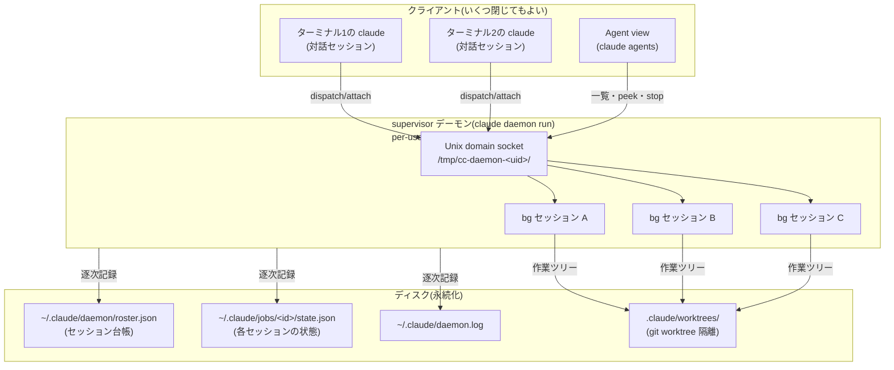
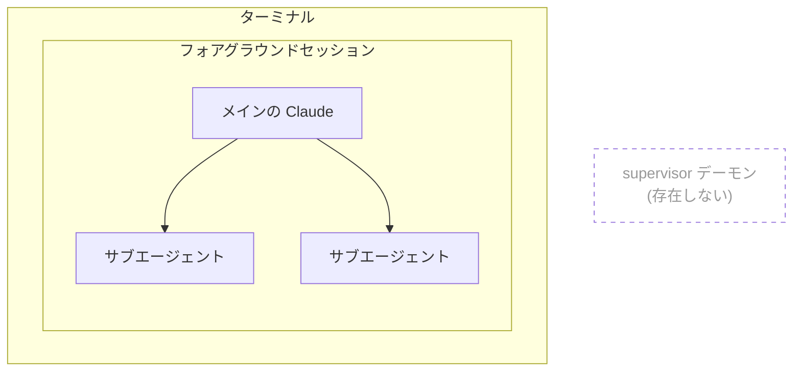
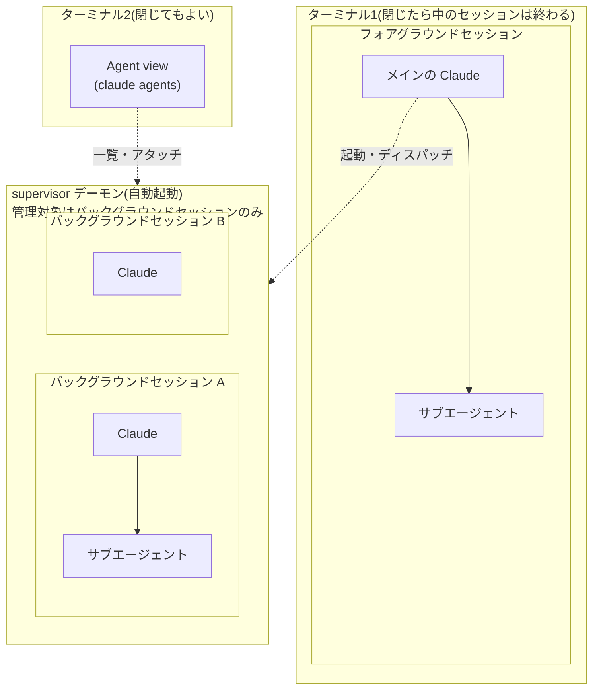

:::message
本記事は筆者個人の見解であり、所属する組織の公式見解ではありません。

また、ここで扱う supervisor デーモンと Agent view は research preview の機能です。この領域は仕様が頻繁に、かつ大きく変わります。本文の記述は執筆時点(2026年8月上旬、Claude Code v2.1.220 で確認)のものなので、最新の挙動は[公式ドキュメント](https://code.claude.com/docs/en/agent-view)をご確認ください。
:::

## TL;DR

* Claude Code には、ターミナルを閉じてもバックグラウンドでセッションを継続できる**supervisor デーモン**(`claude daemon run`)が実装されています(v2.1.139、2026年5月中旬〜)。バックグラウンドセッションは、エージェント群をたばねる実行単位です。

* `claude agents` で開く **Agent view** から、全バックグラウンドセッションの状態確認、アタッチ、停止ができます。

* セッションはターミナルを閉じても、Claude Code のバイナリ更新や PC のスリープをまたいでも生き残ります。デーモンが起動し、いわば tmux や GNU screen のようなセッション維持機能が実装されているのです。

* 入力欄が空のときの ← は、カーソル移動ではなく**そのセッションをバックグラウンドへ送る**操作です。意図して使うのでなければ、`/config` の Agents view セクションで「← opens agents」をオフにしておくのがよいでしょう(詳細は次章)。

:::message
**この記事を読むと、たとえば次のようなことがわかるようになります**

* Claude Code CLI終了時に出る「Background work is running → Move to background and exit」という確認の意味。バックグラウンドには「セッション内の作業」と「セッションそのもの」の2つのレベルがあり、この選択肢が指しているのは後者です(第1章)。
* `/fork` でバックグラウンド実行することの意味。ターミナルやペインに作業をひも付けずに並列作業を送り出せて、ターミナルを閉じても supervisor デーモンの下で動き続けます(終盤の「並列作業を `/fork` で起動する」)。
:::

## はじめに

NTTテクノクロスの上原です。最近見たNetflix アニメ「The Ribbon Hero」は原案リボンの騎士とは全く違うけど必見ですね。ヘケートにはもっと活躍してほしかった…。
さて、以前「[エージェントOS化するClaude CodeをOS機能との類推などで理解していく](https://zenn.dev/uehaj/articles/claude-code-fork-branch-rewind-btw)」という記事を書いたわけですが、Claude Codeの「エージェントOS化」という見立ては、ますます進行しているように見えます。ということで今回はセッション・バックグラウンドセッションについて調べていきます。

## ターミナルを閉じた後、セッションはどうなっているのか

`/exit` と入力したのに Claude Code が終了せず、以下のような見慣れない画面に連れて行かれた経験はないでしょうか。この画面の名前は Agent view です。


*Claude Code v2.1.220 の Agent view 画面(筆者の実行環境のスクリーンショット)*

この画面はsupervisorデーモンと呼ばれるプロセスがバックグラウンドで起動しているときに表示されます。
これが表示される条件は

* claude agentsでClaude Code CLIを起動したとき
* 1つでもバックグラウンドセッションが存在しているとき

です。バックグラウンドセッションを起動したつもりがなくても、プロンプトが空のときに←を押すとその時点のフォアグラウンドセッションがバックグラウンドセッションに移動し、表示すべきフォアグラウンドセッションが無くなるため Agent view に移動します。つまり ← は画面の切り替えではなく、**メインセッションをバックグラウンドへ移動させる操作**です。そのため、バックグラウンドセッションが1つもない状態で ← を押すと、この操作が最初のバックグラウンドセッションを生み、その瞬間に supervisor デーモンが起動します。あるいはフォアグラウンドセッションを `/exit` で終了すると、同じくフォアグラウンドに表示すべきセッションがなくなるので Agent view に移動します。

この ← は、入力欄が空のときにカーソルを左へ動かすつもりで押してしまいやすく、意図せずセッションをバックグラウンドへ送ってしまうことがあります。止めたい場合は `/config` を開き、Agents view セクションの「← opens agents」をオフにしてください。`~/.claude.json` に `"leftArrowOpensAgents": false` が書き込まれ、以後 ← は通常のカーソル移動だけになります(v2.1.223 で確認)。

「バックグラウンド」という語には、もう1つ紛らわしい登場場面があります。セッションの中でバックグラウンド実行中の作業(バックグラウンドの Bash コマンドやサブエージェント)が残っている状態で `/exit` などにより終了しようとすると、次のような確認ダイアログが表示されます(筆者の実行環境、Claude Code v2.1.238 での表示を一部省略して転記)。

```
Background work is running
The following will stop when you exit:
  shell · until [ -f ... ]

  1. Exit and stop tasks
❯ 2. Move to background and exit
  3. Stay
```

作業がバックグラウンドで動いているのに「Move to background」とはどういうことか、と一瞬戸惑いますが、ここでの background はセッション内の作業のことではなく、本記事の主題である**バックグラウンドセッション**のことです。つまりバックグラウンドには2つのレベルがあります。1つはセッションの**中**での作業(Bash やサブエージェント)のバックグラウンド実行、もう1つはセッション**そのもの**を後述の supervisor デーモンに預けるバックグラウンドセッションです。この 2 番の選択肢は「セッション内の作業を抱えたまま、セッションごとバックグラウンドセッションへ移して終了する(作業は止まらない)」という意味で、1 番の「作業ごと止めて終了する」との対比になっています。

Agent view からシェルへ抜けるには、その画面上であらためて `/exit` を実行するか、`Ctrl+C` を2回押します。ただし、これでシェルに抜けても裏で常駐しているsupervisorデーモンは実行をつづけていて、バックグラウンドセッションも動いているままです。Agent view は supervisor デーモンの管理画面です。

## supervisor デーモンとバックグラウンドセッションの仕組み

まず、この仕組みを支える登場人物と、その関係を順に見ていきます。

### supervisor デーモンとは何か

supervisor デーモンは、バックグラウンドセッション(ターミナルから切り離されて動くセッション。後の章で詳しく扱います)をホストする、ユーザーごとの常駐プロセスです。[公式ドキュメント](https://code.claude.com/docs/en/agent-view)によれば、実体は `claude daemon run` で起動する独立した OS プロセスです。

全体の構図はこうなっています。



デーモンは**ユーザーごとに1つ**です。複数のターミナルでそれぞれ `claude` を起動し、別々の対話セッションを持っていても、それらはすべて同じ1つのデーモンにつながります。ソケットのパスが `/tmp/cc-daemon-<uid>/` と UID 単位になっているのはその表れで、そのマシンのそのユーザーのセッションは、対話・バックグラウンドを問わず1つの台帳(`~/.claude/daemon/roster.json`)に集約されます。

クライアント側(各ターミナルの対話セッション、Agent view)はすべて「切断してよい」側にいます。セッションの生殺与奪を握っているのは supervisor デーモンとディスクの側であり、だからこそターミナルを閉じても、Claude Code のバイナリを更新しても、バックグラウンドセッションは生き残ります。シェルに慣れた人向けに一言でいえば「tmux サーバの Claude Code 版」です。tmux サーバが PTY を握っているから端末を閉じてもセッションが生きるのと同じ構図で、`C-z` + `bg` のジョブ制御(プロセスが端末にひもづいたまま)とも別物です。

:::message
では、tmux の中で `claude` を動かせば supervisor は要らないのかというと、そうではありません。tmux が生かしておけるのは端末とその中のプロセスだけで、プロセスが死ねばそこまでです。supervisor が守っているのはプロセスではなく、セッションというデータ(transcript と状態台帳)です。この違いは後述の「セッションとプロセスの関係」で詳しく見ます。
:::

デーモンといっても、OS に登録して常駐し続けるサービスではありません。最初のバックグラウンドセッションが作られたときにオンデマンドで立ち上がり、預かるものがなくなれば黙って終了します。

supervisor と Agent view は v2.1.139([whats-new 2026-w20](https://code.claude.com/docs/en/whats-new/2026-w20)、2026年5月11日から15日の週)で同時に research preview として公開されました([公式ブログの発表](https://claude.com/blog/agent-view-in-claude-code)は2026年5月11日)。supervisor がインフラ、Agent view がその UI という表裏一体の関係です。

### Agent view でバックグラウンドセッションを一覧する

`claude agents` と打つと、ターミナル上にセッション一覧の画面が開きます。対話セッションの中から ← キーで開くこともできますが、導入で述べたとおり、こちらは単なる画面切り替えではなく「いまのセッションをバックグラウンド化してから Agent view に移る」操作です。並ぶのは supervisor 配下の**バックグラウンドセッション**(次節で定義します)の一覧です。[公式ドキュメント](https://code.claude.com/docs/en/agent-view)にあるとおり、別のターミナルで開いている対話セッションは、バックグラウンド化するまで一覧に現れません。セッションは状態別に分類され、今どのセッションが手を止めているかが一目でわかります。

一覧から先の操作もひととおり揃っています。

| キー | 操作 |
| --- | --- |
| Enter | 選択したセッションにアタッチ(自分の端末を接続)し、通常の会話として再開する |
| Space | 会話に入らず様子だけ覗く(peek) |
| プロンプト入力 | そのタスクを実行する新しいバックグラウンドセッションを作る(ディスパッチ) |
| Shift+Enter | 新規ディスパッチして、そのままアタッチ |
| Ctrl+S | ディレクトリ別にグループ化 |
| Ctrl+T | ピン留め |
| Ctrl+R | リネーム |
| Ctrl+X | 停止・削除 |
| `/exit` | アタッチ中はデタッチとして扱われ、Agent view に戻る |
| Ctrl+C 2回 | Agent view からシェルへ抜ける (`Esc` は手前のセッションに戻るだけ) |

「端末に付けずに仕事を送り出す」この操作を、公式ドキュメントは**ディスパッチ**(dispatch)と呼びます。`claude --bg` もシェルからのディスパッチです。


### バックグラウンドセッションとは何か

Agent view に並ぶバックグラウンドセッションは、`claude --bg` のほか `/bg`、`/fork`、Agent view からの新規ディスパッチ(Shift+Enter)によって作られます。いずれの入口を通っても、生まれるのは対話セッションと **対等な独立セッション**であり、誰かの子ではありません。この「対等」という位置づけが、後述の「サブエージェントとの違い」でサブエージェントと区別する軸になります。

:::message

バックグラウンドセッションは、git リポジトリの中であれば既定で `.claude/worktrees/` 配下に git worktree として隔離されます。手元の作業ツリーとバックグラウンドセッションの書き込みが衝突しないための仕組みで、`worktree.bgIsolation: "none"` を設定すれば無効化もできます。ちなみに、この隔離が起きるタイミングは、バックグラウンド化した瞬間ではありません。[公式ドキュメント](https://code.claude.com/docs/en/agent-view)によれば、セッションはまず元の作業ディレクトリのまま動き、最初にファイルを書き込む直前に worktree へ移されます。**つまりWorktreeの作成はCoW(Copy on Write)です**。← や `/bg` で既存セッションをバックグラウンド化した場合も、新規にディスパッチした場合も、この扱いは同じです。

ただし、この移動が起きるのは Write・Edit・MultiEdit・NotebookEdit ツール経由の書き込みに限られるようです。手元で検証したところ、Bash 経由(リダイレクトや `sed -i` など)でファイルを書かせた場合は worktree へ移動せず、元の作業ディレクトリに直接書き込まれました。同じ内容を Write ツールで明示的に書かせると、`.claude/worktrees/` に隔離されました。Bash 経由の書き込みでバックグラウンドセッションを走らせると、手元の作業ディレクトリが隔離なしに変更される可能性があります。
:::

git リポジトリであることは前提条件ではありません。非 git ディレクトリでもバックグラウンドセッションは起動できますが、[公式ドキュメント](https://code.claude.com/docs/en/agent-view)にあるとおり、その場合は worktree による隔離自体が働かず、作業ディレクトリに直接書き込みます。つまり同じ非 git ディレクトリで複数のバックグラウンドセッションを走らせると、互いの変更が隔離されないまま同居することになります。

`/bg` は、いま自分がいるフォアグラウンドセッションを、そのままバックグラウンドセッションへ移す操作です。導入で触れた ← と同じことがコマンドで書けると考えてください。実行すると手元のターミナルからそのセッションは消え、以後は supervisor 配下で動き続けて Agent view の一覧に現れます。会話の文脈はそのまま持っていくので、「調べものを投げたが時間がかかりそうなので、端末を返してもらって別の作業に移りたい」という場面がそのまま用途になります。シェルから最初からバックグラウンドで始める `claude --bg` とは、既存のセッションを移すか、新規に立てるかが違います。

`/bg` と `/fork` は、どちらも今のセッションを起点にバックグラウンドセッションを作りますが、自分がどちら側に残るかが逆です。`/bg` は**自分ごと移る**ので手元には何も残りません。`/fork` は**コピーだけを送り出し**、自分は元のセッションに残ります。手元で会話を続けたいかどうかが選択の基準になります。それぞれの使いどころは、終盤の「並列作業を `/fork` で起動する」「セッションを移動して `/bg` する」で詳しく見ます。

### セッションの「状態」を整理する

バックグラウンド化しないまま、ターミナルごと閉じてしまったフォアグラウンドセッションはどうなるのでしょうか。これはsupervisorデーモンの対象外です。通常通り会話履歴はのこり、 `claude --continue` や `claude --resume` で会話を復元する扱いです。

バックグラウンドセッションの状態は、Agent view では2つの軸で表現されます。1つはタスクの進み具合、もう1つはプロセスの生死です。

タスク状態(一覧の表示名と `claude agents --json` が返す値):

| 表示          | JSON の値   | 意味        |
| ----------- | --------- | --------- |
| Working     | `working` | 実行中       |
| Needs input | `blocked` | ユーザーの入力待ち |
| Idle        | —         | 待機中       |
| Completed   | `done`    | 完了        |
| Failed      | `failed`  | エラーで終了    |
| Stopped     | `stopped` | 手動で停止     |

プロセスの生死(一覧の行頭アイコン):

| アイコン      | 意味                                                     |
| --------- | ------------------------------------------------------ |
| `✻` / `✽` | プロセスが生きていて、すぐ応答できる                                     |
| `∙`       | プロセスは終了済み。ただし peek も返信もでき、返信すると保存済み transcript から再起動する |
| `✢`       | `/loop` セッションがイテレーションの合間にスリープ中                         |

見どころは `∙` です。Completed に見えるセッションでも、プロセスが生きている場合と終了している場合があり、終了していても話しかければ transcript から蘇ります。フォアグラウンドセッションの「閉じたらプロセスは死ぬが resume できる」と同じ原理が、Agent view の中でも働いているわけです。

### セッションとプロセスの関係

ここまで「プロセスは死ぬが会話は残る」「プロセスが終了済みでも返信すれば蘇る」という現象を見てきました。つまり **セッションはプロセスではありません**。セッションの実体は transcript(会話の全記録)と状態台帳というディスク上のデータであり、プロセスはそれを動かすための使い捨ての実行体です。文書とエディタの関係と同じです。エディタを終了しても文書は消えず、開き直せば別のプロセスで続きから編集できます。

したがって両者の対応は、ある瞬間だけを見れば「動いているセッション1つにプロセス1つ」ですが、時間軸では多対多になります。resume するたび、`∙` から蘇生するたび、バイナリ更新でデーモンが再起動するたびに、同じセッションが新しいプロセスに乗り換えます。逆に、対話中に `/resume` で別の会話へ切り替えるときは、同じプロセスのまま開くセッションだけが替わります。実機観察の章で見るとおり、セッション台帳(roster.json)がセッションの同一性を `sessionId` で、実行体を `pid` で別々に記録しているのは、この分離の表れです。

tmux との違いが現れるのはここです。tmux が守っているのは**プロセス**です。端末を閉じても死なないようにサーバが抱え込みますが、プロセスが死ねばセッションも終わりで、生かし続ける限りメモリを掴み続けます。tmux で15セッションを飼えば、15個のプロセスが常駐します。一方 Claude Code の supervisor が守っているのは**セッションというデータ**なので、プロセスは気軽に使い捨てられます。アイドルになったセッションのプロセスは回収しておき、話しかけられたら transcript から再起動する。蘇生の仕組み自体は `claude --resume` と同じですが、人間が履歴の山から正しい1本を選んで手動で蘇生する代わりに、supervisor はそれを台帳付きの自動運転にしています。supervisor 配下のセッションは、寝ている間はタダなのです。

## 関連機能との違い

バックグラウンドセッションと紛らわしい並列実行の機能が Claude Code にはいくつかあります。それぞれとの違いを整理します。

### サブエージェントとの違い

Agent view に一覧されるバックグラウンドセッションと、Claude が呼び出す **サブエージェント**は、起動主体、寿命、結果の行き先という3軸で異なります。

| 軸      | サブエージェント           | バックグラウンドセッション                   |
| ------ | ------------------ | ------------------------------- |
| 起動主体   | Claude が道具として起動する  | ユーザーがディスパッチする                   |
| 寿命     | 親セッションと道連れに終わる     | supervisor デーモンがホストし、親から独立して生きる |
| 結果の行き先 | 親の Claude に自動で返り、統合される | 自動ではどこにも返らない。成果(コミット、PR、回答)をユーザーが回収する |


この包含関係を、バックグラウンドセッションが「ないとき」と「あるとき」の2枚で図にします。

まず、`claude` を1つ起動しただけの状態です。サブエージェントはフォアグラウンドセッションの**中**にいます。supervisor デーモンはまだ存在しません。



この状態でターミナルを閉じると、フォアグラウンドセッションは中のサブエージェントごと終了します(transcript は残ります)。

次に、バックグラウンドセッションを1つでも作った状態です。supervisor デーモンが自動的に立ち上がり、バックグラウンドセッションはターミナルの**外**、デーモンの**中**で動きます。バックグラウンドセッションも、それ自身のサブエージェントを中に持てます。



図のターミナル2での Agent view は、別のターミナルで `claude agents` を実行して開いた場合として描いています。1つのターミナルの中では、フォアグラウンドセッションと Agent view は同時には存在しません。← で Agent view を開いた場合、その瞬間に元の対話セッションはバックグラウンド化されてデーモン側の箱へ移り、そのターミナルに残るのは Agent view だけです。

2つのターミナルで「閉じてもよい」の意味が違う点に注意してください。ターミナル2 の Agent view はデーモンに接続しているだけのクライアントなので、閉じても対象のバックグラウンドセッションは走り続けます。一方ターミナル1 のフォアグラウンドセッションはそのターミナルのプロセスそのものなので、閉じれば終わります(transcript は残るので `claude --continue` や `--resume` で復元できます)。

また、フォアグラウンドセッションはデーモンの管理対象ではありませんが、無関係でもありません。デーモンを最初に起こすのはフォアグラウンドセッションだからです。実際、デーモンのロックファイル `~/.claude/daemon.lock` には、自分を起動した `claude` プロセスが `spawnedBy` として記録されています。

```json
"origin": "transient",
"spawnedBy": { "label": "claude", "cwd": "/Users/<user>/work/<project>", "pid": 44700 }
```

ただし点火役であって親ではありません。起こした側のセッションが終わってもデーモンは残り、以後は独立して動きます。

サブエージェントは常に**どこかのセッションの内側**にいて、そのセッションと運命を共にします。バックグラウンドセッションは**ターミナルの外側**にいて、ターミナルを閉じてもデーモン側の箱は無傷です。そしてバックグラウンドセッションがすべて終われば、デーモンは退場し、1枚目の状態に戻ります。

### Agent Teams との違い

以前からある実験的機能 Agent Teams(`CLAUDE_CODE_EXPERIMENTAL_AGENT_TEAMS=1`)は、リード役のセッションがチームメイトを起動し、共有タスクリストで作業を割り当て、ファイルシステム上のメッセージボックス(`~/.claude/teams/.../inboxes/*.json`)経由で協調する仕組みです(出典: [Agent Teams 公式ドキュメント](https://code.claude.com/docs/en/agent-teams))。表示モードとして、全チームメイトを1ターミナル内のエージェントパネルで切り替える in-process モードと、tmux / iTerm2 の split pane でチームメイトごとにペインを割り当てるモードがあります。ここでは後者、端末とセッションを1対1に対応させる方式と比べます。この方式ではチームの実行がターミナルの多重化に載っており、チームメイトはリードのプロセスと運命共同体です(リードが終わればチームも終わります)。

セッション間メッセージングは、このうち通信をファイル経由から UNIX ドメインソケット(マシン間は Remote Control のトンネル)に、実行基盤をターミナル多重化から supervisor 配下で独立に生きるセッションに載せ直した形になっています。ただし Agent Teams が持つオーケストレーション(リード、共有タスクリスト、タスク割当、プラン承認)は提供されず、あるのは宛先の発見(`/list-agents`)と送受信だけです。

### Dynamic Workflows との違い

Dynamic Workflows の `agent()` 呼び出しは、ワークフロー内で閉じた細かい粒度の並行処理です。それに対して、supervisor デーモン・Agent view・セッション間メッセージングの組み合わせは、1つの開発の中でサブシステムやライブラリごとにセッションを立てて協調させたり、全エージェントの情報を調査したりするような、一段大きな粒度に向いています。また Dynamic Workflows のもつ特別なオーケストレーションの仕組み(`pipeline()` や `parallel()` などによる決定的な制御)もありません。

## supervisor デーモンを実機で観察する

ここまで概念として扱ってきた supervisor デーモンは、実機でそのまま観察できます。プロセスの素性、セッション台帳、ログに現れる挙動から、前章で述べた性質(オンデマンド起動、プリウォームワーカー、バイナリ更新の自己監視)の裏付けが取れます。環境変数(プロキシ設定を含む)の継承の落とし穴もこの章にまとめました。長くなるため、全体を折りたたんであります。

:::details 実機観察の詳細(ログと考察)

`claude daemon status` を叩くと、稼働中のデーモンの素性が返ってきます(ユーザー名やパスはマスク済み)。

```
$ claude daemon status
pid:     48162
version: 2.1.220
uptime:  206564s
origin:  transient — started on-demand by `claude` (pid 45069) in /Users/<user>/work/<project>
config:  /Users/<user>/.claude/daemon.json
log:     /Users/<user>/.claude/daemon.log

bg sessions:
  sock dir:     /tmp/cc-daemon-501/a2508396
  control.sock: reachable
  bg workers:   8 running (control.sock), 8 in roster.json
  roster.json:  updated 5574s ago
  daemon.log:   593.7KB at /Users/<user>/.claude/daemon.log

holding this daemon open:
  8 bg workers running (daemon waits for them to settle)
  `claude agents` (pid 45426) in /Users/<user>/work/<project-a>
  `claude agents` (pid 47486) in /Users/<user>/work/<project-b>
```

`origin: transient` が示すとおり、このデーモンは誰かが手動で登録したサービスではなく、最初のバックグラウンドセッション起動をきっかけに `claude` プロセスがオンデマンドで立ち上げたものです。`ps aux` で見ても独立プロセスとして浮かんでいます。

```
$ ps aux | grep 'claude daemon'
user  48162  0.5  0.7  ...  /Users/<user>/.local/bin/claude daemon run --origin transient \
  --spawned-by {"label":"claude","cwd":"/Users/<user>/work/<project>","pid":45069}
```

`~/.claude/daemon/` の中身も一致します。`roster.json` がセッション台帳、`control.key` が通信の鍵、`dispatch/` がディスパッチ用のソケット類です。

```
$ ls -la ~/.claude/daemon/
auth/
control.key
dispatch/
roster.json
```

`roster.json` を開くと、`supervisorPid`、`updatedAt` の下に `workers` として稼働中セッションの辞書が並びます。1件を抜き出し、鍵やパスをマスクしたものが次のとおりです。

```json
{
  "pid": 48182,
  "sessionId": "a7da13ea-324f-4dbc-8e9b-c683cbc89a45",
  "rendezvousSock": "/tmp/cc-daemon-501/a2508396/rv/a7da13ea.sock",
  "ptySock": "/tmp/cc-daemon-501/a2508396/spare/65d41745.pty.sock",
  "cliVersion": "2.1.220",
  "cwd": "/Users/<user>/work/<project>",
  "dispatch": {
    "source": "slash",
    "isolation": "none",
    "seed": { "intent": "/compact", "name": "<session-name>" }
  },
  "rvAuth": "<redacted>",
  "ptyAuth": "<redacted>"
}
```

セッションごとに PID、rendezvous 用ソケット、PTY 用ソケットが記録されています。これが Agent view からの attach や peek が復元できる根拠で、supervisor はこの台帳を頼りに、どのソケットに繋げばどのセッションの端末に出入りできるかを覚えています。

`~/.claude/daemon.log` を tail すると、セッションの出入りがそのまま流れています。

```
[2026-08-01T10:03:39.290Z] [bg] bg claimed-spare f20228de (slash)
[2026-08-01T10:03:39.291Z] [bg] bg spawned 8c72cd6d (slash)
[2026-08-01T10:03:39.293Z] [bg] bg spare spawned host pid=4359
[2026-08-01T10:04:50.805Z] [bg] bg settled f20228de (killed)
[2026-08-01T13:22:38.698Z] [bg] bg settled 8c72cd6d (done)
```

`claimed-spare` の直後に `bg spare spawned` が続くのが目を引きます。ディスパッチが1件入るたびに、待機中の予備プロセス(spare)を1つ引き渡し、そのぶん新しい spare を1つ補充しています。[公式ドキュメントの説明](https://code.claude.com/docs/en/agent-view)によれば、supervisor は**プリウォームワーカーを常に1つ待機させておく**ことで、Agent view や `claude --bg` からのディスパッチがコールドスタートなしで始まるようにしています。

ライフサイクルはこの観察と `claude daemon --help` の記述で説明がつきます。

```
$ claude daemon --help
Service lifecycle:
  run [json-path]   Run the supervisor in the foreground (default when piped)
  status            Show daemon pid, version, uptime
  logs              Tail the daemon log (Ctrl-C to stop)
  uninstall         Remove the background service (launchctl/systemd)
  stop              Shut down the supervisor and terminate background sessions
                      --any           also stop a transient (non-service) daemon
                      --keep-workers  leave detached sessions running

  Service install is disabled in this version — the daemon runs on demand
  and exits when the last client disconnects.
```

デーモンは最初のバックグラウンドセッション起動時にオンデマンドで立ち上がり、systemd や launchd への常時登録は今のバージョンでは無効化されています。そして help の文言どおり、最後のクライアントが切断すると自動終了します。役目があるときだけ現れて、なくなれば黙って退場する設計です。

もう一つ、バイナリ更新をまたいで生存する仕組みがあります。supervisor デーモン自身が auto-updater によるバイナリの差し替えを監視していて、更新を検知すると新バージョンで自分自身を再起動します(v2.1.207 以降、Windows を含めて安定化)。ターミナルを閉じても、Claude Code を更新しても、バックグラウンドセッションが生き残っているように見えるのは、この自己監視と再起動があるからです。

操作コマンドは `claude daemon status` / `logs` / `stop [--any|--keep-workers]` / `uninstall` の4つに集約されます。日常の観察には `status` と `logs` で足ります。

### 環境変数はどこから来るか

tmux との相似は見た目に留まりません。tmux のセッションがサーバ起動時の環境変数を引き継ぐように、バックグラウンドセッションの環境変数も2層構造になっています。土台は、supervisor が**最初にディスパッチしたシェルからキャプチャした環境**です。そのうえで、壊れると実害が大きい変数だけがディスパッチごとに読み直されます。公式ドキュメントに明記されているのは、[ディスパッチしたシェルの PATH がそのままワーカーに適用されること](https://code.claude.com/docs/en/agent-view)と、`CLAUDE_CODE_USE_BEDROCK` のようなプロバイダ選択変数です。

読み直しリストに入っていない変数は、デーモンがキャプチャした値のまま全ワーカーに波及します。例えば、デーモンで `HTTP_PROXY` / `HTTPS_PROXY` / `NO_PROXY` などの環境変数が設定されていれば、ワーカーにそれらが引き継がれます。つまりワーカーのプロキシ設定は「今の端末」ではなく「デーモンを最初に起こした時点のシェル」由来です。ここから、VPN の切り替えやネットワークの移動でプロキシが変わったとき、デーモンが古い設定を抱えたまま生き続け、**新しい端末では通信できるのにバックグラウンドセッションだけ外に出られない**、という症状が起きえます。

対処は2つあります。`claude daemon stop --keep-workers` でデーモンだけを退場させれば、次のディスパッチのときに新しいシェル環境から再キャプチャされます。セッションを横断して確実に効かせたい変数は、settings.json の `env` に書いておきます。

:::

## いつ機能し、いつ見えないか

supervisor デーモンが働く条件は一つしかありません。バックグラウンドセッションが1つでも存在することです。それ以外の明示的なセットアップは要りません。

裏を返せば、バックグラウンドセッションを一度も作っていない環境では、デーモン自体が存在しません。存在していたセッションがすべて終了すれば、デーモンは黙って退場します。常駐サービスとして居座り続けるわけではありません。サブエージェントや Dynamic Workflows の `agent()` 呼び出しは、そもそも supervisor 配下のバックグラウンドセッションではないので、Agent view には映りません。同じ理由で、**他の端末で開いている対話セッションも映りません**。それらはバックグラウンドセッションではないからで、← や `/bg` でバックグラウンドへ移行させた時点ではじめて一覧に現れます。

関連する機能にはそれぞれ別の前提条件があります。Dynamic Workflows は v2.1.154 以降かつ有料プランが必要で、Agent Teams は環境変数 `CLAUDE_CODE_EXPERIMENTAL_AGENT_TEAMS=1` を立てた実験的機能にとどまります。

## 常駐実行の5つの手段

「Claude Code を動かし続ける」方法は、ここまで見てきたバックグラウンドセッションだけではありません。[`/goal` ドキュメント](https://code.claude.com/docs/en/goal)は「次ターンがいつ始まるか」「いつ止まるか」の2軸で `/goal`、`/loop`、Stop hook の3方式を比較しています。これにバックグラウンドセッションと Routines を加え、動作場所の軸も足して5つの手段を1つの表に並べます。

| 方式            | 次ターンの契機              | 停止条件           | 動作場所              |
| ------------- | -------------------- | -------------- | ----------------- |
| `/goal`       | 前ターン終了               | 評価モデルが達成判定     | セッション内            |
| `/loop`       | 一定間隔                 | ユーザー停止 or 完了判断 | セッション内            |
| Stop hook     | 前ターン終了               | 自作スクリプト        | セッション内            |
| バックグラウンドセッション | (通常のターン)             | ユーザーが停止        | supervisor デーモン配下 |
| Routines      | cron / webhook / API | (常駐)           | Anthropic クラウド    |

上の3方式はいずれも1つのセッションの中で完結します。「終わるまで回す」なら `/goal`、「定期的に見に行く」なら `/loop`、フックで独自の停止判定を書きたいなら Stop hook が適しています。バックグラウンドセッションは、この3方式と直交する軸として「ターミナルから切り離す」を担います。さらにマシンからも切り離して常駐させたいなら、Anthropic クラウド側で走る Routines に手渡すことになります。

## 実用的な使い方

ここまでは supervisor デーモンとバックグラウンドセッションの機能と概念の説明でした。最後に、この仕組みの非常に実用的で便利な使い方を2つ紹介して終わります。

### (実用例その1) 並列作業を `/fork` で起動する

ターミナルのペインや `claude --worktree` を増やして並行作業を増やすと、1プロジェクトあたり2〜3個を超えたあたりから、自分はどのペインがどの作業をしているかを覚えていられなくなりがちです。複数プロジェクトを並行して抱えているとなおさらです。

原因は、作業とペイン(あるいはセッション)がひも付いてしまっていることです。バックグラウンドセッションであれば、この結びつきを最初から作らずに済みます。

`/fork`(v2.1.212〜)は、今の対話セッションのコピーをバックグラウンドセッションへ昇格させる操作です。手元で会話を続けながら、その時点までの文脈を引き継いだ別セッションを裏で走らせられます。会話をコピーする点は `/branch` と同じですが、コピーを作ったあとが違います。`/branch` はコピーへ自分が乗り移り、元セッションは凍結されるので、実行は1本のままです。`/fork` は自分が元セッションに残り、コピーの側が supervisor 配下で並走します。書き込みが起きた瞬間に CoW で worktree が切られる点、supervisor デーモンの下で動き続けるためターミナルや tmux、herdr を終了しても実行が続く点は、既に見た通りです。シェルの `&` に近い感覚で使えます。

```
/fork 作業1をして
/fork 作業2をして
/fork 作業3をして
```

これでバックグラウンドセッションが3つ立ち上がります。ただしサブエージェントと違い、結果を親セッションが自動で回収してくれるわけではありません。fork したコピーには行き先のタスクを与え、成果は自分で収穫するのが基本形です。

:::message
なお v2.1.211 以前の `/fork` は「結果がメイン会話に返る in-session のサブエージェント起動」という別の機能でした。そちらは v2.1.212 で `/subtask` に改名されており、「結果を返してほしい」用途なら現在は `/subtask` を使います。
:::

では、worktree の中で生まれた成果はどう収穫するのでしょうか。一つの方法は git 操作です。worktree は `worktree-<name>` という名前の**普通のブランチ**として作られるため、セッションの作業が終わったら、そのブランチを main に merge すれば取り込みは完了しますし、git操作を忘れた場合でも、[公式ドキュメント](https://code.claude.com/docs/en/agent-view)によれば、リポジトリがリモートと連携している場合は worktree で隔離されたセッションは作業を終えると自動的に許可なしで自分のブランチを push し、**ドラフト PR を自動で開きます**。PR をレビューして merge する、いつもの流れに乗せられるわけです。このように、終わったら PR を open して終わり、というような非同期な単位にジョブを切っておくと、セッションの様子を気にせずに済みます。気になる場合は `claude agents` の Agent view で様子を見るか、Claude Code v2.1.224 以降で使えるようになった[セッション間メッセージング](https://code.claude.com/docs/en/cross-session-messaging)を使って、フォアグラウンドのセッションから「SendMessage で進捗を聞いて」のように頼むこともできます。

なお、バックグラウンドセッションを終了するのを忘れた場合ですが、定期スイープが走っていて [`cleanupPeriodDays`](https://code.claude.com/docs/en/worktrees) を過ぎた worktree はチェックされます。この場合、変更ファイルや**未 push のコミット**が残っている worktree は「まだ収穫されていない」とみなして削除の対象外なので安全です。ただし、なんらのタイミングで`git worktree ls`でチェックし、成果の収穫を忘れないようにする必要があります。

### (実用例その2) セッションを移動して `/bg` する

`/bg` が生きる場面の一つが、ターミナルマルチプレクサのポップアップとの組み合わせです。筆者は [herdr](https://herdr.dev) のポップアップでキー一発で `claude` を起動できるようにしていますが、ポップアップはセッションモーダルなので、閉じればその中のプロセスも終わります。ここで `/bg` を打ってからポップアップを閉じれば、**作業は supervisor 配下で続いたまま、画面だけを畳めます**。続きが見たくなったら Agent view からアタッチします。そのための設定(`~/.config/herdr/config.toml`)は以下です。

```toml
# ~/work をカレントディレクトリにして claude -c (直近会話の継続) をポップアップで起動
[[keys.command]]
key = "prefix+a"
type = "popup"
width = "80%"
height = "80%"
command = "cd \"$HOME/work\" && claude -c"
description = "~/work で claude -c を起動"
```

tmux でも `display-popup -E claude` のようなキーバインドで同じ使い方ができます。

## まとめ

supervisor デーモンと Agent view の組み合わせによって、Claude Code は「1ターミナル1セッション」から「セッション群を管理する」形に変わりました。バックグラウンドセッションはターミナルの生死から独立し、supervisor デーモンという別プロセスに預けられています。

サブエージェントは Claude が使う道具であり、バックグラウンドセッションはユーザーが手放したセッションです。この2つを区別しておけば、Agent view に何が映り、何が映らないかも自然と見えてきます。

視点を引くと、supervisor が強化しているのは、生成 AI の効用の中でもあまり語られてこなかった側面です。生成 AI の価値は「人間の代わりに何かをする」ことばかりが語られますが、使い込むと、「人間が行っている作業のコンテキストを維持してくれる」ことの恩恵が少なくないと気づきます。何をしていて、どこまで終わっていて、次に何をするつもりだったか。従来は人間の頭の中とメモに散らばっていたこの状態が transcript として残るからこそ、過去の作業をいつでも再開できます。supervisor はこの利点をもう一段押し上げます。履歴からの再開では、起動していたサーバや実行途中のツールといった transcript に残らない環境は失われますが、supervisor 配下のlセッションは実行環境ごと生きているため、そのズレ自体が生じません。「終了・再開」にともなうオーバーヘッドや情報欠損の可能性を低めて、作業の継続性をたかめる仕組みといえます。

