## はじめに

Claude Code は、明示的に伝えない限り「いま何時か」を知りません。チャットの履歴にも時刻は残らないので、「あれって何時頃の話だっけ」と後追いするのもしんどい。

`~/.claude/settings.json` に 1 行足すだけで両方解決します。ついでに、自分が今日どのくらい AI と作業していたかも数字で見えるようになります。

## TL;DR

- `~/.claude/settings.json` の `hooks.UserPromptSubmit` に `echo "[$(date ...)]"` を仕込むだけ。
- ユーザがプロンプトを送るたびに hook が走り、**stdout に出した文字列がそのままプロンプトに追加コンテキストとして注入される**。
- 結果として AI には毎ターン「今は `2026-05-13(水) 13:14:45` です」という時刻情報が暗黙に渡る。
- 応用例として、transcript jsonl の `timestamp` フィールドと合わせて作業時間の分析や可視化に使える。

## 設定

`~/.claude/settings.json`:

```json
{
  "hooks": {
    "UserPromptSubmit": [
      {
        "matcher": "",
        "hooks": [
          {
            "type": "command",
            "command": "echo \"[$(date '+%Y-%m-%d(%a) %H:%M:%S')]\""
          }
        ]
      }
    ]
  }
}
```

`echo` で `[2026-05-13(水) 13:14:45]` を吐くだけです。なお `UserPromptSubmit` は matcher をサポートしないので毎回必ず発火します (`matcher: ""` は実害なく無視されるだけなので、書いておいても OK)。

## 仕組み

`UserPromptSubmit` hook の **stdout はそのままプロンプトに追加コンテキストとして注入される** ([Hooks reference](https://docs.claude.com/en/docs/claude-code/hooks))。AI 側には `<system-reminder>UserPromptSubmit hook success: [2026-05-13(水) 13:14:45]</system-reminder>` のような形で届きます。**CLI のチャット画面 (人間側) には表示されず**、AI のコンテキストにだけ静かに足される形なので、見た目のノイズは増えません。プレーンな stdout をそのまま追加コンテキストに渡せるのが `UserPromptSubmit` の手軽さです (`PostToolUse` などでも JSON で `additionalContext` を返せば文脈に情報を渡せるので、「一択」というわけではありません)。

なお、hook の出力はその場のコンテキストには注入されますが、**transcript jsonl の `.message.content` には保存されません**。一方で jsonl の各レコードには `timestamp` フィールド (ISO 8601 UTC) が必ず付いているので、後から作業時間を分析するときはこちらを使います。

## 効用 (1) AI に時刻感覚を持たせる

AI 側にとって一番の変化は、「明日まで」「30 分後」「先週の」のような相対表現を、AI が**正しい絶対時刻に解決できる**ようになることです。`/loop` のような時間依存の機構とも噛み合います。

逆に言うと、これまでは「明日」と言われても AI 側には起点がなかった、ということでもあります。気づいてしまうと結構な落とし穴です。

## 効用 (2) 自分の作業ログとして使える

副産物として、毎ターンの先頭に `[hh:mm:ss]` が並びます。スクロールするだけで時間感覚が戻り、後から `jq` で「13 時台のやり取り」だけ拾うこともできます。

ベンチマークや作業比較をしたいとき、「今から測るぞ」と意識して時刻を控えるやり方もありますが、毎回の段取りが要るうえに測り忘れます。常時記録しておけば、あとから遡って好きな切り口で調べられるので、二度手間が消えます。あとで「そういえばあの作業は何分かかったんだっけ」と思いついたときに、その場で答えが出るのが地味に効きます。

さらに transcript jsonl の `timestamp` フィールドを使えば、「今日どのくらい AI と作業していたか」までも定量化できます。これは次節で。

## 副産物: 作業時間の分析と可視化

jsonl の `timestamp` を使うと「自分が AI とどんなリズムで作業していたか」を後追いで眺められます。以下、3 種類のレンズで見てみます。

### transcript の場所と構造

会話ログは `~/.claude/projects/<cwd をエンコードしたディレクトリ>/<session-uuid>.jsonl` に 1 行 1 JSON で保存されます。主なフィールド:

```json
{
  "type": "user",                              // or "assistant"
  "timestamp": "2026-05-13T04:14:45.407Z",     // UTC ISO 8601
  "message": { "role": "user", "content": "..." },
  "sessionId": "8aef9bf8-..."
}
```

`type: "user"` のうち `message.content` が string のレコードが人間の入力。`tool_result` を含む配列はツール実行結果なので除外します。

### プロンプト間隔を見る

「プロンプト送信 → 次のプロンプト送信」の間隔 ≒ **AI 作業時間 + 人間のレビュー・思考時間**。

```bash
SESSION=$(ls ~/.claude/projects/-Users-ueha-j-work-zenn-articles/8aef9bf8-*.jsonl)

jq -r 'select(.type=="user" and (.message.content | type == "string"))
       | "\(.timestamp)\t\(.message.content | gsub("\n";" ") | .[0:50])"' \
    "$SESSION" \
| awk -F'\t' '
    function epoch(s,   cmd, e) {
        cmd="date -j -u -f %Y-%m-%dT%H:%M:%S \""substr(s,1,19)"\" +%s"
        cmd | getline e; close(cmd); return e
    }
    { now=epoch($1); if (prev) printf "  +%5ds\n", now-prev; print $1, $2; prev=now }
'
```

> macOS の awk には `mktime` が無いので `date -j -u -f` を呼んでいます。Linux なら `date -d "$s" +%s` か gawk の `mktime()` に。

このリポジトリの実セッションでの出力:

```
2026-05-13T04:14:45.407Z <command-message>init</command-message> <command-name>/init...
  + 195s
2026-05-13T04:18:00.986Z 以下についてのあたらしい記事をかいて...
  +  97s
2026-05-13T04:19:37.305Z npm zenn preview
  +1100s
2026-05-13T04:37:57.587Z この設定の主要な用途の一つは、「作業時間」を計測できるということです...
```

`+1100s` (18 分) のように突出した区間は人間のレビュー時間、短い区間は AI の生成→即指示、と素性が見えてきます。

### 総経過時間 vs 実作業時間

「最初のプロンプト → 最後のプロンプト」の経過と、隣接間隔が一定 (例: 15 分) を超えた区間を中断として除いた実作業時間を比べてみます。

```bash
jq -r 'select(.type=="user") | .timestamp' "$SESSION" \
| sort \
| awk '
    function epoch(s,   cmd, e) {
        cmd="date -j -u -f %Y-%m-%dT%H:%M:%S \""substr(s,1,19)"\" +%s"
        cmd | getline e; close(cmd); return e
    }
    NR==1 { first=$0 }
    { t=epoch($0); if (prev && (t-prev)<=900) sum+=t-prev; prev=t; last=$0 }
    END {
        total=epoch(last)-epoch(first)
        printf "総経過: %d 分 / 実作業 (15分超のギャップ除外): %d 分\n", total/60, sum/60
    }
'
```

実セッションでの出力:

```
総経過: 161 分 / 実作業 (15分超のギャップ除外): 38 分
```

体感と実態のズレが定量的に見えます。

### おまけ: プロンプト間隔の分布

合計時間だけでなく「短い間隔と長い間隔のどっちが多いか」を見ると、自分の作業の癖が出ます。別プロジェクトの 1 日分 (60 プロンプト) を 6 ビンに分けたヒストグラム:

```bash
PROJECT=~/.claude/projects/-Users-ueha-j-work-foo

(for f in $PROJECT/*.jsonl; do
  jq -r 'select(.type=="user" and (.message.content | type == "string")) | .timestamp' "$f" 2>/dev/null
done) | sort | grep '^2026-05-13' \
| awk '
    function epoch(s,   cmd, e) {
        cmd="date -j -u -f %Y-%m-%dT%H:%M:%S \""substr(s,1,19)"\" +%s"
        cmd | getline e; close(cmd); return e
    }
    function bin(d) {
        if (d < 30)   return 1
        if (d < 60)   return 2
        if (d < 180)  return 3
        if (d < 600)  return 4
        if (d < 1800) return 5
        return 6
    }
    { t=epoch($0); if (prev) bins[bin(t-prev)]++; prev=t }
    END {
        labels[1]="    〜30秒"; labels[2]="30秒〜1分"; labels[3]=" 1〜 3分"
        labels[4]=" 3〜10分";  labels[5]="10〜30分";  labels[6]="   30分〜"
        max=0; for (i=1;i<=6;i++) if (bins[i]>max) max=bins[i]
        for (i=1;i<=6;i++) {
            bar=""; n=int(bins[i]*40/max); for (j=0;j<n;j++) bar=bar "█"
            printf "%s │%s %d\n", labels[i], bar, bins[i]+0
        }
    }
'
```

出力:

```
    〜30秒 │█████████████████████████████████████ 17
30秒〜1分 │███████████ 5
 1〜 3分 │████████████████████████████████████████ 18
 3〜10分 │██████████████████████████ 12
10〜30分 │████████ 4
   30分〜 │██████ 3
```

1〜3 分 がボリュームゾーン (AI 生成 → さっと読む → 次の指示の標準テンポ)、30 分以上はセッション間ギャップ、と分布の形で自分のリズムが見えます。

### 1 日のタイムライン (ASCII 横棒 / Mermaid gantt)

最後は視覚的な締めとして、1 日のタイムラインを並べてみます。15 分以下の間隔でつながるプロンプトを 1 ブロックとみなし、その日の活動ブロックを横に並べる手です。

```bash
(for f in $PROJECT/*.jsonl; do
  jq -r 'select(.type=="user" and (.message.content | type == "string")) | .timestamp' "$f" 2>/dev/null
done) | sort | grep '^2026-05-13' \
| awk '
    function epoch(s,   cmd, e) {
        cmd="date -j -u -f %Y-%m-%dT%H:%M:%S \""substr(s,1,19)"\" +%s"
        cmd | getline e; close(cmd); return e
    }
    function jst(e,   cmd, s) {
        cmd="TZ=Asia/Tokyo date -r " e " \"+%H:%M\""
        cmd | getline s; close(cmd); return s
    }
    BEGIN { THRESH=900 }
    {
        t=epoch($0)
        if (!bs) { bs=t; be=t; bn=1; next }
        if (t-be > THRESH) {
            mins=int((be-bs)/60)+1
            bar=""; for (i=0;i<mins;i++) bar=bar "━"
            printf "%s  %s %d min (%d prompts)\n", jst(bs), bar, mins, bn
            bs=t; bn=0
        }
        be=t; bn++
    }
    END {
        mins=int((be-bs)/60)+1
        bar=""; for (i=0;i<mins;i++) bar=bar "━"
        printf "%s  %s %d min (%d prompts)\n", jst(bs), bar, mins, bn
    }
'
```

出力 (1 文字 = 1 分):

```
11:31  ━━━━━━━━━━━━━━━━━━━━━━━━━━━━━━━━━ 33 min (18 prompts)
13:42  ━━━━━━ 6 min (2 prompts)
15:45  ━━━━━━━━━━━━━━━━━━━━━━━━━━━━━━━━━━━━━━━━━━━━━━━━━━ 50 min (23 prompts)
17:05  ━━━━━━━━━ 9 min (4 prompts)
17:58  ━ 1 min (1 prompts)
18:26  ━━━━━━━━━━━━━━━━━━━━━━━━━ 25 min (12 prompts)
```

Zenn は mermaid をそのままレンダリングできるので、同じデータを gantt 形式で吐けば視覚的にも見やすくなります:

```mermaid
gantt
    dateFormat  HH:mm
    axisFormat  %H:%M
    title       2026-05-13 の作業ブロック
    section     blocks
    18 prompts :11:31, 33m
    2 prompts  :13:42, 6m
    23 prompts :15:45, 50m
    4 prompts  :17:05, 9m
    1 prompt   :17:58, 1m
    12 prompts :18:26, 25m
```



横軸が等間隔なので、`11:31-12:03` と `15:45-16:35` の間に 3 時間半の空白 (= 集中していなかった時間) があることまで一目で分かります。

## ハマりどころ

### 曜日の locale

`%a` は `LC_TIME` / `LANG` に依存します。`launchd` 経由や最小限の環境変数で hook が走るケースでは `Wed` のように英語表記になることがあります。明示するなら、コマンド置換の **内側** で環境変数を渡すのがポイントです (外側に書くと `echo` の環境にしか効かず、`date` には届きません):

```json
"command": "echo \"[$(LC_TIME=ja_JP.UTF-8 date '+%Y-%m-%d(%a) %H:%M:%S')]\""
```

### 他の `UserPromptSubmit` hook との衝突

同じ matcher で複数登録すると全部の stdout が結合されて注入されます。長い文字列を吐く hook を増やすときはノイズ量に注意。

### 失敗時の挙動

`UserPromptSubmit` で **プロンプト送信を明示的にブロックする**のは、hook が **exit code 2** で終了するか、JSON で `decision: "block"` を返したときです。通常の非 0 終了 (exit code 1 など) は non-blocking error として扱われます。

本記事の単純な `echo "[$(date ...)]"` であれば、`date` が失敗しても最終的なステータスは `echo` の 0 になることが多く、`|| true` を付けなくても問題はほぼ起きません。ただし、もう少し凝った処理をぶら下げる場合は、意図しないブロックを避ける保険として書いておくと安心です:

```json
"command": "echo \"[$(date '+%Y-%m-%d(%a) %H:%M:%S')]\" || true"
```

## 派生アイデア

同じ枠組みで毎プロンプトに渡したい情報を増やせます。

- **カレントブランチ**: `echo \"[branch: $(git -C \"$CLAUDE_PROJECT_DIR\" rev-parse --abbrev-ref HEAD 2>/dev/null)]\"`
- **最近のコミット**: `echo \"[last: $(git -C \"$CLAUDE_PROJECT_DIR\" log -1 --pretty=%s 2>/dev/null)]\"`
- **context 消費トークン** (サイドカー推奨): hook の stdin に渡る JSON の `transcript_path` から直前ターンの `message.usage` を読み、`~/.claude/usage.log` などに追記する。stdout に出すと AI が変に保守的になるのでファイル側に逃がす。

ただし注入量が増えるとトークンを食うので、毎ターン渡す価値があるものに絞るのが吉。

## まとめ

`~/.claude/settings.json` に 1 行入れるだけで、AI 側には時刻感覚が、人間側には作業ログが手に入ります。

注入された文字列は毎ターンのコンテキストに足されるので、置く情報はトークンに見合う価値があるものに絞るのがコツです (時刻はそのギリギリ最低限のラインだと思います)。

「いま何時か」を AI が知らないというのは普段気にしないだけに、知ってしまうと「明日まで」の指示にもちょっと自信が持てます。

---

### 参考

- [Claude Code hooks 公式ドキュメント](https://docs.claude.com/en/docs/claude-code/hooks)
- [`date(1)` の format 指定 (macOS / BSD)](https://www.freebsd.org/cgi/man.cgi?query=date)
