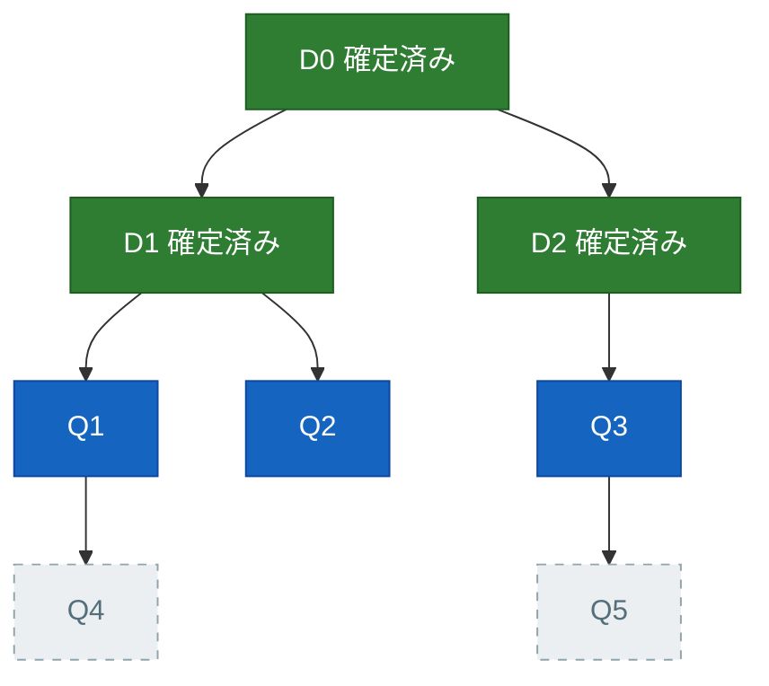
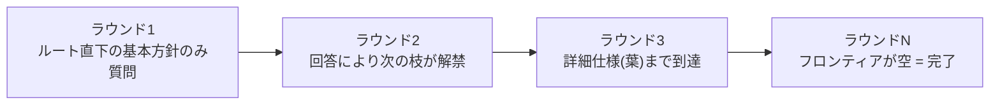
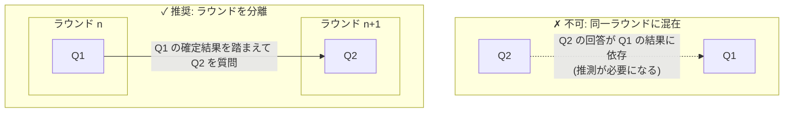
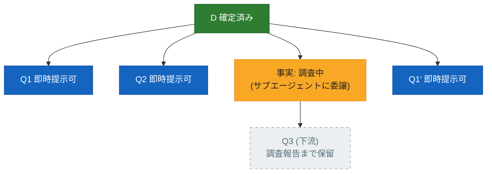
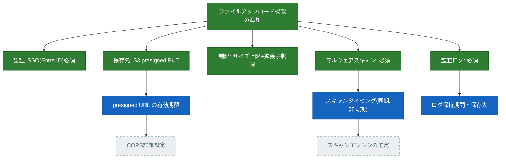

:::message
本記事は筆者個人の見解であり、所属する組織の公式見解ではありません。

本記事で取り上げる [mattpocock/skills](https://github.com/mattpocock/skills) は mattpocock 氏が提供するスキル集であり、頻繁に更新されています。本文の記述は執筆時点(2026年9月、リポジトリの main ブランチおよび手元導入版で確認)の情報に基づいています。最新の内容はリポジトリをご確認ください。
:::

## はじめに

NTTテクノクロスの上原です。最近、攻殻機動隊THE GHOST IN THE SHELLにはまりました。ヤンジャン連載を読んでたリアタイ勢としては最高ですね。やはりタチコマよりフチコマでしょう。

さて、以前執筆した記事「[AskUserQuestionをもっと見やすくわかりやすく](https://zenn.dev/uehaj/articles/claude-code-review-wizard-plugin)」では、grill 系スキルによる質疑応答をブラウザ上のウィザード UI で操作できるようにする工夫を紹介しました。今回は一歩踏み込み、その grill 系スキルの核心部、すなわち**質問がどのような仕組みで生成され、その進行状態がどこに保持されているのか**という内部メカニズムを解説します。

## TL;DR

* mattpocock/skills に含まれる **grilling** は、計画・設計・アイデアの具体化を「連続した質問」によって支援するスキルです。質問はランダムに出されるのではなく、**フロンティア**というルールに基づいて整理され、ラウンドごとに提示されます。
* フロンティアとは、設計プロセスのうち「前提条件(上位の意思決定)がすべて確定している未決定事項」の集合です。つまり、**未確定の回答を推測することなく、現時点で確認できる質問のすべて**を指します。
* 注目すべき点として、この**設計木(デザインツリー)は明示的なデータ構造としてどこにも保存されていません**。SKILL.md に記載された 20 行程度の指示(プロンプト)のみで動作しており、木を構築・保存するコードは存在せず、状態の実体は会話履歴そのものです。
* 「現在の設計木を表示して」と依頼すると表示されますが、これは保存されたデータの読み出しではなく、会話履歴をもとに**その場で再構築した結果**です。セッションを超えて決定事項を残したい場合は、決定内容を ADR や CONTEXT.md に書き出す **grill-with-docs** を使います。

## grilling と関連する2つのスキル

mattpocock/skills には「grill」という名称を含むスキルが3つ存在しますが、実際の処理主体は1つです。

| スキル | 実体と役割 |
| --- | --- |
| [grilling](https://github.com/mattpocock/skills/blob/main/skills/productivity/grilling/SKILL.md) | 本体。質問攻めの手順を定義する |
| [grill-me](https://github.com/mattpocock/skills/blob/main/skills/productivity/grill-me/SKILL.md) | ユーザー起動用のラッパー。「`/grilling` セッションを実行せよ」の 1 行のみ |
| [grill-with-docs](https://github.com/mattpocock/skills/blob/main/skills/engineering/grill-with-docs/SKILL.md) | grilling を `/domain-modeling` スキル併用で実行するラッパー。決定事項が ADR や CONTEXT.md へ書き出される |

grilling 本体の SKILL.md は、frontmatter を除くと 20 行程度のプロンプト(指示文)のみで構成されており、プログラムコードは含まれていません。スキルだからプロンプトなのは当然、と思うかもしれませんが、スキルにはスクリプトを同梱して実行させることもできます([前回記事](https://zenn.dev/uehaj/articles/claude-code-review-wizard-plugin)の review-wizard は Node スクリプトを同梱する例です)。grilling はそれをしていない、つまり**設計木を構築・保持する処理がモデルの外のどこにも存在しない**——この簡潔な記述でどう合理的な挙動を実現しているのか、本記事で紐解いていきます。

:::message
**「grill-me は grilling に改名された」という誤解について**

「grill-me が grilling に改名された(または別名になった)」とされるケースを見かけますが、これは誤りです。リポジトリの実ファイルを確認すると、grill-me はユーザーが直接起動するためのエントリーポイント(User-invoked スキル)として存続しており、内部記述は「`/grilling` セッションを実行せよ」という 1 行です。一方 grilling は、[README にあるとおり](https://github.com/mattpocock/skills/blob/main/README.md)、grill-me や grill-with-docs のほか triage・wayfinder・improve-codebase-architecture からも内部的に呼び出される、ヒアリング機能の共通モジュール(Model-invoked スキル)という位置付けです。すなわち改名ではなく、**起動インターフェースと実行処理の分離**というのが正確な構造で、grill-me は今後も入口として残ります。
:::

## 前提となる構造: 設計木(デザインツリー)

複数の項目について順序立てて質問を行う場合、問いの順序には依存関係が生じます。たとえば「認証機能が必要かどうか」が決まっていない段階で「アクセストークンの有効期限は何分にするか」を尋ねても意味がありません。ひとつの決定がなされると、その決定に紐づく次の検討事項が枝として現れる——この階層構造の全体を**設計木**(design tree)と捉えることが出発点となります。

設計木の各ノード(検討項目)は、つねに次の3状態のいずれかにあります。

- **確定済み**: ユーザーの回答または調査によって決定した項目
- **いま聞ける(フロンティア)**: 未決定だが、前提となる上位の項目がすべて確定している項目
- **まだ聞けない**: 未決定であり、前提となる上位の項目も未確定の項目

*図1 — 親ノードがすべて確定済み(緑)の未決定ノードだけがフロンティア(青)になる。Q4・Q5 は親(Q1・Q3)が未確定のため、現時点では質問できない*

:::message
「設計木(design tree)」という呼び名自体は grilling の SKILL.md 上のもので、確立された標準用語ではありません。ただし「設計の審議を、問いとその解決の連なりとして構造化する」考え方には設計根拠(design rationale)研究の系譜があります。代表格は、設計を issue(論点)・position(立場)・argument(論拠)のつながりとして記録する [IBIS](https://en.wikipedia.org/wiki/Issue-based_information_system)(Kunz & Rittel, 1970)と、Questions・Options・Criteria で設計空間を分析する [QOC](https://en.wikipedia.org/wiki/Design_rationale)(MacLean ら, 1991)です。grilling のフロンティアは、この系譜の「未解決の問いを依存順に潰していく」運用を LLM への短いプロンプトに圧縮したものと見ることができます。なお、機械学習の決定木(decision tree)や CAD ソフトの design tree(形状の履歴ツリー)とは別物です。
:::

## フロンティア: 今確認すべき質問の全体像

**フロンティア**とは、前提となる決定がすべて揃っている未決事項の集合です。言い換えると、「まだ得られていない回答を推測することなく、現時点で提示可能なすべての質問」を意味します(図1における Q1・Q2・Q3)。

重要な点は、フロンティアが「事前に用意された質問リスト」ではなく、設計木の状態からラウンドごとに**動的に再計算される導出値**であることです。したがって「フロンティアを形成する」処理は、(a) 設計木(構造)を把握することと、(b) その木から条件を満たす項目を抽出すること、の2つに分解されます。

1 ラウンドの処理フローは次のとおりです。

1. 設計木の中から未決定のノードを列挙する
2. そのうち、前提条件がすべて確定しているものだけを残す。これがフロンティア
3. フロンティアの質問を**1つのラウンドでまとめて提示する**。番号を振り、各問いに推奨回答(➡️)を添える
4. ユーザーからの回答を待つ。ここで必ず処理が止まる
5. 回答を受けて設計木を更新する。確定したノードはフロンティアから外れ、それに依存していた下位の質問が解禁される
6. 2 に戻り、繰り返す

「フロンティアの生成」の本質はステップ 2 であり、残りは「提示・回答待ち・木の更新」のループです。ラウンドが進むにつれて、フロンティアは木のルート(根)からリーフ(葉)へ向かって外側へ移動していきます。

*図2 — 質問の帯(フロンティア)が外側へ移動し、対象が存在しなくなった時点で完了となる*

この定義は、grilling の [SKILL.md](https://github.com/mattpocock/skills/blob/main/skills/productivity/grilling/SKILL.md) における次の記述に基づいています。

> The frontier is every decision whose prerequisites are already settled: the questions you can ask _now_ without guessing at answers you haven't heard yet.

(仮訳: フロンティアとは、前提がすべて決着している決定の全部——つまり、まだ聞いていない答えを推測することなく、**いま**聞ける質問のことである。)

## 抽出ルールの根幹: 同一ラウンド内での依存関係の禁止

質問をフロンティアに含めるかどうかの判断基準はシンプルです。**同時に提示する他の質問の回答に依存する質問は、同一ラウンドに含めない**。依存関係のある質問は、必ず後のラウンドへ回します。

*図3 — 依存関係のある問いを同時に提示すると、未確定の前提に基づく回答を強いることになる*

相互に依存する質問を同一ラウンドに含めてしまうと、回答者は「Q1 が A パターンだと仮定した場合、Q2 は B になる」といった前提付きの回答を行わざるを得なくなり、「推測なしで質問する」というフロンティアの原則が崩れます。ラウンドを分ければ、Q2 は Q1 の確定結果を踏まえた確実な形で質問できます。

## 「事実(fact)」と「決定(decision)」の切り分け

フロンティアの候補となる情報には、性質の異なる2種類の要素が混ざっています。この切り分けを誤ると、調査すれば判明する事柄までユーザーに質問してしまうことになります。

| | 事実 (fact) | 決定 (decision) |
| --- | --- | --- |
| 主体 | エージェント側 | ユーザー側 |
| 取得方法 | サブエージェントを飛ばして環境(コード・設定ファイル等)から調べる | 質問として提示し、ユーザーの回答を待つ |
| 禁止事項 | 自力で調べられる内容をユーザーに質問すること | 推奨案を提示せず、エージェント側で勝手に決めて進めること |

また、調査を実施している間も、全体を止める必要はありません。進行中の調査は「未確定の前提条件」として扱われるため、その調査結果に依存する**下流の質問だけを保留し、独立している他の質問は同一ラウンドで提示します**。調査の完了を全体の同期点にしないことがポイントです。

*図4 — 調査は前提の1つにすぎない。影響を受ける下流(Q3)のみを保留し、独立した質問(Q1・Q2・Q1')は同じラウンドで提示する*

## 終了条件

フロンティアが空になった状態とは、設計木のすべての枝の確認が完了し、あいまいな仮定や未確認事項が残っていない状態を意味します。この段階に達して初めてユーザーに全体方針の最終確認を行い、確認が取れるまで実行には着手しません。「質問が出尽くしたら終わり」ではなく「**推測なしで聞ける質問が存在しなくなったら終わり**」という終了条件が、確認漏れと勝手な仕様決定の両方を防いでいます。

## 設計木の状態はどこに保持されているのか

ラウンドが進むたびに木が更新され、フロンティアが再計算される——と聞くと、どこかに木のデータ構造が保存・管理されているように思えます。

結論として、**明示的なデータ構造としての決定木はどこにも存在しません**。

前述のとおり grilling はプロンプトのみで構成されたスキルで、木の構築や JSON 等へのシリアライズを行うコードはありません。プロンプトには「依存関係を考慮しながら、決定の木を辿れ」という自然言語の指示が書かれているだけです。実際に各ラウンドで起きているのは、LLM がそれまでの**会話履歴全体を毎回読み直し**、「どの項目が確定済みで、どの項目が依存関係により保留中か」を**その場で推論・再構築する**ことです。つまり、

- キューや木構造の外部データを参照しているのではなく、**会話履歴そのものが暗黙の状態**として機能している
- 木という構造物はデータとして実体化されておらず、モデルが「木の概念」に沿って推論しているだけ
- したがって理論上は、同じ会話履歴を渡してもモデルの推論のブレによって、次に提示される質問や順序が多少変わりえます(決定論的な木の巡回アルゴリズムではない)

これは grilling が手を抜いているという話ではなく、「会話履歴 = 暗黙の状態」という LLM エージェントに共通の素朴な仕組みにそのまま乗っている、ということです。

:::message
**「先に全ラウンドを組み立てる」と grilling ではなくなる**

grilling の質問を HTML を使った見やすいブラウザ UI でハンドリングするスキルは考えられます([前回記事](https://zenn.dev/uehaj/articles/claude-code-review-wizard-plugin)の review-wizard はまさにそれです)。ただし作り方に罠があります。最初の段階で複数ラウンド分の質問を先に組み立てて、まとめて回答させる形にすると、それは本来の grilling とは違うことをしていることになります。後のラウンドの質問は、前のラウンドで**決めたことによって柔軟に変わっていく**——決着した答えを前提にできるからこそ、的確で必要最低限の質問だけを聞く grilling が成立します。先に木を固定してしまうと、聞く必要のなくなった枝を聞き、決着を前提にできたはずの質問を推測込みで聞くことになります。UI を差し替えるなら、単位はあくまで 1 ラウンドで、ラウンドごとに作り直すのが正解です。
:::

### 「設計木を表示して」と頼んだ場合の挙動

「現在の設計木を表示して」と指示すれば、木を出力させることは可能です。しかしこれは保存されているデータの取得ではなく、**その時点までの会話履歴をもとに、その場で木の形として整形・出力した即興の再構成**です。次の特性を頭に入れて見る必要があります。

- 同じ会話コンテキストで再度出力を求めても、枝の粒度や表現が微妙に変わることがあります
- 表示される木は「モデルが現在認識していると自己申告している状態」であって、それ以上の正確性の保証はありません
- 会話が長くなりコンテキストの要約(圧縮)が行われると、実際の決定内容と表示される木との間に差異が生じる場合があります

裏を返せば、これは認識合わせの道具として有効です。「モデルがどの項目を未解決と認識しているか」を可視化することで、モデルの内部理解とユーザーの意図とのズレを早期に発見できます。

### 仮想例: セッション途中で木を表示させてみる

実際にやってみます。題材は「社内向け Web アプリケーションへのファイルアップロード機能の追加」に関する grilling です(社内限定・セキュリティ重視・SSO 連携・AWS 環境・監査ログ必須、という想定の仮想セッション)。

ラウンド1では、前提条件なしで確認できる5項目——SSO 認証の必須化、保存先アーキテクチャ、ファイルサイズ・拡張子制限、マルウェアスキャンの要否、監査ログの要否——が提示されました。すべてに「実施する/必須とする」方向で回答すると、ラウンド2では、その確定事項に依存していた3項目——presigned URL の有効期限、スキャンの実行タイミング(同期/非同期)、ログの保持期間・保存先——が解禁されます。

このラウンド2の質問が出た瞬間に「いまの設計木を表示して」と頼むと、たとえば次の木が返ってきます。

*図5 — ラウンド2の途中でモデルに再構成させた設計木(仮想例)。緑が確定済み、青が現在質問中のフロンティア、灰破線が前提の回答待ちでまだ聞けないもの*

CORS の詳細設定は presigned URL の運用仕様(有効期限など)が、スキャンエンジンの選定は同期/非同期の処理方式が決まった後にしか確認できないため、灰色の破線ノードとして次ラウンド以降に保留されています。図1で説明した3つの状態が、具体的な仕様決定の途中でそのまま現れているのが分かります。

繰り返しになりますが、この木は保存データのダンプ出力ではありません。同じセッションでもう一度頼めば、枝の切り方やノードの名前は微妙に変わりえます。それでも「どの決定が完了し、何がなぜ保留されているのか」という前提認識を合わせるには十分に役立ちます。

### 唯一の永続化: grill-with-docs

セッションを超えて残る記録が必要な場合の答えが grill-with-docs です。grilling の進行に合わせて domain-modeling スキルが連動し、仕様や決定事項が固まるたびに **ADR(Architecture Decision Record)や CONTEXT.md というファイルとしてリポジトリ内に書き出されます**。会話コンテキストの外部にある実ファイルなので、セッションが終了しても情報は失われず、次回以降のセッションで過去の決定事項として参照できます。

ただしこれも「木構造そのものを管理・保存するシステム」ではありません。保存されるのはあくまで確定した決定内容のドキュメントであり、未決定の枝や依存関係を含む木全体の状態が保存されるわけではない点は同じです。

整理すると次のようになります。

| | 状態の保存場所 | セッションを超えるか |
| --- | --- | --- |
| grilling / grill-me | 会話履歴のみ(暗黙) | 超えない(コンテキストウィンドウ依存) |
| grill-with-docs | 会話履歴 + ADR・CONTEXT.md(確定分のみ明示) | 確定した決定だけ超える |

### grill-me と grill-with-docs の使い分け

grill-with-docs の内部記述も「`/grilling` を `/domain-modeling` と組み合わせて実行せよ」という 1 行のみです。ヒアリングの中身は grill-me と完全に同一で、そこに用語集(CONTEXT.md)と ADR の書き出しを行う [domain-modeling](https://github.com/mattpocock/skills/blob/main/skills/engineering/domain-modeling/SKILL.md) が乗るだけの関係です。

しかも domain-modeling はむやみに文書を作りません。ADR を作成するのは「**後から変更しにくい**」「**背景情報がないと意図が分かりにくい**」「**実際のトレードオフの結果である**」という3条件をすべて満たす決定だけで、1つでも欠ければ作らない、とスキル自身が定めています。ファイルも、書くべきものが出て初めて作られます。

したがって、設計判断を ADR や CONTEXT.md に残す可能性が少しでもあるなら、grill-me を選ぶ理由はありません。**grill-with-docs は grill-me の上位互換**で、ドキュメント化すべき事項が出なければ grill-me と全く同じ挙動になるだけです。著者自身も [README](https://github.com/mattpocock/skills/blob/main/README.md) で grill-me を非コード用途向け("for non-code uses")、grill-with-docs を「grill-me と同じだが追加のおまけ付き」と位置付けています。

## まとめ

grilling のフロンティア方式は、「相互に依存しない質問のみを、ラウンド単位でまとめて提示する」というヒアリングの規律を、わずか 20 行程度のプロンプトで実現しています。「設計木」や「フロンティア」といった専門用語から精巧な内部データ構造を想像しがちですが、その実体は会話履歴に対する毎ラウンドの再解釈であり、ツリー構造自体はデータとして一度も実体化されていません。

この特徴から、実践上の重要な指針が見えてきます。長時間のセッションでは、コンテキストの要約や圧縮によって「AI 内部の暗黙のツリー」にズレが生じる可能性があるため、確定事項を外部ファイル(ADR や CONTEXT.md)へ明示的に書き出す grill-with-docs を活用する運用がより安全だということです。

### 考察: これは果たして「アルゴリズム」なのか

今回、mattpocock の grilling 系スキルの仕組みを詳しく調べてきました。実際に使ったことがある方なら共感していただけると思いますが、これは極めて高機能で有用なスキルです。フロンティアや設計木という内部構造を持ち、システマチックかつ回答に応じて動的に展開していく、非常に知的な振る舞いを見せます。それだけに、この設計木を緻密に処理するプログラミング的アルゴリズムがどこかに記述されているのだろうと予想していたのですが、その実体が「二十数行のプロンプト」に過ぎなかったことには大きな衝撃を受けました。

そしてこの構造を眺めているうちに、「これは果たしてアルゴリズムと呼べるのだろうか?」という疑問が湧いてきます。

一般的な定義において、アルゴリズムとは「有限の手続きによって、有限回数のステップで確実に停止するもの」です。しかし、grilling が有限のラウンドで必ず終了することは、プログラムの構造としては何ら保証されていません。プロンプトには「フロンティアが空になったら終了せよ」と記述されているだけであり、それを解釈・実行する LLM 側が非決定論的に動作する以上、これは厳密な停止保証とは言えないからです。

例えるなら、決定論的な「ユークリッドの互除法」そのものというよりは、「頭の中で互除法を再現しながら手計算している人間」に近い存在と言えます。結果として正しく最大公約数が求まるかもしれませんが、そこで実行されているのは、私たちが慣れ親しんできた「プログラム」ではありません。足し算のアルゴリズムを、「暗算する人間」という非決定論的なレイヤー上で実行しているようなものです。

ここには、どこか不思議な感覚を覚えます。ここでは**「決定論的なアルゴリズム」を「非決定論的な AI の推論」の上でエミュレートすることで、(ほぼ)決定論的な結果を得る**という現象が起きています。

これは、AI のモデル性能が飛躍的に向上したからこそ可能になった手法です。そしてここから連想されるのが、ハーネスエンジニアリング(Harness Engineering)そしてループエンジニアリング(Loop Engineering)の未来です。

現在私たちは、非決定論的で気まぐれな AI の動作を決定論的なコード(ハーネス)で縛り、逸脱しないための安全枠を作りながら実行させる工夫を日々重ねています。しかし AI の能力向上は、そうした「決定論的な枠組みや処理手順」そのものを、自身の推論能力によってエミュレートできるようにしてしまいます。そしてその再現性の高さは、モデルが賢くなるにつれて確実に向上していくでしょう。

つまり将来的には、ハーネスエンジニアリングのうち**知的な判断や、手順・繰り返しの制御にあたる部分**は、「モデルの頭の中で確実に遵守されるルール」へと置き換わっていくことが予想されます。現在「AI 活用のための高度なフレームワークやテクニック」と見なされている仕組みのうちこの種のものは、ここ数年のスパンで不要になっていくのではないか——その先進的な予兆を感じさせる鮮やかな例こそが、わずか 20 行のプロンプトでツリーの巡回を行ってみせる mattpocock の grilling なのだと言えます。

実はこのことは、Anthropic のエンジニア自身によって予告されてもいます。Claude Code の作者 Boris Cherny 氏は、[YC Startup School 2026 での対談](https://www.ycombinator.com/library/UN-boris-cherny-building-claude-code)(2026年7月)で、新しいモデルが出るたびにシステムプロンプトの大部分を削除・書き換えていて直近では 80% を削除したこと、もはや scaffolding(足場)を使う必要すらないこと、そして Claude Code のユーザーにも「6か月ごとに CLAUDE.md も skills も hooks も削除してみるべきだ」と勧めることを語っています。grilling の解剖を通じて、この予告をあらためて実感できました。

ただし、ハーネスエンジニアリングそのものが無くなるわけではありません。Anthropic の公式ブログにも[ハーネスの余地は縮小せず移動する、という見解](https://www.anthropic.com/engineering/harness-design-long-running-apps)があります。モデルに吸収されるのは判断と手順であって、権限・記憶・検証といった賢さでは代替できない器は残ります。grilling はその境界の実例です——規律はプロンプトへ移り、永続化だけが domain-modeling という外部の器に残されています。

なお、grilling による質問ラウンドの見せ方(UI)を改善する取り組み(ブラウザ上のウィザード UI へ流し込む工夫)については[前回の記事](https://zenn.dev/uehaj/articles/claude-code-review-wizard-plugin)で解説していますので、あわせてご覧ください。
