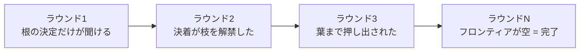
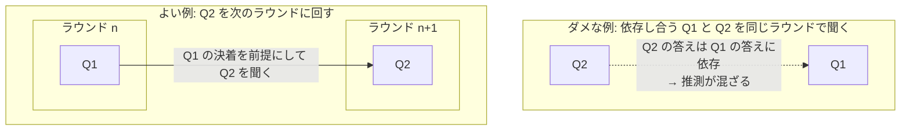
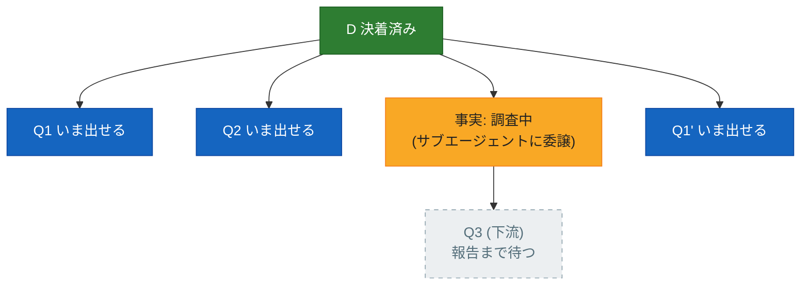
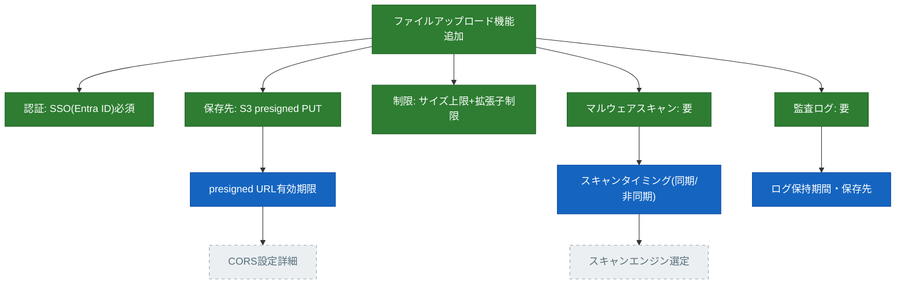

:::message
本記事は筆者個人の見解であり、所属する組織の公式見解ではありません。

ここで扱う [mattpocock/skills](https://github.com/mattpocock/skills) はサードパーティ配布のスキル集で、更新が頻繁です。本文の記述は執筆時点(2026年9月、リポジトリ main ブランチおよび手元導入版で確認)のものなので、最新の内容はリポジトリをご確認ください。
:::

## はじめに

NTTテクノクロスの上原です。以前「[AskUserQuestionをもっと見やすくわかりやすく](https://zenn.dev/uehaj/articles/claude-code-review-wizard-plugin)」で、grill 系スキルの質問ラウンドをブラウザのウィザード UI に流す話を書きました。今回はその grill 系スキルの本体、つまり**質問がどういう仕組みで生成され、その状態がどこに保持されているのか**を掘り下げます。

## TL;DR

* mattpocock/skills の **grilling** は、計画・設計・アイデアをユーザーへの質問攻めで鍛えるスキルです。質問は思いつき順ではなく、**フロンティア**という規律で束ねてラウンド単位で出てきます。
* フロンティア = 設計木の未決定ノードのうち、**前提(親の決定)がすべて決着しているもの**の集合。「まだ聞いていない答えを推測せずに、いま聞ける質問の全部」です。
* ところがこの設計木、**明示的なデータ構造としてはどこにも保存されていません**。SKILL.md は 20 行あまりのプロンプトで、木を構築・シリアライズするコードは存在せず、状態の実体は会話履歴そのものです。
* 「木を表示して」と頼めば表示されますが、それは保存されていた木の取り出しではなく、**その場での即興的な再構成**です。セッションを超えて残したければ、確定事項を ADR や CONTEXT.md に書き出す **grill-with-docs** を使います。

## grilling と、その周りの2つのスキル

[mattpocock/skills](https://github.com/mattpocock/skills) には grill と名の付くスキルが3つありますが、実体は1つです。

| スキル | 実体 |
| --- | --- |
| [grilling](https://github.com/mattpocock/skills/blob/main/skills/productivity/grilling/SKILL.md) | 本体。質問攻めの手順を定義する |
| [grill-me](https://github.com/mattpocock/skills/blob/main/skills/productivity/grill-me/SKILL.md) | 「`/grilling` セッションを実行せよ」と書いてあるだけの起動用ラッパー |
| [grill-with-docs](https://github.com/mattpocock/skills/blob/main/skills/engineering/grill-with-docs/SKILL.md) | grilling を `/domain-modeling` スキル併用で実行するラッパー。決定が ADR・CONTEXT.md に書き出される |

grilling 本体の SKILL.md は frontmatter を除くと 20 行あまりのプロンプトで、コードは 1 行もありません。スキルだからプロンプトなのは当然、と思うかもしれませんが、スキルにはスクリプトを同梱して実行させることもできます([前回記事](https://zenn.dev/uehaj/articles/claude-code-review-wizard-plugin)の review-wizard は Node スクリプトを同梱する例です)。grilling はそれをしていない、つまり**設計木を構築・保持する処理がモデルの外のどこにも存在しない**——この点が後半の話につながります。

:::message
**「grill-me は grilling に改名された」は誤解です**

grill-me が「grilling に改名された」「grilling のエイリアスになった」という話をたまに見かけますが、これは誤解です。リポジトリの実ファイルを見ると、grill-me は現役の入口(ユーザーが打って起動する User-invoked スキル)で、本文は「`/grilling` セッションを実行せよ」の 1 行。一方 grilling は、[README にあるとおり](https://github.com/mattpocock/skills/blob/main/README.md)、grill-me・grill-with-docs のほか triage・wayfinder・improve-codebase-architecture も内部で共通に呼ぶ、モデル側から呼ばれるインタビュー・プリミティブ(Model-invoked)です。つまり改名ではなく**入口と手法の分離**で、grill-me は今後も入口として残ります。
:::

## 前提となる構造: 設計木

計画について質問するとき、質問には自然な順序があります。「認証は必要か」が決まらないうちに「トークンの有効期限は何分か」を聞いても、答えは推測混じりになります。ひとつの決定が決まると、その決定にぶら下がる次の決定が枝として現れる——この入れ子の全体を**設計木**(design tree)と捉えるのが出発点です。

設計木の各ノードは、つねに次の 3 状態のどれかにあります。

- **決着済み**: ユーザーの回答(または調査)で決まった
- **いま聞ける**: 未決定だが、前提となる親の決定はすべて決着している
- **まだ聞けない**: 未決定で、親のどれかも未決定

*図1 — 未決定ノードのうち、親がすべて決着済み(緑)のものだけがフロンティア(青)になる。Q4・Q5 は親(Q1・Q3)が未決定なので、まだ聞けない*

:::message
「設計木(design tree)」という呼び名自体は grilling の SKILL.md 上のもので、確立された標準用語ではありません。ただし「設計の審議を、問いとその解決の連なりとして構造化する」考え方には設計根拠(design rationale)研究の系譜があります。代表格は、設計を issue(論点)・position(立場)・argument(論拠)のつながりとして記録する [IBIS](https://en.wikipedia.org/wiki/Issue-based_information_system)(Kunz & Rittel, 1970)と、Questions・Options・Criteria で設計空間を分析する [QOC](https://en.wikipedia.org/wiki/Design_rationale)(MacLean ら, 1991)です。grilling のフロンティアは、この系譜の「未解決の問いを依存順に潰していく」運用を LLM への短いプロンプトに圧縮したものと見ることができます。なお、機械学習の決定木(decision tree)や CAD ソフトの design tree(形状の履歴ツリー)とは別物です。
:::

## フロンティア: いま聞ける質問の全部

**フロンティア**とは、前提(親の決定)がすべて決着している未決定ノードの集合です。言い換えると、**まだ聞いていない答えを推測せずに、いま聞ける質問の全部**。図1 なら Q1・Q2・Q3 の 3 つです。

大事なのは、フロンティアが「書き溜めた質問リスト」ではないことです。設計木の状態から**毎ラウンド計算し直される派生値**です。だから「フロンティアを作る」という作業は、(a) 木を持つことと、(b) 木から条件を満たすノードを抜き出すこと、の 2 つに分かれます。

1 ラウンドの手順に落とすとこうなります。

1. 木の中の未決定ノードを列挙する
2. そのうち前提がすべて決着しているものだけを残す。これがフロンティア
3. フロンティアを**まるごと 1 ラウンドで**出す。番号を振り、各問に推奨回答(➡️)を添える
4. ユーザーの回答を待つ。ここで必ず止まる
5. 回答が木を組み替える。決着したノードがフロンティアの外へ押し出され、依存していた質問が解禁される
6. 2 に戻る

「フロンティアを作る」の実体はステップ 2 だけで、残りはそれを出して待って木を更新するループにすぎません。ラウンドが進むと、フロンティアは木の根から葉へ、外側へ動いていきます。

*図2 — 帯(=フロンティア)は木の外側へ移動し、空になった時点で終了条件を満たす*

この定義の出典は grilling の [SKILL.md](https://github.com/mattpocock/skills/blob/main/skills/productivity/grilling/SKILL.md) です。

> The frontier is every decision whose prerequisites are already settled: the questions you can ask _now_ without guessing at answers you haven't heard yet.

(仮訳: フロンティアとは、前提がすべて決着している決定の全部——つまり、まだ聞いていない答えを推測することなく、**いま**聞ける質問のことである。)

## 判定の唯一の基準: 同一ラウンド内の依存を禁じる

フロンティアに載せるかどうかの実質的な判定は、これ一本です。**いま開いている別の質問の答えに依存する質問は、このラウンドに入れない**。それは後のラウンドのものです。

*図3 — 依存が閉じていない問いを同時に出すと、聞いていない答えを前提に答えを組むことになる*

依存する質問を同じラウンドに混ぜてしまうと、回答者は「Q1 がこう決まると仮定すれば Q2 はこう」という仮定込みの答えを書くことになり、フロンティアの定義(推測なしで聞ける)が壊れます。ラウンドを分ければ、Q2 は Q1 の決着を前提として聞けます。

## 事実と決定を仕分ける

フロンティアに載る候補には、性質の違う 2 種類が混ざります。ここを取り違えると、調べれば分かることをユーザーに聞くことになります。

| | 事実 (fact) | 決定 (decision) |
| --- | --- | --- |
| 持ち主 | 自分(エージェント) | ユーザー |
| 取り方 | サブエージェントを飛ばして環境(ファイル・ツール)から取る | 問いとして出し、回答を待つ |
| 禁止 | 自分で調べられることをユーザーに聞く | 推奨を添えたうえで、勝手に決めて進む |

そして、調査が走っている間も全体をブロックしません。走っている調査は「未決着の前提」として扱われるので、**その下流の質問だけが待ち、兄弟の質問は今のラウンドで出します**。調査の完了を全体の同期点にしてはいけない、というのがポイントです。

*図4 — 調査は前提のひとつにすぎない。下流(Q3)だけを待たせ、フロンティアの残り(Q1・Q2・Q1')は同じラウンドで出す*

## 終了条件

フロンティアが空になったとき、木の全枝を訪問し終え、**黙って仮定したものが残っていない**状態になります。そこで初めてユーザーに共通理解の確認を取り、確認が取れるまで実行に移りません。「質問が尽きたら終わり」ではなく「推測なしで聞ける質問が存在しなくなったら終わり」という終了条件が、聞き漏らしと勝手な仮定の両方を塞いでいます。

## では、その設計木はどこに保存されているのか

ラウンドが進むたびに木が組み替わり、フロンティアが再計算される——と聞くと、どこかに木のデータ構造があって、ラウンド間で更新・保持されているように思えます。

結論は、**明示的なデータ構造としての決定木はどこにも存在しない**、です。

前述のとおり grilling はプロンプトだけのスキルで、木を構築・シリアライズするコードはありません。「decision tree の各枝を、依存関係を解決しながら降りていけ」という指示文があるだけです。実際に各ラウンドで起きているのは、LLM がそれまでの**会話履歴全体を毎回読み直し**、「どの枝が決着済みか」「依存関係でまだ聞けない項目は何か」を**推論によってその場で再構築する**ことです。つまり、

- 「未処理キュー」や「木の JSON」を参照しているのではなく、会話履歴そのものが暗黙の状態
- 木という構造物は一度も実体化されておらず、木の比喩に沿って推論するよう指示されているだけ
- したがって理論上は、同じ履歴を渡してもモデルの推論のブレで「次に何を聞くか」が多少変わりえます(決定論的なツリー巡回アルゴリズムではない)

これは grilling が手を抜いているという話ではなく、「会話履歴 = 暗黙の状態」という LLM エージェントに共通の素朴な仕組みにそのまま乗っている、ということです。

:::message
**「先に全ラウンドを組み立てる」と grilling ではなくなる**

grilling の質問を HTML を使った見やすいブラウザ UI でハンドリングするスキルは考えられます([前回記事](https://zenn.dev/uehaj/articles/claude-code-review-wizard-plugin)の review-wizard はまさにそれです)。ただし作り方に罠があります。最初の段階で複数ラウンド分の質問を先に組み立てて、まとめて回答させる形にすると、それは本来の grilling とは違うことをしていることになります。後のラウンドの質問は、前のラウンドで**決めたことによって柔軟に変わっていく**——決着した答えを前提にできるからこそ、的確で必要最低限の質問だけを聞く grilling が成立します。先に木を固定してしまうと、聞く必要のなくなった枝を聞き、決着を前提にできたはずの質問を推測込みで聞くことになります。UI を差し替えるなら、単位はあくまで 1 ラウンドで、ラウンドごとに作り直すのが正解です。
:::

### 「木を表示して」と頼んだら

表示はできます。ただしそれは保存されていた木の取り出しではなく、**その時点までの会話履歴を材料に、木の形をその場で即興的に再構成したもの**です。次の性質を頭に入れて見る必要があります。

- 同じ会話に対して 2 回頼んでも、枝の粒度や順序が微妙に変わりえます
- 表示された木は「いまモデルが把握していると自己申告している状態」であって、それ以上の正確性の保証はありません
- 会話が長くなってコンテキストが圧縮・要約されていると、実際に決まった内容と表示された木がズレることがあります

裏を返せば、これは認識合わせの道具として有効です。「モデルはどの枝を未解決と思っているか」を可視化させることで、モデルの暗黙の心的モデルと自分の理解のズレを検出できます。

### 仮想例: ある瞬間の木を表示させてみる

実際にやってみます。題材は「社内向け Web アプリにファイルアップロード機能を追加する」仕様の grilling です(社内利用のみ・セキュリティ重視・SSO あり・AWS・監査要件あり、という想定の仮想セッション)。

ラウンド1では、前提なしで聞ける 5 問が出ました: 認証を SSO 必須にするか、保存先(サーバ経由か presigned URL 直接 PUT か)、サイズ・拡張子制限、マルウェアスキャンの要否、監査ログの要否。回答はすべて「必須/やる」方向で決着したとします。するとラウンド2では、その決着に依存していた 3 問——presigned URL の有効期限、スキャンのタイミング(同期/非同期)、ログの保持期間・保存先——が解禁されます。

このラウンド2の質問を出した直後の瞬間に「いまの設計木を表示して」と頼むと、たとえば次の木が返ってきます。

*図5 — ラウンド2の途中でモデルに再構成させた設計木(仮想例)。緑が決着済み、青がいま聞いているフロンティア、灰破線がフロンティアの質問の答え待ちで、まだ聞けないもの*

CORS の詳細は presigned URL の運用(有効期限など)が、スキャンエンジンの選定は同期/非同期の決着が決まってからでないと聞けないので、灰色のまま次のラウンド以降に回っています。図1で説明した 3 状態が、具体的な仕様決定の途中でそのまま現れているのが分かります。

繰り返しになりますが、この木は保存されていたデータのダンプではありません。同じセッションでもう一度「表示して」と頼めば、枝の切り方やノードの名前は微妙に変わりえます。それでも「どの決定が済んでいて、何がなぜまだ聞けないのか」の認識合わせには十分に役立ちます。

### 唯一の永続化: grill-with-docs

セッションを超えて残る状態が欲しい場合の答えが grill-with-docs です。こちらは grilling を domain-modeling スキル併用で実行し、決定が固まるたびに **ADR(Architecture Decision Record)や CONTEXT.md に確定事項を書き出していきます**。会話コンテキストの外の実ファイルなので、セッションをまたいでも消えず、次回はそれを読み込んで過去の決定と照合できます。

ただしこれも「木構造を管理するシステム」ではありません。書き出されるのは確定した決定の記述であって、未決定の枝や依存関係を含む木全体の状態遷移が管理されるわけではない点は同じです。

整理するとこうなります。

| | 状態の置き場所 | セッションを超えるか |
| --- | --- | --- |
| grilling / grill-me | 会話履歴のみ(暗黙) | 超えない(コンテキストウィンドウ依存) |
| grill-with-docs | 会話履歴 + ADR・CONTEXT.md(確定分のみ明示) | 確定した決定だけ超える |

### grill-me と grill-with-docs、どちらを使うか

grill-with-docs の本文も「`/grilling` を `/domain-modeling` 併用で実行せよ」の 1 行だけです。インタビューの中身は grill-me と完全に同一で、そこに CONTEXT.md(用語集)と ADR を書く [domain-modeling](https://github.com/mattpocock/skills/blob/main/skills/engineering/domain-modeling/SKILL.md) が乗るだけの関係です。

しかも domain-modeling は書きたがりません。ADR を作るのは「**戻しにくい**」「**文脈なしだと不思議に見える**」「**実際のトレードオフの結果**」の 3 条件をすべて満たす決定だけで、1 つでも欠ければ作らない、とスキル自身が定めています。ファイルも lazy に、書くものが出て初めて作られます。

つまり、設計判断を ADR や CONTEXT.md に残す可能性が少しでもあるなら、grill-me を選ぶ理由はありません。**grill-with-docs は grill-me の上位互換**で、ドキュメントに書くべきものが出なければ grill-me と同じ挙動になるだけです。著者自身も [README](https://github.com/mattpocock/skills/blob/main/README.md) で grill-me を非コード用途向け("for non-code uses")、grill-with-docs を「grill-me と同じだが追加のおまけ付き」と位置づけています。

## まとめ

grilling のフロンティア方式は、「依存の閉じた質問だけを、ラウンド単位でまとめて出す」という規律を 20 行のプロンプトで実現しています。設計木・フロンティアという語彙から精巧な内部データ構造を想像しがちですが、実体は会話履歴に対する毎ラウンドの再解釈であり、木は一度も実体化されていません。

このことから、実用上の指針が 2 つ出ます。長いセッションではコンテキスト圧縮で暗黙の木がズレうるので、確定事項を外部ファイルに書き出す grill-with-docs 側の運用が安全であること。そして「木を表示して」は保存状態のダンプではなく即興の再構成なので、正として扱うのではなく、認識合わせのために使うのがよい、ということです。

なお、grilling の質問ラウンドの**見せ方**を改善する話(ブラウザのウィザード UI に流す)は[前回の記事](https://zenn.dev/uehaj/articles/claude-code-review-wizard-plugin)に書いたので、あわせてどうぞ。
